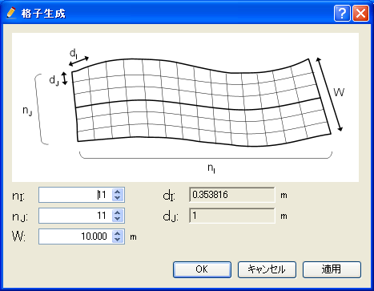
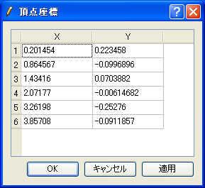

.. _sec_grid_create_polyline_and_width:

折れ線と格子幅から生成
===========================================

折れ線に沿ってなめらかに曲がる構造格子を生成します。このアルゴリズムによって
生成される格子の例を
:numref:`image_example_grid_polyline_and_width` に示します。

.. _image_example_grid_polyline_and_width:

   折れ線と格子幅から生成する格子の形状例

このアルゴリズムを選択したら、まずは描画領域でのマウスクリックで、
格子の中心線が通る点を複数指定します。ダブルクリックもしくは改行キーを押すと、
中心線の指定が完了します。中心線の指定が完了した時の画面の表示例を
:numref:`image_polyline_display_after_centerline_set`
に示します。

中心線の指定が完了したら、メニューから「格子生成」を選択します。
:numref:`image_example_grid_creation_dialog` に示すダイアログが
表示されますので、「適用」ボタンを押して結果を確認しながら入力情報を
調整した上で「OK」ボタンを押すと格子が生成されます。

.. _image_polyline_display_after_centerline_set:

.. figure:: images/polyline_display_after_centerline_set.png

   格子中心線の定義完了時の表示例

.. _image_example_grid_creation_dialog:

   格子生成条件ダイアログ

中心線の頂点の編集は、:numref:`menu_polygonal_line_and_width_table`
で示すメニューから行います。

メニュー構成
----------------

折れ線と格子幅から生成するアルゴリズムを選択している時の、
格子 (G) --> 格子生成条件(C) サブメニューの構成を
:numref:`menu_polygonal_line_and_width_table` に示します。

.. _menu_polygonal_line_and_width_table:

.. list-table:: 折れ線と格子幅から生成するアルゴリズムのメニューの構成
   :header-rows: 1

   * - メニュー
     - 説明
   * - 頂点の追加(A)
     - 中心線に頂点を追加します
   * - 頂点の削除(R)
     - 中心線の頂点を削除します
   * - 座標の編集(C)
     - 中心線の座標を編集します
   * - 中心線の向きを反転(E)
     - 中心線の向きを反転します
   * - 初期状態に戻す(D)
     - 中心線を削除します

頂点の追加(A)
----------------

中心線に頂点を追加します。

メニューを選択した状態で、中心線上にマウスを移動すると、マウスカーソルが
:numref:`image_poly_cursor_add_vertex`
で示した形に変わります。この状態で左クリックすると、新しい頂点が追加されます。

.. _image_poly_cursor_add_vertex:

.. figure:: images/poly_cursor_add_vertex.png

   中心線の頂点の追加が可能な時のマウスカーソル

頂点の削除(R)
-------------------

中心線の頂点を削除します。

メニューを選択した状態で、中心線上の頂点にマウスを移動すると、マウスカーソルが
:numref:`image_poly_cursor_remove_vertex` で示した形に変わります。
この状態で左クリックすると、選択した頂点が削除されます。

.. _image_poly_cursor_remove_vertex:

.. figure:: images/poly_cursor_remove_vertex.png

   中心線の頂点の削除が可能な時のマウスカーソル

頂点座標の編集(C)
---------------------

中心線の頂点の座標を編集します。

頂点座標の編集ダイアログ (:numref:`image_poly_centerline_coordinates_dialog`
参照) が表示されますので、頂点の座標を編集して「OK」ボタンを押します。

.. _image_poly_centerline_coordinates_dialog:

   頂点座標の編集ダイアログ

中心線の向きを反転(E)
-------------------------

中心線の向きを反転します。例を
:numref:`image_poly_example_reversing` に示します。

.. _image_poly_example_reversing:

.. figure:: images/poly_example_reversing.png

   中心線の向きの反転 表示例

初期状態に戻す(D)
------------------------

中心線を削除し、アルゴリズムを選択した直後の状態に戻します。

実行後は、アルゴリズムを選択した直後と同様、描画領域でクリックして中心線を定義し直します。
