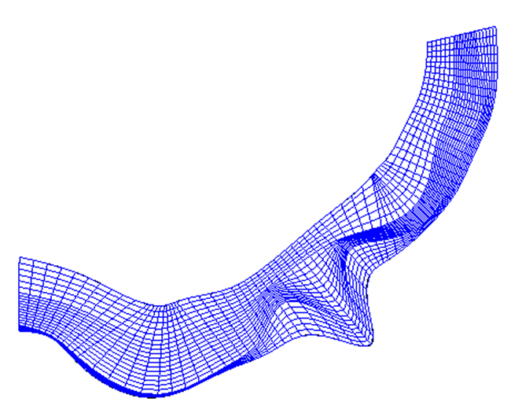
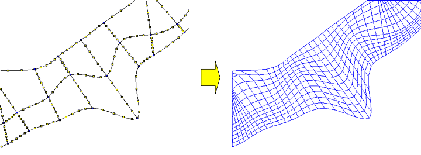
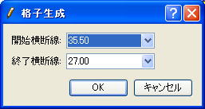
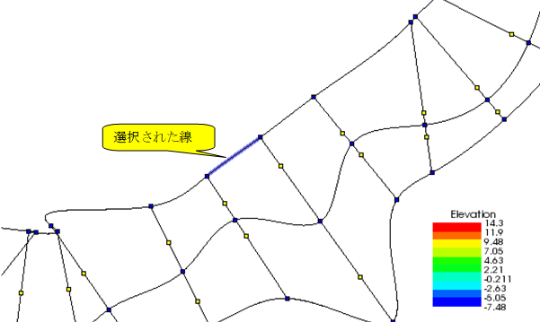
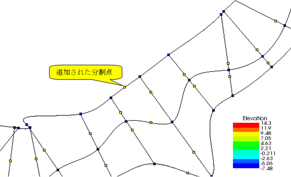
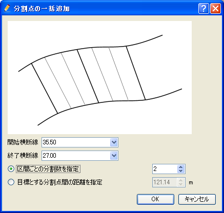
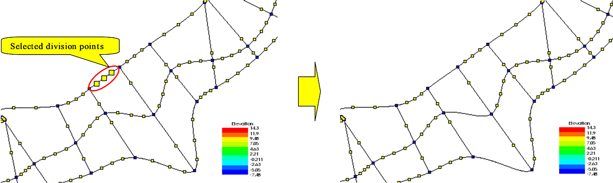
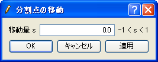
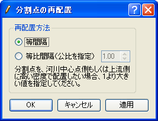

[Create grid from River Survey Data] (2-D structured grid)
==========================================================

**Description**: Creates a grid from River Survey Data. In addition to
transverse lines being set, division points are set on the transverse
lines, the river centerline and left/right bank lines.
:numref:`image_riv_data_2d_grid_example` shows
an example of a grid created by this algorithm.

Before using this algorithm, you need to import River Survey Data.

.. _image_riv_data_2d_grid_example:

   Example of a grid created from River Survey Data

The following lines of River Survey Data are used as grid lines. In
addition, division points added by the user are used to create a grid.

- River transverse line
- River centerline: the curve made by linking the center point of each river transverse line
- Left bank end line: the curve made by linking the left bank end of each river transverse line
- Right bank end line: the curve made by linking the right bank end of each river transverse line

:numref:`image_riv_data_2d_example_grid_div_points` shows an example of grid division
points and the grid made from these division points.

.. _image_riv_data_2d_example_grid_div_points:

   Example of grid division points and the grid made from these division points

Select [Grid Creation] from the menu. The [Grid Creation] dialog
(:numref:`image_riv_data_2d_grid_creating_dialog`)
will open. Specify the region where the grid is to be made and
click on [OK]. The grid is generated according to the division points.
Operations related to the division points are done from the menu shown
in :ref:`riv_data_2d_menuitems`.

.. _image_riv_data_2d_grid_creating_dialog:

   [Grid Creating] dialog

.. _riv_data_2d_menuitems:

Menu items
----------

:numref:`riv_data_2d_menuitems_table` shows the menu items of the submenu of
[Grid] (G) -->  [Grid Creating Conditions] (C)
when [Create grid from River Survey Data] is selected as the grid creating algorithm.

.. _riv_data_2d_menuitems_table:

.. list-table:: Menu items for algorithm [Create grid from River Survey Data]
   :header-rows: 1

   * - Menu
     - Description
   * - [Add Division Points] (A)
     - Adds division points to the selected line.
   * - [Add Division Points Regionally] (R)
     - Simultaneously adds division points to the river centerline and/or left/right bank lines.
   * - [Delete Division Points] (D)
     - Deletes the selected division points.
   * - Move Division Points (M)
     - Moves the selected division point.
   * - Reposition Division Point (P)
     - Repositions the selected division points.

[Add Division Points] (A)
-------------------------

**Description**: Adds division points to the selected line.

Select the line to which you want to add division points (e.g., river
centerline, left bank end line, right bank end line, river transverse line)
by clicking on it. :numref:`image_riv_data_2d_example_selected_line`
shows an example of a display after selecting a line.
Then, select [Add Division Points] from the menu. The
[Add Division Point] dialog
(:numref:`image_riv_data_2d_add_div_points_dialog`) will open.
Input number of divisions and select division method, and click on [OK].
Division points are added to the line
(:numref:`image_riv_data_2d_example_after_add_div_points`).

.. _image_riv_data_2d_example_selected_line:

   Example of a selected line

.. _image_riv_data_2d_add_div_points_dialog:

.. figure:: images/riv_data_2d_add_div_points_dialog.png
   :width: 210pt

   [Add Division Points] dialog

.. _image_riv_data_2d_example_after_add_div_points:

   Example of a display after division points have been added

[Add Division Points Regionally] (R)
------------------------------------

**Description**: Simultaneously adds division points to the river centerline
and left/right bank lines.

The [Add Division Points Regionally] dialog
(:numref:`image_riv_data_2d_add_div_points_regionally_dialog`) will open.
Specify the region where division points are to be added and number of
divisions, and click on [OK].

.. _image_riv_data_2d_add_div_points_regionally_dialog:

   [Add Division Points Regionally] dialog

[Delete Division Points] (D)
----------------------------

**Description**: Deletes the selected division points.

:numref:`image_riv_data_2d_example_delete_div_points` shows an example.

.. _image_riv_data_2d_example_delete_div_points:

   Example of deleting a division point

[Move Division Points] (M)
--------------------------

**Description**: Moves the selected division points. This is possible when
selecting continuous division points on the same line.

When you select [Move Division Points], the [Move Division Points]
dialog (:numref:`image_riv_data_2d_move_div_points`)
will open. Set [Transfer Quantity] and click on [OK].

.. _image_riv_data_2d_move_div_points:

   [Move Division Points] dialog

[Reposition Division Points] (P)
--------------------------------

**Description**: Relocates the selected division points. This is possible
when selecting continuous division points on the same line.

When this is selected, the [Reposition Division Points] dialog
(:numref:`image_riv_data_2d_reposition_div_points_dialog`)
will open. Edit the coordinates and click on [OK].

.. _image_riv_data_2d_reposition_div_points_dialog:

   [Reposition Division Points] dialog

Reset to default (R)
--------------------

**Description**: Discard the modifications of grid creating condition, and
restore to the state just after selecting the grid creating algorithm.
