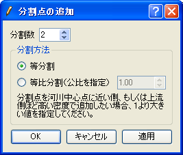

.. _sec_gridgen_riv_data_2d:

河川測量データから生成 (二次元構造格子を生成)
==========================================================

河川測量データから格子を生成します。各横断線のほか、横断線上、河川中心線、
左岸線、右岸線に分割点を設定してそこに格子線を配置します。
このアルゴリズムによって生成される格子の例を
:numref:`image_riv_data_2d_grid_example` に示します。

このアルゴリズムを選択するには、あらかじめ河川測量データをインポート
しておく必要があります。

.. _image_riv_data_2d_grid_example:

   河川測量データから生成する格子の形状例

河川測量データの以下の線を格子線とするほか、
ユーザがこれらの線の上に追加した分割点を利用して格子を生成します。

-  河川横断線
-  河川中心線：各河川横断線の中心点をつないだ曲線
-  左岸端線：各河川横断線の左岸端点をつないだ曲線
-  右岸端線：各河川横断線の右岸端点をつないだ曲線

分割点と、そこから生成される格子の例を
:numref:`image_riv_data_2d_example_grid_div_points` に示します。

.. _image_riv_data_2d_example_grid_div_points:

.. figure:: images/riv_data_2d_example_grid_div_points.png
   :width: 400pt

   格子分割点と、生成される格子の例

メニューから「格子生成」を選択すると、
:numref:`image_riv_data_2d_grid_creating_dialog` に示すようなダイアログが
表示されます。格子を生成する領域を指定して「OK」ボタンを押すと、
分割点に基づいて格子が生成されます。分割点の操作は、:ref:`riv_data_2d_menuitems`
で示すメニューから行います。

.. _image_riv_data_2d_grid_creating_dialog:

   格子生成ダイアログ 表示例

.. _riv_data_2d_menuitems:

メニュー構成
-------------

河川測量データから生成するアルゴリズムを選択している時の、
格子(G) --> 格子生成条件 (C) サブメニューの構成を
:numref:`riv_data_2d_menuitems_table` に示します。

.. _riv_data_2d_menuitems_table:

.. list-table:: 河川測量データから生成するアルゴリズムのメニューの構成
   :header-rows: 1

   * - メニュー
     - 説明
   * - 分割点の追加(A)
     - 選択した線上に、分割点を追加します
   * - 分割点の一括追加(R)
     - 分割点を複数の河川中心線、左岸、右岸上に一括追加します。
   * - 分割点の削除(D)
     - 選択した分割点を削除します
   * - 分割点の移動(M)
     - 選択した分割点を移動します
   * - 分割点の再配置(P)
     - 選択した分割点を再配置します

分割点の追加(A)
-------------------------

選択した線上に分割点を追加します。

まず、分割点を追加したい線 (河川中心線、左岸線、右岸線、河川横断線)
上をマウスでクリックして選択します。線が選択されている時の画面例を
:numref:`image_riv_data_2d_example_selected_line`
に示します。この状態で「分割点の追加」をメニューで選択すると、分割点の追加ダイアログ
(:numref:`image_riv_data_2d_add_div_points_dialog` 参照)
が表示されます。分割数などを指定して「OK」ボタンを押すと、分割点が追加されます
(:numref:`image_riv_data_2d_example_after_add_div_points` 参照)。

.. _image_riv_data_2d_example_selected_line:

.. figure:: images/riv_data_2d_example_selected_line.png
   :width: 380pt

   線の選択時の画面例

.. _image_riv_data_2d_add_div_points_dialog:

   分割点の追加ダイアログ 表示例

.. _image_riv_data_2d_example_after_add_div_points:

.. figure:: images/riv_data_2d_example_after_add_div_points.png
   :width: 380pt

   分割点の追加後の表示例

分割点の一括追加(R)
------------------------------------

分割点を複数の河川中心線、左岸、右岸上に一括追加します。

分割点の一括追加ダイアログ
(:numref:`image_riv_data_2d_add_div_points_regionally_dialog` 参照)
が表示されますので、分割点を追加する範囲と分割数を指定して「OK」ボタンを押します。

.. _image_riv_data_2d_add_div_points_regionally_dialog:

   分割点の一括追加ダイアログ 表示例

分割点の削除(D)
----------------------------

選択した分割点を削除します。操作例を
:numref:`image_riv_data_2d_example_delete_div_points` に示します。

.. _image_riv_data_2d_example_delete_div_points:

.. figure:: images/riv_data_2d_example_delete_div_points.png
   :width: 420pt

   分割点の削除 操作例

分割点の移動(M)
--------------------------

選択した分割点を移動します。同一の線上の連続した分割点を選択している時のみ可能です。

分割点の移動ダイアログ (:numref:`image_riv_data_2d_move_div_points` 参照)
が表示されますので、移動量を設定して「OK」ボタンを押します。

.. _image_riv_data_2d_move_div_points:

.. figure:: images/riv_data_2d_move_div_points.png
   :width: 160pt

   分割点の移動ダイアログ 表示例

分割点の再配置(P)
--------------------------------

選択した分割点を再配置します。同一の線上の連続した分割点を選択している時のみ可能です。

分割点の再配置ダイアログ
(:numref:`image_riv_data_2d_reposition_div_points_dialog` 参照)
が表示されますので、再配置条件を設定して「OK」ボタンを押します。

.. _image_riv_data_2d_reposition_div_points_dialog:

.. figure:: images/riv_data_2d_reposition_div_points_dialog.png
   :width: 160pt

   分割点の再配置ダイアログ 表示例

初期状態に戻す(R)
--------------------

格子生成条件の編集内容を取り消し、アルゴリズムを選択した直後の状態に戻します。
