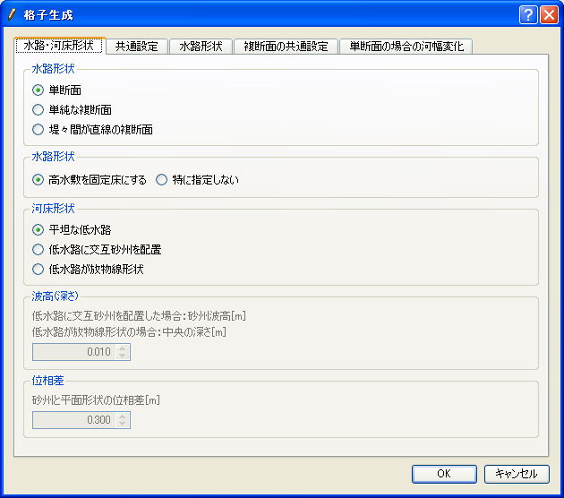

幾何学的な形状の格子を生成
=============================

パラメータを指定して、幾何学的な形状の格子を生成します。このアルゴリズム
によって生成される格子の例を
:numref:`image_example_geometric_shape_grid` に示します。

.. _image_example_geometric_shape_grid:

.. figure:: images/example_geometric_shape_grid.png

   幾何学的な形状の格子の形状例

このアルゴリズムでは、格子生成を行うより前に設定すべき生成条件は
特にありません。アルゴリズムを選択したら、メニューから「格子生成」を選択します。
:numref:`image_geometric_example_grid_creation_dialog`
に示すダイアログが表示されますので、条件を設定して「OK」ボタンを押すと
格子を生成します。

.. _image_geometric_example_grid_creation_dialog:

   格子生成条件設定ダイアログ 表示例
