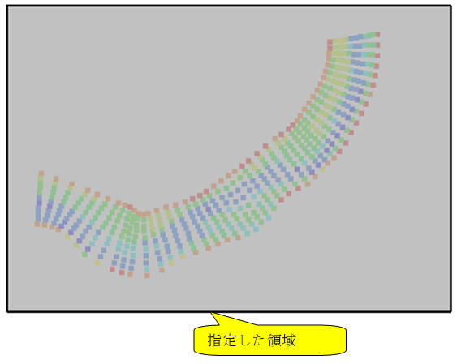
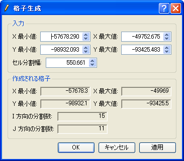

矩形領域の格子を生成
============================

矩形の領域を指定して、その領域を X
方向、Y方向に等分割した格子を生成します。このアルゴリズムによって
生成される格子の例を
:numref:`image_example_rect_region_grid` に示します。

.. _image_example_rect_region_grid:

   矩形領域の格子の形状例

このアルゴリズムを選択したら、まずは描画領域での左ドラッグにより、
格子を生成したい領域を指定します。領域を指定した直後の画面例を
:numref:`rect_example_after_region_specified` に示します。
その上でメニューから「格子生成」を選択すると、
:numref:`rect_example_grid_creation_dialog`
に示すダイアログが表示されます。

左ドラッグで指定した領域が「入力」欄にあらかじめ入力されていますので、
「適用」ボタンを押して結果を確認しながら入力欄を調整し、
「OK」ボタンを押すと格子が生成されます。

.. _rect_example_after_region_specified:

   格子生成領域指定後の画面表示例

.. _rect_example_grid_creation_dialog:

   格子生成条件ダイアログ 表示例
