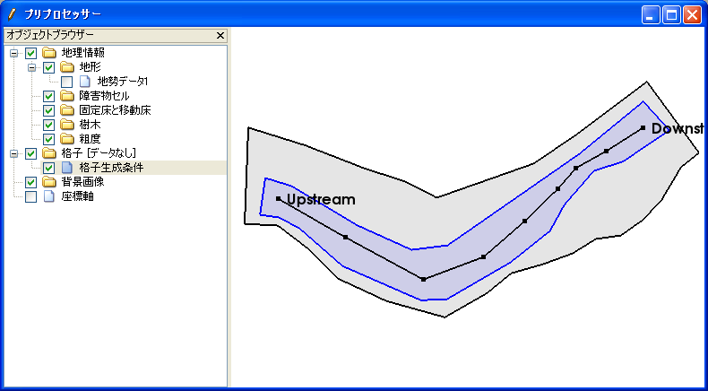
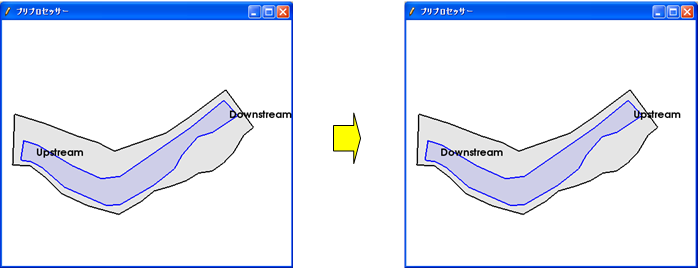

複断面格子を生成
==============================

折れ線に沿ってなめらかに曲がる構造格子を生成します。格子生成領域、低水域を
ポリゴンで指定します。生成される格子の例を
:numref:`image_compound_example_grid` に示します。

.. _image_compound_example_grid:

.. figure:: images/compound_example_grid.png

   生成される複断面格子の形状例

このアルゴリズムを選択したら、まずは描画領域でのマウスクリックで、
格子生成領域をポリゴンで定義します。ダブルクリックもしくは改行キーを押すと、
定義が完了します。次に、同様の方法で低水域領域を定義します。
続いて、格子の中心線を折れ線で定義します。
格子生成領域の定義、低水域領域の定義、中心線の定義が完了した時の
画面の表示例を
:numref:`image_compound_pre_after_grid_region`、
:numref:`image_compound_pre_after_lower_region`、
:numref:`image_compound_pre_after_centerline` に示します。

中心線の定義が完了すると、:numref:`image_compound_grid_creation_dialog`
に示すダイアログが表示されます。入力情報を調整して「OK」ボタンを押すと
格子が生成されます。「キャンセル」ボタンを押すと、
ポリゴン領域及び中心線の頂点の編集を行うことができます。
編集後、メニューから「格子生成」を選択すると、
:numref:`image_compound_grid_creation_dialog`
に示すダイアログが表示されますので、入力情報を調整して「OK」ボタンを押すと
格子が生成されます。

中心線は低水域領域の内側に、低水域領域は格子生成領域の内側にある必要があります。
この条件を満たしていない時は、ポリゴン領域及び中心線の頂点の編集を行ってから、
格子生成を行います。

.. _image_compound_pre_after_grid_region:

.. figure:: images/compound_pre_after_grid_region.png

   格子生成領域の定義完了時の表示例

.. _image_compound_pre_after_lower_region:

   低水域領域の定義完了時の表示例

.. _image_compound_pre_after_centerline:

   格子中心線の定義完了時の表示例

.. _image_compound_grid_creation_dialog:

.. figure:: images/compound_grid_creation_dialog.png

   格子生成条件ダイアログ

ポリゴン領域及び中心線の頂点の編集は、
:ref:`sec_grid_creationg_compound_channel_menu_items` で示すメニューから行います。

.. _sec_grid_creationg_compound_channel_menu_items:

メニュー構成
----------------

複断面格子を生成するアルゴリズムを選択している時の、
格子 (G) --> 格子生成条件 (C) サブメニューの構成を
:numref:`comp_channel_menuitems_table` に示します。

.. _comp_channel_menuitems_table:

.. list-table:: 複断面格子を生成するアルゴリズムのメニューの構成
   :header-rows: 1

   * - メニュー
     - 説明
   * - 頂点の追加(A)
     - ポリゴンまたは中心線に頂点を追加します
   * - 頂点の削除(R)
     - ポリゴンまたは中心線の頂点を削除します
   * - 座標の編集(C)
     - ポリゴンまたは中心線の座標を編集します
   * - 中心線の向きを反転(E)
     - 中心線の向きを反転します
   * - 初期状態に戻す(D)
     - 編集中の格子生成条件を破棄します

頂点の追加(A)
----------------

ポリゴンまたは中心線に頂点を追加します。

編集したいポリゴンまたは中心線をクリックして選択し、
メニューを選択します。その状態で選択したポリゴンまたは中心線上
にマウスを移動すると、マウスカーソルが
:numref:`image_compound_cursor_add_vertex`
で示した形に変わります。左クリックすると、新しい頂点が追加されます。

.. _image_compound_cursor_add_vertex:

.. figure:: images/compound_cursor_add_vertex.png

   ポリゴンまたは中心線の頂点の追加が可能な時のマウスカーソル表示例

頂点の削除(R)
-------------------

ポリゴンまたは中心線の頂点を削除します。

編集したいポリゴンまたは中心線をクリックして選択し、メニューを選択します。
その状態で、選択したポリゴンまたは中心線上の頂点にマウスを移動すると、
マウスカーソルが
:numref:`image_compound_cursor_remove_vertex`
で示した形に変わります。左クリックすると、選択した頂点が削除されます。

.. _image_compound_cursor_remove_vertex:

.. figure:: images/compound_cursor_remove_vertex.png

   ポリゴンまたは中心線の頂点の削除が可能な時のマウスカーソル表示例

座標の編集(C)
----------------------

ポリゴンまたは中心線の頂点の座標を編集します。

編集したいポリゴンまたは中心線をクリックして選択し、
メニューを選択すると、頂点座標の編集ダイアログ
(:numref:`image_comp_channel_polygon_coords_dialog` 参照)
が表示されますので、頂点の座標を編集して「OK」ボタンを押します。

.. _image_comp_channel_polygon_coords_dialog:

   座標の編集ダイアログ 表示例

中心線の向きを反転(E)
--------------------------------------

中心線の向きを反転します。例を
:numref:`image_comp_channel_example_center_line_reversing` に示します。

.. _image_comp_channel_example_center_line_reversing:

   中心線の向きの反転 表示例

初期状態に戻す(D)
----------------------

編集中の格子生成条件を破棄します。

格子生成領域の定義から格子生成条件を設定し直します。
