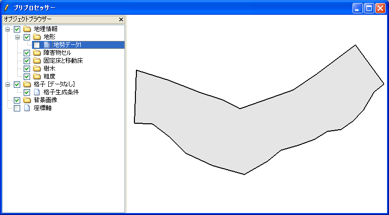
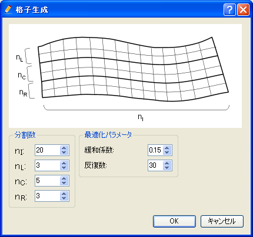

[Create compound channel grid]
==============================

**Description**: Creates a grid that has lower channel, by defining grid
creating region and lower channel region.
:numref:`image_compound_example_grid` shows an example
of created grig.

.. _image_compound_example_grid:

.. figure:: images/compound_example_grid.png
   :width: 200pt

   Example of grid created by [Create compound channel grid]

After selecting this algorithm, define grid creating region as a polygon
in canvas, by mouse-clicking. Finish defining by double-clicking or by
pressing Enter key. Next, define low lower channel as a polygon in the
same way. Next, define center line of grid as polygonal line.
:numref:`image_compound_pre_after_grid_region`,
:numref:`image_compound_pre_after_lower_region`, and
:numref:`image_compound_pre_after_centerline` show examples.

When the center line is defined, the [Grid Creation] dialog
(:numref:`image_compound_grid_creation_dialog`) will open.
Input the grid creating condition and click on [OK] to
create a grid.

Center line has to be inside low water channel region, and low water
channel region have to be inside grid creating region. If this condition
is not matched, a warning dialog will be shown, and you'll have to
modify conditions before creating a grid.

.. _image_compound_pre_after_grid_region:

   [Pre-processing Window] after defining grid creating region

.. _image_compound_pre_after_lower_region:

.. figure:: images/compound_pre_after_lower_region.png
   :width: 360pt

   [Pre-processing Window] after defining lower channel region

.. _image_compound_pre_after_centerline:

.. figure:: images/compound_pre_after_centerline.png
   :width: 360pt

   [Pre-processing Window] after defining grid center line

.. _image_compound_grid_creation_dialog:

   [Grid Creation] dialog

Regions and center lines can be edited using the menu items explained in
:ref:`sec_grid_creationg_compound_channel_menu_items`.

.. _sec_grid_creationg_compound_channel_menu_items:

Menu items
----------

:numref:`comp_channel_menuitems_table` shows the sub menu items of
[Grid] (G) --> [Grid Creating Conditions] (C) when
[Create compound channel grid] is selected as the grid creating algorithm.

.. _comp_channel_menuitems_table:

.. list-table:: Menu items for algorithm [Create compound channel grid]
   :header-rows: 1

   * - Menu
     - Description
   * - [Add Vertex] (A)
     - Add a vertex to the region (or center line) that is currently selected.
   * - [Remove Vertex] (R)
     - Remove a vertex from the region (or center line) that is currently selected.
   * - [Edit Coordinates] (O)
     - Edit coordinates of the region (or center line) that is currently selected.
   * - [Line Direction] (E)
     - Reverse the direction of center line.
   * - [Reset to Default] (D)
     - Discard the grid creating condition and reset to default state.

[Add Vertex] (A)
----------------

**Description**: Adds a vertex to the region (or center line) that is
currently selected.

When you select [Add Vertex] and move the cursor to the edge of region
(or center line), the cursor changes to that shown in
:numref:`image_compound_cursor_add_vertex`. Left
click on the line and drag it to add a new vertex. The vertex is placed
where you release the left button.

.. _image_compound_cursor_add_vertex:

   Mouse cursor when possible to add a vertex

[Remove Vertex] (R)
-------------------

**Description**: Deletes a vertex from the region (or center line) that is
currently selected..

When you select [Remove Vertex] and move the cursor onto the vertex you
want to remove, the cursor changes to that shown in
:numref:`image_compound_cursor_remove_vertex`. Left
clicking will remove the vertex.

.. _image_compound_cursor_remove_vertex:

.. figure:: images/compound_cursor_remove_vertex.png
   :width: 20pt

   Mouse cursor when possible to remove a vertex

[Edit coordinates] (C)
----------------------

**Description**: Edits the coordinates of the vertices of the region (or
center line) that is currently selected.

When you select [Edit Coordinates], the [Polygon Coordinates] dialog
(:numref:`image_comp_channel_polygon_coords_dialog`) will open.
Edit the coordinates and click on [OK].

.. _image_comp_channel_polygon_coords_dialog:

.. figure:: images/comp_channel_polygon_coords_dialog.png
   :width: 170pt

   [Polygon Coordinates] dialog

[Reverce Center Line Direction] (E)
--------------------------------------

**Description**: Reverce the center line direction.
:numref:`image_comp_channel_example_center_line_reversing`
shows an example. Note that the "Upstream" and "Downstream" are reversed.

.. _image_comp_channel_example_center_line_reversing:

.. figure:: images/comp_channel_example_center_line_reversing.png
   :width: 440pt

   Example of center line before and after reversing

[Reset to Default] (D)
----------------------

**Description**: Discard the grid creating condition and reset to the
default status.
