.. _sec_grid_creation_laplace:

ラプラス方程式を解いて格子を生成
=================================

格子を生成する領域を、定義して、
囲まれた領域内について、ラプラス方程式を解いて格子点の位置を収束計算により求めることによって格子を生成します。

ラプラス方程式を解くことにより、生成される格子のセルの形状は、どれも正方形に近い
ものとなり、ソルバによる計算が安定しやすくなります。

また、このアルゴリズムでは、流れ方向、横断方向に定義する分割線の数に制限がありません。
そのため、自由に分割線を定義することにより、低水敷の境界線を格子線としたり、合流点の格子を
生成したりすることができます。

このアルゴリズムによって生成される格子の例を
:numref:`image_laplace_example_grid1` ～ :numref:`image_laplace_example_grid4`
に示します。

.. _image_laplace_example_grid1:

.. figure:: images/laplace_example_grid1.png
   :width: 300pt

   ポアソン方程式を解いて生成する格子の形状例(1)

.. _image_laplace_example_grid2:

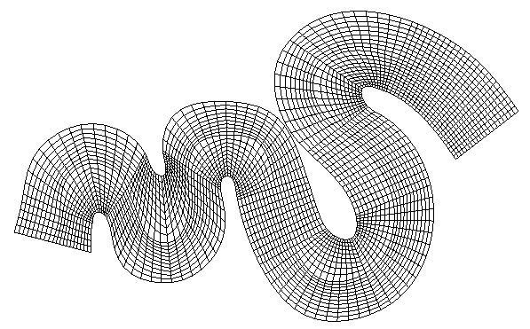

   ポアソン方程式を解いて生成する格子の形状例(2)

.. _image_laplace_example_grid3:

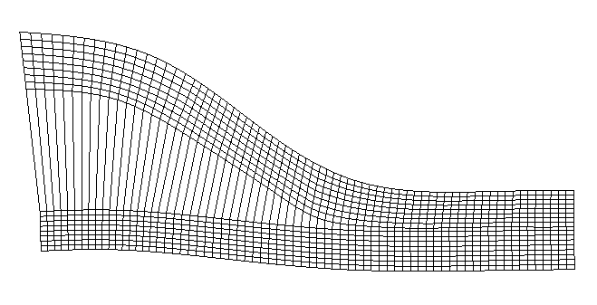

   ポアソン方程式を解いて生成する格子の形状例(3)

.. _image_laplace_example_grid4:

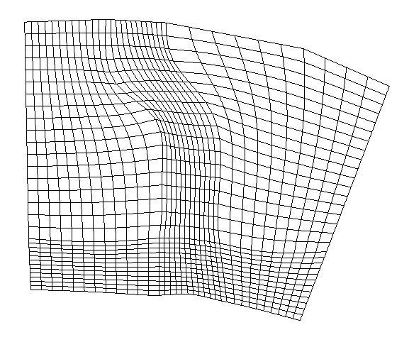

   ポアソン方程式を解いて生成する格子の形状例(4)

このアルゴリズムを選択したら、もし河川測量データがインポートされていた場合は、
コントロール断面数の指定ダイアログ
(:numref:`image_laplace_select_control_xsec_dialog` 参照)が表示されます。
コントロール断面数を指定して「OK」ボタンを押すと、
:numref:`image_laplace_centerline_example` に示すように、河川測量データの
河川中心点をつなぐ形で中心線が定義された状態になります。

河川測量データがインポートされていなかった場合は、手動で中心線を定義します。

.. _image_laplace_select_control_xsec_dialog:

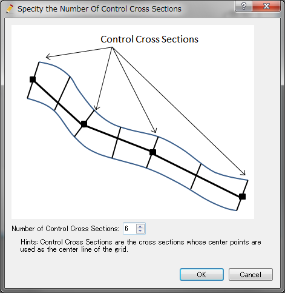

   コントロール断面数の指定ダイアログ

.. _image_laplace_centerline_example:

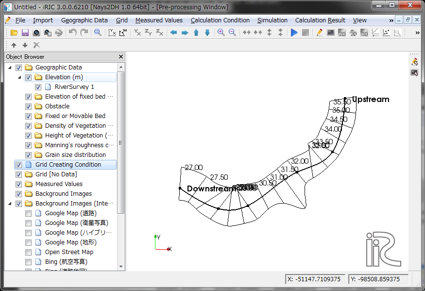

   中心線の定義例

次に、左岸線と右岸線を生成します。メニューから「左岸線・右岸線の生成」を選択します。
すると、:numref:`image_laplace_banks_dialog` に示す岸線の生成ダイアログが
表示されます。ここで、左岸線、右岸線を中心線からどれだけ距離を離したところに生成するか
を指定して「OK」ボタンを押すと、 :numref:`image_laplace_banks_example` に
示すように左岸線、右岸線が生成されます。

.. _image_laplace_banks_dialog:

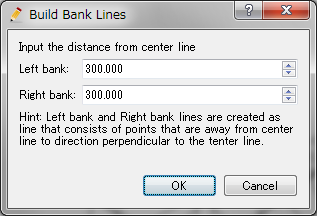

   岸線の生成ダイアログ

.. _image_laplace_banks_example:

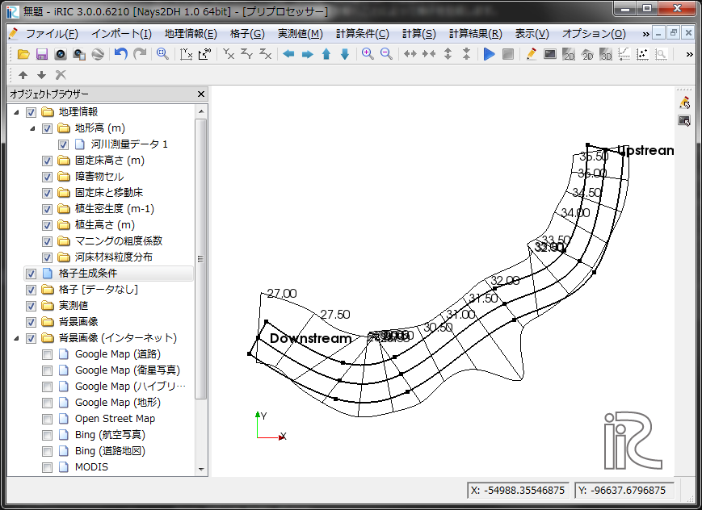

   左岸線・右岸線の生成例

左岸線、右岸線ができた後は、必要に応じて、線を構成する点を移動したり、
領域を分割したりします。

格子を生成したい領域を定義できたら、以下を選択します。

**メニュー**: モードの切替 (S) --> 分割設定モード (D)

:numref:`image_laplace_dividesetting_example` に
示すように、領域の縁に格子分割の位置が表示されます。

.. _image_laplace_dividesetting_example:

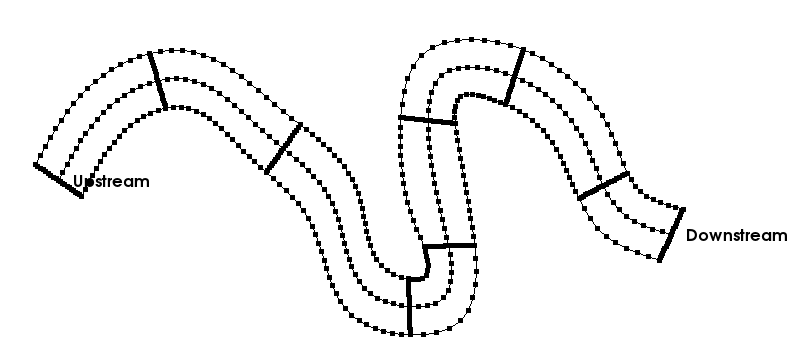

   分割設定モード 表示例

以下を選択することで、領域全体の分割数を設定することができます。

**メニュー**: 格子 (G) --> 格子生成条件 (G) --> 領域全体の分割設定 (W)

:numref:`image_laplace_divisionsetting_wholeregion_dialog` に示す
ダイアログが表示されますので、分割数を指定して「OK」ボタンを押すと、
領域全体の分割数が設定されます。

.. _image_laplace_divisionsetting_wholeregion_dialog:

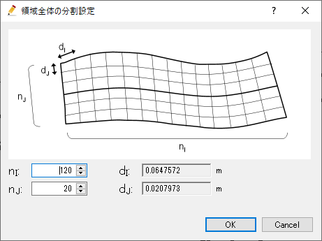

   領域全体の分割設定ダイアログ

区間ごとに分割数を個別に指定することもできます。区間ごとの分割数を指定する
には、指定したい区間の線を選択した上で、以下を選択します。

**メニュー**: 格子 (G) --> 格子生成条件 (G) --> 分割設定 (D)

最後に、メニューから「格子生成」を選択します。すると、作成した格子生成条件
に基づいて、格子が生成されます。

.. _image_laplace_grid_example:

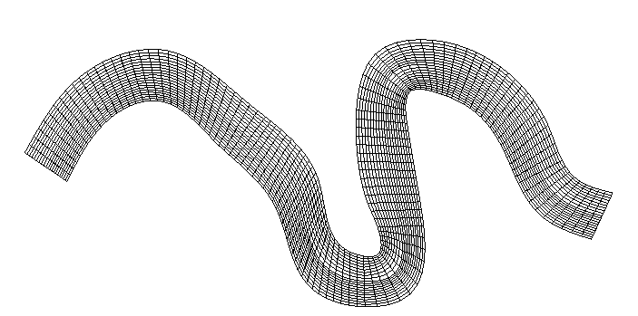

   生成される格子の例

メニュー構成
--------------------

ラプラス方程式を解いて生成するアルゴリズムを選択している時の、
格子 (G) --> 格子生成条件 (C) サブメニューの構成を
:numref:`laplace_menuitems_table_centeronly` 、
:numref:`laplace_menuitems_table_regiondefined` 、
:numref:`laplace_menuitems_table_divisionsetting` 
に示します。

.. _laplace_menuitems_table_centeronly:

.. list-table:: メニューの構成 (左右岸 定義前)
   :header-rows: 1

   * - メニュー
     - 説明
   * - 左岸線・右岸線の生成
     - 左岸線・右岸線を生成します
   * - 点の追加 (A)
     - 中心線に頂点を追加します
   * - 点の削除 (R)
     - 中心線から頂点を削除します
   * - 座標の編集 (E)
     - 中心線の頂点座標を編集します

.. _laplace_menuitems_table_regiondefined:

.. list-table:: メニューの構成 (形状編集モード)
   :header-rows: 1

   * - メニュー
     - 説明
   * - 左岸線・右岸線の生成
     - 左岸線・右岸線を生成します
   * - モードの切替 (S)
     - 形状編集モード・分割設定モードの間でモードを切り替えます
   * - 領域の分割 (D)
     - 領域内に線を追加し、領域を分割します
   * - 領域の結合 (J)
     - 現在選択されている線を削除し、線で区切られた2つの領域を結合します
   * - 補間モード (I)
     - 現在選択されている線の補間モードを、スプライン補間と線形補間の間で切り替えます
   * - 点の追加 (A)
     - 中心線に頂点を追加します
   * - 点の削除 (R)
     - 中心線から頂点を削除します
   * - 座標の編集 (E)
     - 中心線の頂点座標を編集します

.. _laplace_menuitems_table_divisionsetting:

.. list-table:: メニューの構成 (分割設定モード)
   :header-rows: 1

   * - メニュー
     - 説明
   * - モードの切替 (S)
     - 形状編集モード・分割設定モードの間でモードを切り替えます
   * - 領域全体の分割設定 (W)
     - 領域全体の分割数を設定します
   * - 分割設定 (S)
     - 現在選択されている線の分割数を設定します
   * - 点の配置設定 (P)
     - 現在選択されている線上での点の配置方法を設定します

左岸線・右岸線の生成
---------------------------

左岸線・右岸線を生成します。

:numref:`image_laplace_banks_dialog` に示すダイアログが表示されますので、
中心線から左岸線・右岸線までの距離を入力して「OK」ボタンを押します。

生成される左岸線と右岸線の例を :numref:`image_laplace_banks_example` に示します。

生成した左岸線と右岸線は、頂点をマウスカーソルでドラッグすることにより、変形することができます。

点の追加 (A)
----------------

中心線もしくは領域を定義する線に頂点を追加します。

このメニューを選択した後、中心線もしくは左右岸線の上に
カーソルを移動すると、
:numref:`image_laplace_add_vertex_cursor`
で示すカーソルに変化します。この状態でマウスの左ボタンを押してドラッグすると、
新しい頂点が追加できます。マウスの左ボタンを離すと、頂点の位置が確定します。

.. _image_laplace_add_vertex_cursor:

.. figure:: images/laplace_add_vertex_cursor.png
   :width: 20pt

   頂点の追加が可能な時のマウスカーソル

点の削除 (R)
-------------------

中心線もしくは領域を定義する線から頂点を削除します。

このメニューを選択した後、中心線もしくは領域を定義する線の上に
ある点の上にカーソルを移動すると、
:numref:`image_laplace_remove_vertex_cursor`
で示すカーソルに変化します。この状態でマウスの左ボタンを押すと、
頂点が削除されます。

.. _image_laplace_remove_vertex_cursor:

.. figure:: images/laplace_remove_vertex_cursor.png
   :width: 20pt

   頂点の削除が可能な時のマウスカーソル

.. _subsec_laplace_editcoords:

座標の編集 (T)
----------------------

中心線もしくは現在選択されている線の頂点座標を編集します。

頂点座標を編集するダイアログ
(:numref:`image_laplace_coordinates_dialog` 参照)
が表示されますので、座標を編集して「OK」ボタンを押します。

.. _image_laplace_coordinates_dialog:

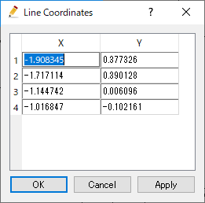

   頂点の座標編集ダイアログ

モードの切替 (S)
----------------------

形状編集モード・分割設定モードの間でモードを切り替えます。

形状編集モードでは、格子を生成する領域を定義する線の編集を行えます。形状編集
モードでは、領域を定義する線と、その線の形状を編集するための制御点が表示されます。

分割設定モードでは、格子を生成する領域を構成する線分を、それぞれどのように分割するか
の設定を行います。分割設定モードでは、領域を定義する線と、その線の上に生成される格子点の位置が
表示されます。

形状編集モードでの表示例を
:numref:`image_laplace_region_edit_mode_example` に、
分割設定モードでの設定例を
:numref:`image_laplace_division_setting_mode_example` にそれぞれ示します。

.. _image_laplace_region_edit_mode_example:

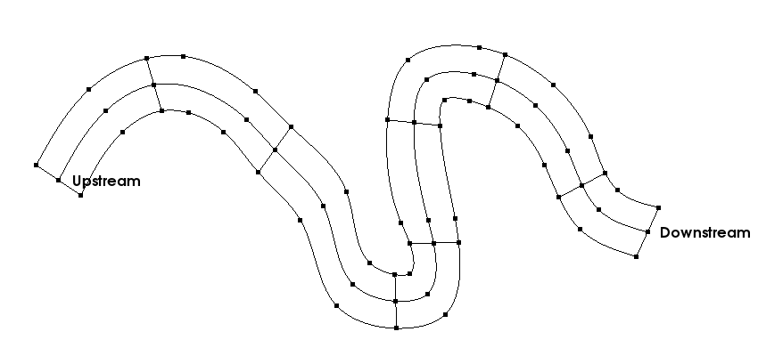

   形状編集モード 表示例

.. _image_laplace_division_setting_mode_example:

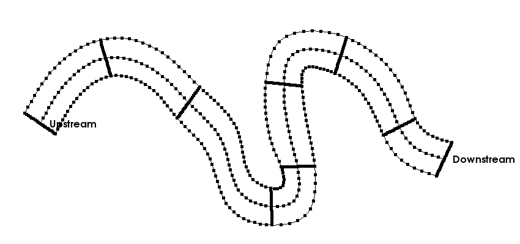

   分割設定モード 表示例

領域の分割 (D)
----------------------

領域内に線を追加し、領域を分割します。

領域を分割するモードになると、領域の外側の縁の線の上にマウスカーソルを移動すると、
マウスカーソルが :numref:`image_laplace_add_vertex_cursor` に示す形状に
変化します。この状態でマウスをクリックすると、領域の外側の縁の線の上に新しい分割線の
開始点が作成されます。

その後、任意の場所に点を追加して折れ線形状を定義した上で、反対側の縁の
線の上にマウスカーソルを移動すると、再度マウスカーソルが 
:numref:`image_laplace_add_vertex_cursor` に示す形状に変化します。
この状態でマウスをクリックすると、領域の分割が実行されます。

領域の分割は、流れ方向にも横断方向にも任意の数だけ行えます。

領域の分割前の表示例を :numref:`image_laplace_divide_region_before` に、
分割後の表示例を :numref:`image_laplace_divide_region_after` にそれぞれ示します。

.. _image_laplace_divide_region_before:

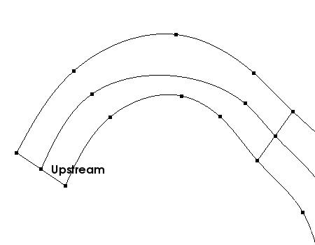

   領域の分割前 表示例

.. _image_laplace_divide_region_after:

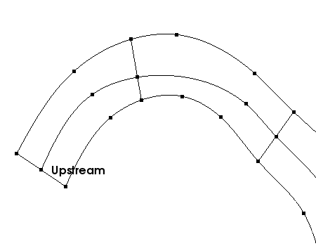

   領域の分割後 表示例

領域の結合 (J)
----------------------

現在選択されている線を削除し、線で区切られた2つの領域を結合します

このメニューを選択するには、先に領域の内側の線を選択します。

メニューを選択すると、 :numref:`image_laplace_join_confirm_dialog`
に示すダイアログが表示されます。ダイアログで「はい」ボタンを押すと、
領域の結合が実行されます。

領域の結合前の表示例を :numref:`image_laplace_join_region_before` に、
結合後の表示例を :numref:`image_laplace_join_region_after`
にそれぞれ示します。

.. _image_laplace_join_confirm_dialog:

   領域の結合 確認ダイアログ

.. _image_laplace_join_region_before:

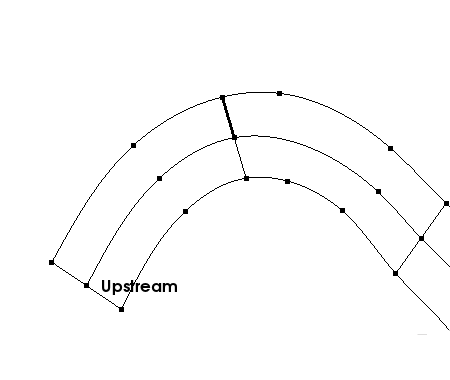

   領域の結合前 表示例

.. _image_laplace_join_region_after:

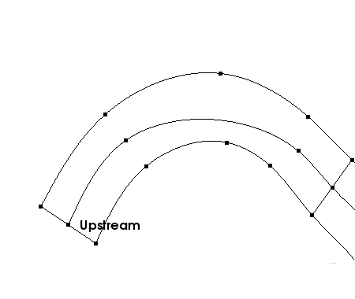

   領域の結合後 表示例

補間モード (I)
------------------

現在選択されている線の補間モードを、スプライン補間と線形補間の間で切り替えます。

スプライン補間の例を :numref:`image_laplace_interpolation_spline_example` に、
線形補間の例を :numref:`image_laplace_interpolation_linear_example`
にそれぞれ示します。

.. _image_laplace_interpolation_spline_example:

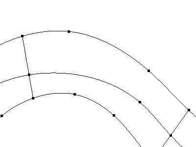

   スプライン補間 表示例

.. _image_laplace_interpolation_linear_example:

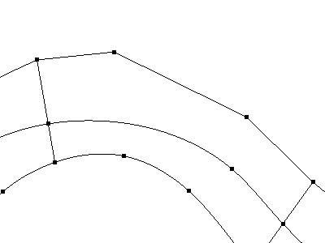

   線形補間 表示例

領域全体の分割設定 (W)
------------------------

領域全体の分割数を設定します。

:numref:`image_laplace_divisionsetting_wholeregion_dialog` に示す
ダイアログが表示されますので、分割数を指定して「OK」ボタンを押します。
dI, dJ には、指定した分割数で分割した際の、平均的なセルの I 方向、J方向の
セル幅が表示されます。

分割設定 (D)
---------------

現在選択している線の分割数を設定します。

:numref:`image_laplace_divisionsetting_dialog` に示す
ダイアログが表示されますので、分割数を指定して「OK」ボタンを押します。

.. _image_laplace_divisionsetting_dialog:

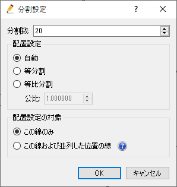

   分割設定 ダイアログ

点の配置設定 (P)
-----------------

現在選択されている線上での点の配置方法を設定します。

:numref:`image_laplace_deploysetting_dialog` に示す
ダイアログが表示されますので、点の配置方法を指定して「OK」ボタンを押します。

ダイアログに示す通り、点の配置方法は以下から選択できます。

- 等分割
- 等比分割

等分割での配置例を :numref:`image_laplace_deploy_equally_example` に、
等比分割での配置例を :numref:`image_laplace_deploy_geometric_example`
にそれぞれ示します。

.. _image_laplace_deploysetting_dialog:

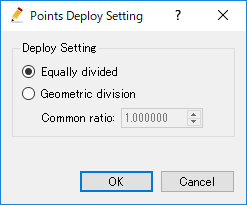

   点の配置設定 ダイアログ

.. _image_laplace_deploy_equally_example:

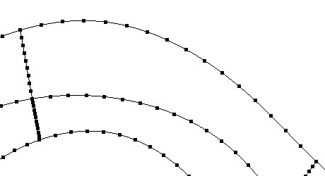

   等分割での配置例

.. _image_laplace_deploy_geometric_example:

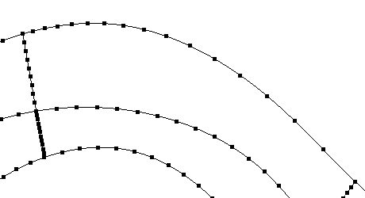

   等比分割での配置例

初期状態に戻す(R)
----------------------

格子生成条件を破棄し、初期状態に戻します。
