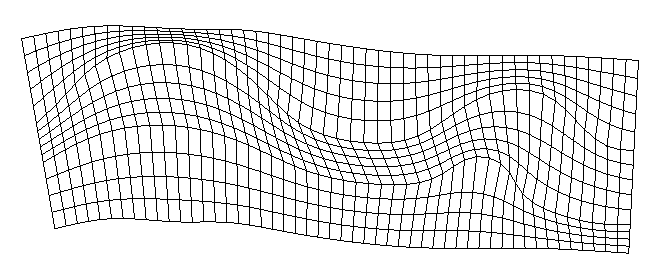
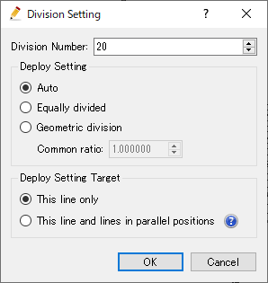
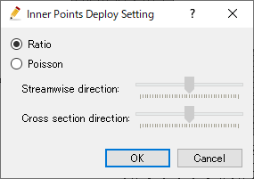

.. _sec_grid_creation_laplace:

汎用格子生成ツール
===================

格子を生成する領域を、定義して、
囲まれた領域内について、格子点の位置を収束計算により求めることによって格子を生成します。

このツールでは、流れ方向、横断方向に定義する分割線の数に制限がありません。
そのため、自由に分割線を定義することにより、低水敷の境界線を格子線としたり、合流点の格子を
生成したりすることができます。

このアルゴリズムによって生成される格子の例を
:numref:`image_laplace_example_grid1` ～ :numref:`image_laplace_example_grid4`
に示します。

.. _image_laplace_example_grid1:

   汎用格子生成ツールで生成する格子の形状例(1)

.. _image_laplace_example_grid2:

.. figure:: images/laplace_example_grid2.png
   :width: 300pt

   汎用格子生成ツールで生成する格子の形状例(2)

.. _image_laplace_example_grid3:

.. figure:: images/laplace_example_grid3.png
   :width: 300pt

   汎用格子生成ツールで生成する格子の形状例(3)

.. _image_laplace_example_grid4:

   汎用格子生成ツールで生成する格子の形状例(4)

このアルゴリズムを選択したら、もし河川測量データがインポートされていた場合は、
コントロール断面数の指定ダイアログ
(:numref:`image_laplace_select_control_xsec_dialog` 参照)が表示されます。
コントロール断面数を指定して「OK」ボタンを押すと、
:numref:`image_laplace_centerline_example` に示すように、河川測量データの
河川中心点をつなぐ形で中心線が定義された状態になります。

河川測量データがインポートされていなかった場合は、手動で中心線を定義します。

.. _image_laplace_select_control_xsec_dialog:

.. figure:: images/laplace_select_control_xsec_dialog.png
   :width: 220pt

   コントロール断面数の指定ダイアログ

.. _image_laplace_centerline_example:

   中心線の定義例

次に、左岸線と右岸線を生成します。メニューから「左岸線・右岸線の生成」を選択します。
すると、:numref:`image_laplace_banks_dialog` に示す岸線の生成ダイアログが
表示されます。ここで、左岸線、右岸線を中心線からどれだけ距離を離したところに生成するか
を指定して「OK」ボタンを押すと、 :numref:`image_laplace_banks_example` に
示すように左岸線、右岸線が生成されます。

.. _image_laplace_banks_dialog:

.. figure:: images/laplace_banks_dialog.png
   :width: 200pt

   岸線の生成ダイアログ

.. _image_laplace_banks_example:

.. figure:: images/laplace_banks_example.png
   :width: 340pt

   左岸線・右岸線の生成例

左岸線、右岸線ができた後は、必要に応じて、線を構成する点を移動したり、
領域を分割したりします。

格子を生成したい領域を定義できたら、以下を選択します。

**メニュー**: 格子 (G) -> 格子生成 (C)

すると、 :numref:`image_laplace_divisionsetting_wholeregion_dialog` に示す
ダイアログが表示されます。
ここで、領域の分割数を指定して「格子の生成 (G)」ボタンを押すと、
:numref:`image_laplace_grid_example` に示すような格子が生成されます。

.. _image_laplace_divisionsetting_wholeregion_dialog:

.. figure:: images/laplace_divisionsetting_wholeregion_dialog.png
   :width: 240pt

   格子生成ダイアログ

.. _image_laplace_grid_example:

.. figure:: images/laplace_grid_example.png
   :width: 360pt

   生成される格子の例

単純な格子を作りたい場合は上記手順で十分ですが、汎用格子生成ツールでは、
格子の分割数やセル幅の変化方法、領域内の格子点の配置方法などを細かく
制御できます。詳細は以下を参照してください。

メニュー構成
--------------------

汎用格子生成ツールを選択している時の、
格子 (G) --> 格子生成条件 (C) サブメニューの構成を
:numref:`laplace_menuitems_table_centeronly` 、
:numref:`laplace_menuitems_table_regiondefined` 、
に示します。

.. _laplace_menuitems_table_centeronly:

.. list-table:: メニューの構成 (左右岸 定義前)
   :header-rows: 1

   * - メニュー
     - 説明
   * - 左岸線・右岸線の生成
     - 左岸線・右岸線を生成します
   * - 点の追加 (A)
     - 中心線に頂点を追加します
   * - 点の削除 (R)
     - 中心線から頂点を削除します
   * - 座標の編集 (E)
     - 中心線の頂点座標を編集します

.. _laplace_menuitems_table_regiondefined:

.. list-table:: メニューの構成 (左右岸 定義後)
   :header-rows: 1

   * - メニュー
     - 説明
   * - 左岸線・右岸線の生成 (B)
     - 左岸線・右岸線を生成します
   * - 分割線の追加 (D)
     - 領域内に分割線を追加し、領域を分割します
   * - 分割線の削除 (I)
     - 現在選択されている分割線を削除し、分割線で区切られた2つの領域を結合します
   * - 点の追加 (A)
     - 線に頂点を追加します
   * - 点の削除 (R)
     - 線から頂点を削除します
   * - 選択した線の分割設定 (D)
     - 現在選択されている線の分割設定を編集します
   * - 選択した領域の点の配置設定 (D)
     - 現在選択されている線の分割数と分割方法を設定します
   * - 分割設定の削除 (D)
     - 分割数の設定を削除します。

左岸線・右岸線の生成 (B)
---------------------------

左岸線・右岸線を生成します。

:numref:`image_laplace_banks_dialog` に示すダイアログが表示されますので、
中心線から左岸線・右岸線までの距離を入力して「OK」ボタンを押します。

生成される左岸線と右岸線の例を :numref:`image_laplace_banks_example` に示します。

生成した左岸線と右岸線は、頂点をマウスカーソルでドラッグすることにより、変形することができます。

点の追加 (A)
----------------

線に頂点を追加します。

このメニューを選択した後、線の上にカーソルを移動すると、
:numref:`image_laplace_add_vertex_cursor`
で示すカーソルに変化します。この状態でマウスの左ボタンを押してドラッグすると、
新しい頂点が追加できます。マウスの左ボタンを離すと、頂点の位置が確定します。

.. _image_laplace_add_vertex_cursor:

.. figure:: images/laplace_add_vertex_cursor.png
   :width: 20pt

   頂点の追加が可能な時のマウスカーソル

点の削除 (R)
-------------------

線から頂点を削除します。

このメニューを選択した後、線の上にある点の上にカーソルを移動すると、
:numref:`image_laplace_remove_vertex_cursor`
で示すカーソルに変化します。この状態でマウスの左ボタンを押すと、
頂点が削除されます。

.. _image_laplace_remove_vertex_cursor:

.. figure:: images/laplace_remove_vertex_cursor.png
   :width: 20pt

   頂点の削除が可能な時のマウスカーソル

.. _subsec_laplace_editcoords:

座標の編集 (E)
----------------------

中心線の頂点座標を編集します。

頂点座標を編集するダイアログ
(:numref:`image_laplace_coordinates_dialog` 参照)
が表示されますので、座標を編集して「OK」ボタンを押します。

.. _image_laplace_coordinates_dialog:

.. figure:: images/laplace_coordinates_dialog.png
   :width: 160pt

   頂点の座標編集ダイアログ

格子生成 (C)
------------------------

格子を生成します。

:numref:`image_laplace_divisionsetting_wholeregion_dialog` に示す
ダイアログが表示されますので、分割数を指定して「OK」ボタンを押します。
dI, dJ には、指定した分割数で分割した際の、平均的なセルの I 方向、J方向の
セル幅が表示されます。

「選択した線の分割設定 (D)」を使って、先に個別の分割設定を行ってある場合は、
ダイアログは表示されず、既に設定された分割設定に基づいて格子が生成されます。

「分割設定の削除 (C)」メニューを使用すると、分割設定が削除され、「格子生成 (C)」
メニュー選択時に再度ダイアログが表示されるようになります。

分割線の追加 (D)
----------------------

領域内に分割線を追加し、領域を分割します。

分割線の追加モードになると、領域の外側の縁の線の上にマウスカーソルを移動すると、
マウスカーソルが :numref:`image_laplace_add_vertex_cursor` に示す形状に
変化します。この状態でマウスをクリックすると、領域の外側の縁の線の上に新しい分割線の
開始点が作成されます。

その後、任意の場所に点を追加して折れ線形状を定義した上で、反対側の縁の
線の上にマウスカーソルを移動すると、再度マウスカーソルが 
:numref:`image_laplace_add_vertex_cursor` に示す形状に変化します。
この状態でマウスをクリックすると、領域の分割が実行されます。

領域の分割は、流れ方向にも横断方向にも任意の数だけ行えます。

領域の分割前の表示例を :numref:`image_laplace_divide_region_before` に、
分割後の表示例を :numref:`image_laplace_divide_region_after` にそれぞれ示します。

.. _image_laplace_divide_region_before:

.. figure:: images/laplace_divide_region_before.png
   :width: 250pt

   領域の分割前 表示例

.. _image_laplace_divide_region_after:

   領域の分割後 表示例

分割線の削除 (I)
----------------------

現在選択されている分割線を削除し、分割線で区切られた2つの領域を結合します。

このメニューを選択するには、先に領域の内側の分割線を選択します。

メニューを選択すると、 :numref:`image_laplace_join_confirm_dialog`
に示すダイアログが表示されます。ダイアログで「はい」ボタンを押すと、
領域の結合が実行されます。

領域の結合前の表示例を :numref:`image_laplace_join_region_before` に、
結合後の表示例を :numref:`image_laplace_join_region_after`
にそれぞれ示します。

.. _image_laplace_join_confirm_dialog:

.. figure:: images/laplace_join_confirm_dialog.png
   :width: 180pt

   分割線の削除 確認ダイアログ

.. _image_laplace_join_region_before:

.. figure:: images/laplace_join_region_before.png
   :width: 250pt

   分割線の削除前 表示例

.. _image_laplace_join_region_after:

.. figure:: images/laplace_join_region_after.png
   :width: 250pt

   分割線の削除後 表示例

選択した線の分割設定 (D)
----------------------------

現在選択している線の分割設定を編集します。

分割設定を行いたい線をクリックして選択した上で、このメニューを選択して
ください。選択された点は、太線で表示されます。

:numref:`image_laplace_divisionsetting_dialog` に示す
ダイアログが表示されますので、設定を行って「OK」ボタンを押します。

.. _image_laplace_divisionsetting_dialog:

   分割設定 ダイアログ

.. note:: 配置設定の「自動」について

   「配置設定」で「自動」を選択すると、以下のように分割設定が行われます。

   * この線の上の点は、線を等比分割するように配置されます。
   * 公比は、隣の線との境界で、格子のセルの幅がなるべく近くなるように
     収束計算により求められます。

    「自動」設定を使うと、格子のセル幅がなるべくなめらかに変化するように
    格子を生成することができますが、各線の分割数の設定によっては、極端に
    大きい公比が設定され、計算に適さない格子が生成されることがあります。
    
    そのような場合は、「等分割」、「等比分割」の設定を選択し、手動で
    適切な設定を行って下さい。

.. note:: 配置設定の対象について

   「配置設定の対象」は、デフォルトは「この線のみ」ですが、
   「この線および並列した位置の線」を選択することもできます。

   「この線および並列した位置の線」を選択すると、例えば流れ方向の線を
   選択していた場合、左右岸方向に並んでいる全ての線に対し、同じ設定を
   行うことができます。

選択した領域の点の配置設定 (D)
--------------------------------

現在選択されている領域内の点の配置方法を設定します。

点の配置設定を行いたい領域をクリックして選択した上で、このメニューを
選択してください。選択された領域は、背景を灰色に塗られて表示されます。

:numref:`image_laplace_deploysetting_dialog` に示す
ダイアログが表示されますので、点の配置方法を指定して「OK」ボタンを押します。

ダイアログに示す通り、点の配置方法は以下から選択できます。

- 比による配置
- ポアソン方程式による配置

.. _image_laplace_deploysetting_dialog:

   点の配置設定 ダイアログ

.. note:: 点の配置設定について

   「比による配置」と「ポアソン方程式による配置」では、それぞれ以下のようなアルゴリズム
   で点が配置されます。

   * **比による配置**: 領域内の点を、格子セルの長さの比がなるべくなめらかに変化する
     ように、収束計算により求めます。

   * **ポアソン方程式による配置**: 領域内の点をの座標を、ポアソン方程式を解くことによる
     収束計算により求めます。「流れ方向」「横断方向」のスライダーを移動することにより、
     格子点を左岸側に寄せたり右岸側に寄せたりと、細かい設定が行なえます。

分割設定の削除 (C)
----------------------

全ての線の分割設定を削除します。
