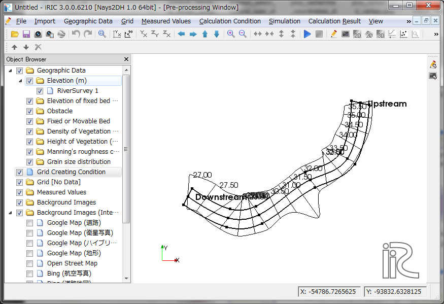

.. _sec_grid_creation_laplace:

[General purpose grid generation tool]
==============================================

Create grids by solving convergence calculation.

Grids generated by this alogrithm consists of cells whose edge lengths
changes smoothly, so it helps solvers do stable simulations.

An advantage of this tool is that there is no limitation about the
number of division lines in streamwise and cross section directions.
Because of this feature, user can use this algorithm to define grids with 
low-water channels, or for junctions of rivers.

:numref:`image_laplace_example_grid1` to :numref:`image_laplace_example_grid4`
shows examples of grids generated with the algorithm.

.. _image_laplace_example_grid1:

.. figure:: images/laplace_example_grid1.png
   :width: 300pt

   Example of a grid created by general purpose grid generation tool (1)

.. _image_laplace_example_grid2:

   Example of a grid created by general purpose grid generation tool (2)

.. _image_laplace_example_grid3:

.. figure:: images/laplace_example_grid3.png
   :width: 300pt

   Example of a grid created by general purpose grid generation tool (3)

.. _image_laplace_example_grid4:

.. figure:: images/laplace_example_grid4.png
   :width: 300pt

   Example of a grid created by general purpose grid generation tool (4)

When this algorithm is selected, if a river survey data is imported,
The dialog in :numref:`image_laplace_select_control_xsec_dialog` is shown.

When you specify the number of Control Cross Sections and click on
[OK] button, center line is defined by using the river center lines
of river survey data, as shown in 
:numref:`image_laplace_centerline_example`.

If a river survey data is not imported, user can define the center line
with mouse operations.

.. _image_laplace_select_control_xsec_dialog:

.. figure:: images/laplace_select_control_xsec_dialog.png
   :width: 220pt

   [Specify the Number of Control Cross Sections] dialog

.. _image_laplace_centerline_example:

.. figure:: images/laplace_centerline_example.png
   :width: 360pt

   Example of center line

Next, please generate left bank line and right bank line. Select
[Build Left bank and Right bank lines] from menu.
[Build Bank Lines] dialog (:numref:`image_laplace_banks_dialog`) will
be shown. When you input the distance on the dialog and click on
[OK], Left bank line and Right bank line are generated, and shown
like in :numref:`image_laplace_banks_example`.

.. _image_laplace_banks_dialog:

.. figure:: images/laplace_banks_dialog.png
   :width: 200pt

   [Build Bank Lines] dialog

.. _image_laplace_banks_example:

   Example of generated Left bank line and Right bank line

After you defined left bank and right bank lines, you can edit the points,
or divide the region, if you need to.

When you've finished defining the region to generate grid, select the
following:

**Menu**: [Grid] (G) --> [Create Grid] (C)

[Division Setting for Whole Region] dialog
(:numref:`image_laplace_divisionsetting_wholeregion_dialog`) will be shown,
so imput the numbers of divisions for streamwise direction and
cross section direction, and click on [OK] button, to generate grid like
:numref:`image_laplace_grid_example`.

.. _image_laplace_divisionsetting_wholeregion_dialog:

   [Grid generation] dialog

.. _image_laplace_grid_example:

   Example of generated grid

In cases you wan to generate simple grids, the workflow is simple as above,
but general purpose grid generating tool allow you to control the
cell edge lengths and grid node positions more precisely. Please refer to
the following sections to know how to do that.

Menu items
--------------------

:numref:`laplace_menuitems_table_centeronly` and
:numref:`laplace_menuitems_table_regiondefined`
shows the menu items for the submenu of [Grid] (G) -->
[Grid Creating Conditions] (G) when
[General purpose grid generation tool] is selected as
the grid creating algorithm. 

.. _laplace_menuitems_table_centeronly:

.. list-table:: Menu items (before building left bank and right bank lines)
   :header-rows: 1

   * - Menu
     - Description
   * - [Build Left bank and Right bank lines] (B)
     - Generate Left bank and Right bank lines.
   * - [Add Vertex] (A)
     - Adds a vertex to the lines.
   * - [Remove Vertex] (R)
     - Removes a vertex from lines.
   * - [Edit Coordinates] (E)
     - Edits the coordinates.

.. _laplace_menuitems_table_regiondefined:

.. list-table:: Menu items (after building left bank and right bank lines)
   :header-rows: 1

   * - Menu
     - Description
   * - [Build Left bank and Right bank lines] (B)
     - Generate Left bank and Right bank lines.
   * - [Add Division line] (D)
     - Add a division line inside the region.
   * - [Remove Division line] (I)
     - Remove the division line currently selected, to join the two regions separated by that line.
   * - [Add Vertex] (A)
     - Adds a vertex to the lines.
   * - [Remove Vertex] (R)
     - Removes a vertex from lines.
   * - [Division Setting for selected line] (D)
     - Edit the division setting for the line currently selected.
   * - [Deploying Setting for selected area] (D)
     - Edit the points deploying setting for the area currently selected.
   * - [Clear division Setting] (C)
     - Clear the division settings for all lines.

[Build Left bank and Right bank lines] (B)
----------------------------------------------

**Description:** Generate Left bank and Right bank lines.

Dialog in :numref:`image_laplace_banks_dialog` is shown, so 
specify the distance values and click on [OK].

:numref:`image_laplace_banks_example` shows an example of 
generated [Left Bank Line] and [Right Bank Line].

You can modify the lines by dragging the vertices.

[Add Vertex] (A)
------------------

**Description:** Add vertices to lines

When you move the mouse cursor to hover on lines after
selecting this menu, the mouse cursor changes to the shape in 
:numref:`image_laplace_add_vertex_cursor`.

Left click on the line and drag it to add a new vertex.
The vertex is placed wherever you release the left click button.

.. _image_laplace_add_vertex_cursor:

.. figure:: images/laplace_add_vertex_cursor.png
   :width: 20pt

   The mouse cursor display when adding a vertex is possible

[Remove Vertex] (R)
---------------------

**Description:** Deletes the vertex of lines.

When this is selected and you move the cursor onto the vertex of the
lines, the cursor shape will change
(:numref:`image_laplace_remove_vertex_cursor`).
Left clicking will remove the vertex.

.. _image_laplace_remove_vertex_cursor:

.. figure:: images/laplace_remove_vertex_cursor.png
   :width: 20pt

   The mouse cursor when removing the vertex is possible

.. _subsec_laplace_editcoords:

[Edit Coordinates] (E)
------------------------

**Description:** Edits the coordinates of the line currently selected.

When you select the menu, the [Line Coordinates] dialog
(:numref:`image_laplace_coordinates_dialog`) will open.
Edit the coordinates and click on [OK].

.. _image_laplace_coordinates_dialog:

.. figure:: images/laplace_coordinates_dialog.png
   :width: 160pt

   [Line Coordinates] dialog

[Create Grid] (C)
---------------------

**Description:** Crreate grid by inputting division setting.

[Division Setting for Whole Region] dialog
(:numref:`image_laplace_divisionsetting_wholeregion_dialog`) is shown,
so input the number of divisions, and click on [OK] button.
In [dI] and [dJ], the average cell width in I-direction and J-direction
are displayed. 

When you've specified division settings for lines, using
[Division Setting for selected line], the dialog is not shown, and
grid is generated based on the settings.

When you select [Clear division Setting], division settings on 
all lines are removed, and the dialog will be shown again, when 
selecting the menu.

[Add Division line] (D)
---------------------------

**Description:** Add a division line inside the region.

When in the mode to add division line, when user moves the mouse cursor
to the outer edge line of the region, the mouse cursor changes to
the shape in :numref:`image_laplace_add_vertex_cursor`.
When user clicks the left mouse button, a new point is created on the
line, and user can start defining new division line.

User can add points to define a poly line, and when user moved the
mouse cursor to the edge on the other side, the mouse cursor 
changes to the shape in :numref:`image_laplace_add_vertex_cursor` again.
When user click the left mouse button, the definition of the new line
is finished, and the region is devided.

You can divide the region with arbitrary number of lines, both in
streamwise direction and cross section direction.

An example of before and after dividing a region is shown in 
:numref:`image_laplace_divide_region_before` and
:numref:`image_laplace_divide_region_after`.

.. _image_laplace_divide_region_before:

   Example of display before adding division line

.. _image_laplace_divide_region_after:

.. figure:: images/laplace_divide_region_after.png
   :width: 250pt

   Example of display after adding division line

[Remove Division line] (I)
-----------------------------

**Description:** Remove the division line currently selected, to join
the two regions separated by that line.

To select this menu, user have to select a division line inside
the region first.

When user selec the menu, [Warning] dialog (:numref:`image_laplace_join_confirm_dialog`)
is shown. When user click on [Yes] button, removing the division line is executed.

An example of before and after removing division line is shown in 
:numref:`image_laplace_join_region_before` and 
:numref:`image_laplace_join_region_after`.

.. _image_laplace_join_confirm_dialog:

.. figure:: images/laplace_join_confirm_dialog.png
   :width: 180pt

   [Warning] dialog

.. _image_laplace_join_region_before:

   Example of display before removing a division line

.. _image_laplace_join_region_after:

   Example of display after removing a division line

[Division Setting for selected line] (D)
---------------------------------------------

**Description:** Edit the division setting for the line currently selected.

Please select the line on which you want to edit division setting,
by clicking it. The selected line is shown as a bold line.

[Division Setting] dialog
(:numref:`image_laplace_divisionsetting_dialog`) is shown, 
so edit the setting and click on [OK] button.

.. _image_laplace_divisionsetting_dialog:

.. figure:: images/laplace_divisionsetting_dialog.png
   :width: 180pt

   [Division Setting] dialog

.. note:: About [Auto] setting in [Deploy Setting]

   When you select [Auto] in [Deploy Setting], the division points
   are deployed on the line like below:

   * The points are deployed on the line with [Geometric division]
     setting.
   * The [Common ratio] value is calculated by solving convergence calculation,
     to make the ratio between the cell widths at the region boundaries 
     near to 1.

   Using [Auto] setting, you can generate grids in which the grid cell widths
   changes smoothly on grid edges. But in cases you've specified extreme settings
   as division numbers, the [Common ratio] values are calculated to be
   big value. In such cases the grid generated are not appropriate for calculation.

   In such cases, please specify the [Deploy Setting] manually, by selecting
   [Equally divided] or [Geometric division].

.. note:: About [Deploy Setting Target]

   [Deploy Setting Target] is [This line only] in default,
   but you can select [This line and lines in parallel positions].

   When you select [This line and lines in parallel positions],
   for example when you've selected a line with streamwise direction,
   the same setting is applied to the lines that exists on
   the left bank side and right bank side.

[Deploying Setting for selected area] (D)
-------------------------------------------

**Description:** Edit the points deploying setting for the area currently selected.

Before selecting the menu, select the area you want to edit deploying setting,
by clicking on the region. The selected area is painted gray.

[Points Deploying Setting] dialog
(:numref:`image_laplace_deploysetting_dialog`) is shown,
so edit the points deploying setting, and click on [OK] button.

As shown on the dialog, the points deploying setting cah be
selected from the followings:

- [Ratio]
- [Poisson]

.. _image_laplace_deploysetting_dialog:

.. figure:: images/laplace_deploysetting_dialog.png
   :width: 180pt

   [Points Deploying Setting] dialog

.. note:: About [Deploying Setting]

   For each setting, the points are deployed with the algorithms below:

   * **[Ratio]**: The point positions are calculated by solving
     convergence calculation, so that the grid cell edge lengths changes
     smoothly.

   * **[Poisson]**: The point positions are calculated by solving 
     poisson equation. By moving the sliders with labels [Streamwise direction]
     and [Cross section direction], you can control the position of points precisely,
     to move the points to left bank side or right bank side, for example.

[Clear Division Setting] (C)
------------------------------

**Description**: Clear the division setting all lines.
