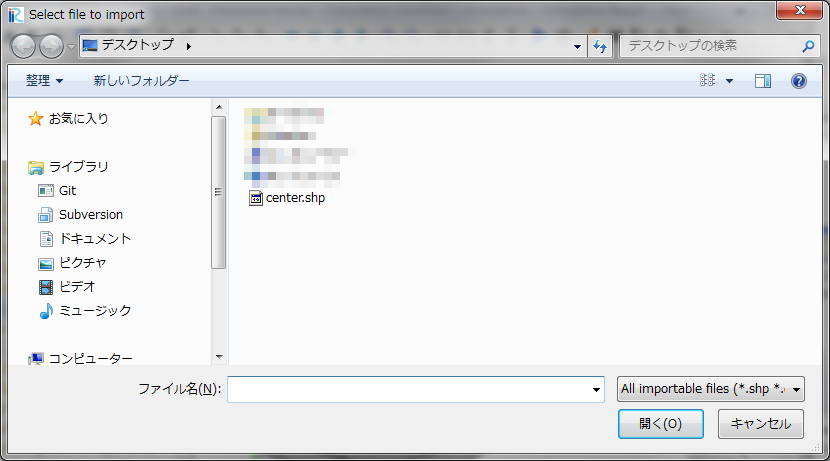

.. _sec_grid_creation_poisson:

ポアソン方程式を解いて格子を生成
=================================

格子を生成する領域を、中心線・左岸線・右岸線を用いて定義して、
囲まれた領域内について、ポアソン方程式を解くことによって格子を生成します。

ポアソン方程式を解くことにより、生成される格子のセルの形状は、どれも正方形に近い
ものとなり、ソルバによる計算が安定しやすくなります。

このアルゴリズムによって生成される格子の例を
:numref:`image_poisson_example_grid` に示します。

.. _image_poisson_example_grid:

   ポアソン方程式を解いて生成する格子の形状例

このアルゴリズムを選択したら、もし河川測量データがインポートされていた場合は、
コントロール断面数の指定ダイアログ
(:numref:`image_poisson_select_control_xsec_dialog` 参照)が表示されます。
コントロール断面数を指定して「OK」ボタンを押すと、
:numref:`image_poisson_centerline_example` に示すように、河川測量データの
河川中心点をつなぐ形で中心線が定義された状態になります。

.. _image_poisson_select_control_xsec_dialog:

.. figure:: images/poisson_select_control_xsec_dialog.png

   コントロール断面数の指定ダイアログ

.. _image_poisson_centerline_example:

.. figure:: images/poisson_centerline_example.png

   中心線の定義例

次に、左岸線と右岸線を生成します。メニューから「左岸線・右岸線の生成」を選択します。
すると、:numref:`image_poisson_banks_dialog` に示す岸線の生成ダイアログが
表示されます。ここで、左岸線、右岸線を中心線からどれだけ距離を離したところに生成するか
を指定して「OK」ボタンを押すと、 :numref:`image_poisson_banks_example` に
示すように左岸線、右岸線が生成されます。

.. _image_poisson_banks_dialog:

.. figure:: images/poisson_banks_dialog.png

   岸線の生成ダイアログ

.. _image_poisson_banks_example:

.. figure:: images/poisson_banks_example.png

   左岸線・右岸線の生成例

なお、中心線、左岸線、右岸線は、 Shapeファイル、 CSVファイルからインポートする
こともできます。

最後に、メニューから「格子生成」を選択します。すると、
:numref:`image_poisson_gridgeneration_dialog` に示す
格子生成ダイアログが表示されます。
分割数と反復計算の最大数を指定して「OK」ボタンを押すと、格子が生成されます。
生成される格子の例を :numref:`image_poisson_grid_example` に示します。

なお、反復計算の最大数を小さく指定すると、ポアソン方程式の収束が十分に行われませんので
ご注意下さい。

.. _image_poisson_gridgeneration_dialog:

.. figure:: images/poisson_gridgeneration_dialog.png

   格子生成ダイアログ

.. _image_poisson_grid_example:

.. figure:: images/poisson_grid_example.png

   生成される格子の例

メニュー構成
-------------

ポアソン方程式を解いて生成するアルゴリズムを選択している時の、
格子 (G) --> 格子生成条件 (C) サブメニューの構成を
:numref:`poisson_menuitems_table` に示します。

.. _poisson_menuitems_table:

.. list-table:: ポアソン方程式を解いて格子を生成するアルゴリズムのメニューの構成
   :header-rows: 1

   * - メニュー
     - 説明
   * - 左岸線・右岸線の生成
     - 左岸線・右岸線を生成します
   * - 頂点の追加 (A)
     - 中心線もしくは左右岸線に頂点を追加します
   * - 頂点の削除 (R)
     - 中心線もしくは左右岸線から、頂点を削除します
   * - 中心線の座標編集 (T)
     - 中心線の頂点座標を編集します
   * - 左岸線の座標編集 (C)
     - 左岸線の頂点座標を編集します
   * - 右岸線の座標編集 (H)
     - 右岸線の頂点座標を編集します
   * - 初期状態に戻す (R)
     - 格子生成条件を破棄し、初期の状態に戻します
   * - 中心線のインポート (E)
     - 中心線を、ShapeファイルもしくはCSVファイルからインポートします
   * - 左岸線のインポート (L)
     - 左岸線を、ShapeファイルもしくはCSVファイルからインポートします
   * - 右岸線のインポート (I)
     - 右岸線を、ShapeファイルもしくはCSVファイルからインポートします
   * - 中心線のエクスポート (N)
     - 中心線を、ShapeファイルもしくはCSVファイルにエクスポートします
   * - 左岸線のエクスポート (F)
     - 左岸線を、ShapeファイルもしくはCSVファイルにエクスポートします
   * - 右岸線のエクスポート (G)
     - 右岸線を、ShapeファイルもしくはCSVファイルにエクスポートします

左岸線・右岸線の生成
---------------------------

左岸線・右岸線を生成します。

:numref:`image_poisson_banks_dialog` に示すダイアログが表示されますので、
中心線から左岸線・右岸線までの距離を入力して「OK」ボタンを押します。

生成される左岸線と右岸線の例を :numref:`image_poisson_banks_example` に示します。

生成した左岸線と右岸線は、頂点をマウスカーソルでドラッグすることにより、変形することができます。

頂点の追加 (A)
----------------

中心線もしくは左右岸線に頂点を追加します。

このメニューを選択した後、中心線もしくは左右岸線の上に
カーソルを移動すると、
:numref:`image_poisson_add_vertex_cursor`
で示すカーソルに変化します。この状態でマウスの左ボタンを押してドラッグすると、
新しい頂点が追加できます。マウスの左ボタンを離すと、頂点の位置が確定します。

.. _image_poisson_add_vertex_cursor:

.. figure:: images/poisson_add_vertex_cursor.png

   頂点の追加が可能な時のマウスカーソル

頂点の削除 (R)
-------------------

中心線もしくは左右岸線から頂点を削除します。

このメニューを選択した後、中心線もしくは左右岸線の上に
カーソルを移動すると、
:numref:`image_poisson_remove_vertex_cursor`
で示すカーソルに変化します。この状態でマウスの左ボタンを押すと、
頂点が削除されます。

.. _image_poisson_remove_vertex_cursor:

   頂点の削除が可能な時のマウスカーソル

.. _subsec_poisson_center_editcoords:

中心線の座標の編集 (T)
----------------------

中心線の頂点座標を編集します。

中心線の頂点座標を編集するダイアログ
(:numref:`image_poisson_coordinates_dialog` 参照)
が表示されますので、座標を編集して「OK」ボタンを押します。

.. _image_poisson_coordinates_dialog:

   中心線の頂点座標編集ダイアログ

左岸線の座標の編集 (C)
----------------------

左岸線の頂点座標を編集します。

操作手順は :ref:`subsec_poisson_center_editcoords` と同じです。

右岸線の座標の編集 (H)
----------------------

右岸線の頂点座標を編集します。

操作手順は :ref:`subsec_poisson_center_editcoords` と同じです。

初期状態に戻す(R)
----------------------

格子生成条件を破棄し、初期状態に戻します。

.. _subsec_poisson_center_import:

中心線のインポート (E)
------------------------

中心線を、ShapeファイルもしくはCSVファイルからインポートします

:numref:`image_poisson_center_import_dialog` に示すダイアログが
表示されますので、インポートしたいファイルを選択して「開く」ボタンを押します。

.. _image_poisson_center_import_dialog:

   中心線のインポートダイアログ

左岸線のインポート (L)
------------------------

左岸線を、ShapeファイルもしくはCSVファイルからインポートします

操作手順は :ref:`subsec_poisson_center_import` と同じです。

右岸線のインポート (I)
------------------------

右岸線を、ShapeファイルもしくはCSVファイルからインポートします

操作手順は :ref:`subsec_poisson_center_import` と同じです。

.. _subsec_poisson_center_export:

中心線のエクスポート (N)
------------------------

中心線を、ShapeファイルもしくはCSVファイルにエクスポートします

:numref:`image_poisson_center_export_dialog` に示すダイアログが
表示されますので、エクスポートするファイルの名前を指定して「保存」ボタンを押します。

.. _image_poisson_center_export_dialog:

.. figure:: images/poisson_center_export_dialog.png

   中心線のエクスポートダイアログ

左岸線のエクスポート (F)
------------------------

左岸線を、ShapeファイルもしくはCSVファイルにエクスポートします

操作手順は :ref:`subsec_poisson_center_export` と同じです。

右岸線のエクスポート (G)
------------------------

右岸線を、ShapeファイルもしくはCSVファイルにエクスポートします

操作手順は :ref:`subsec_poisson_center_export` と同じです。
