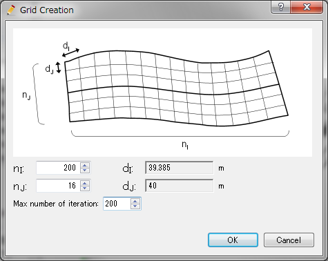

.. _sec_grid_creation_poisson:

Create grid shape solving Poisson equation
================================================

Create grids by solving poisson equation to region which is defined
by [Center line], [Left bank line], and [Right bank line].

Grids generated by this algorithm consists of cells that are similar to square,
so it helps solvers do stable simulations.

:numref:`image_poisson_example_grid` shows an example 
of a grid created by this algorithm.

.. _image_poisson_example_grid:

.. figure:: images/poisson_example_grid.png
   :width: 300pt

   Example of a grid created by solving Poisson equation

When this algorithm is selected, if a river survey data is imported,
The dialog in :numref:`image_poisson_select_control_xsec_dialog` is shown.

When you specify the number of Control Cross Sections and click on
[OK] button, center line is defined by using the river center lines
of river survey data, as shown in 
:numref:`image_poisson_centerline_example`.

.. _image_poisson_select_control_xsec_dialog:

.. figure:: images/poisson_select_control_xsec_dialog.png
   :width: 220pt

   [Specify the Number of Control Cross Sections] dialog

.. _image_poisson_centerline_example:

.. figure:: images/poisson_centerline_example.png
   :width: 360pt

   Example of center line

Next, please generate left bank line and right bank line. Select
[Build Left bank and Right bank lines] from menu.
[Build Bank Lines] dialog (:numref:`image_poisson_banks_dialog`) will
be shown. When you input the distance on the dialog and click on
[OK], Left bank line and Right bank line are generated, and shown
like in :numref:`image_poisson_banks_example`.

.. _image_poisson_banks_dialog:

.. figure:: images/poisson_banks_dialog.png
   :width: 180pt

   [Build Bank Lines] dialog

.. _image_poisson_banks_example:

.. figure:: images/poisson_banks_example.png
   :width: 340pt

   Example of generated Left bank line and Right bank line

Center line, Left bank line, Right bank line can be imported from 
Shape files or CSV files.

At last, select [Create Grid] from menu.
[Grid Creation] dialog (:numref:`image_poisson_gridgeneration_dialog`)
will be shown.

When you input the number of division, and Maximum number of iteration
on the dialog, and click on [OK], the grid is generated.

An example of generated grid is shown in
:numref:`image_poisson_grid_example`.

.. _image_poisson_gridgeneration_dialog:

   [Grid Creation] dialog

.. _image_poisson_grid_example:

.. figure:: images/poisson_grid_example.png
   :width: 360pt

   Example of generated grid

.. attention::

   When you specify a small [Max number of iteration] value, Poisson equation
   will not converge enough.

.. attention::

   When you create grids using this algorithm for strongly curved rivers,
   it sometimes occurs that grid cells get inverted, like shown in 
   :numref:`image_poisson_bad_example`. When you get grids like this, please
   try again with different values of nI and nJ, to change rate between them.

   Generally speaking, this kind of problem seldom happens when you input nI and
   nJ value to make dI and dJ values almost the same.

   .. _image_poisson_bad_example:

   .. figure:: images/poisson_bad_example.png
      :width: 200pt

      Example of grids with inverted cells

Menu items
-------------

:numref:`poisson_menuitems_table` shows the menu items for
the submenu of [Grid] (G) -->
[Grid Creating Conditions] (R) when
[Create grid shape solving Poisson equation] is selected as
the grid creating algorithm. 

.. _poisson_menuitems_table:

.. list-table:: Menu items for algorithm [Create grid shape solving Poisson equation]
   :header-rows: 1

   * - Menu
     - Description
   * - [Build Left bank and Right bank lines]
     - Generate Left bank and Right bank lines
   * - [Add Vertex] (A)
     - Adds vertices to the lines
   * - [Remove Vertex] (R)
     - Removes vertices from lines
   * - [Edit Center Line Coordinates] (T)
     - Edits the coordinates of [Center Line].
   * - [Edit Left Bank Line Coordinates] (C)
     - Edits the coordinates of [Left Bank Line].
   * - [Edit Right Bank Line Coordinates] (H)
     - Edits the coordinates of [Right Bank Line].
   * - [Reset to Default] (R)
     - Discards the grid creating conditions and reset to the default state.
   * - [Import Center Line] (E)
     - Import [Center Line] from Shape files or CSV files.
   * - [Import Left Bank Line] (L)
     - Import [Left Bank Line] from Shape files or CSV files.
   * - [Import Right Bank Line] (I)
     - Import [Right Bank Line] from Shape files or CSV files.
   * - [Export Center Line] (N)
     - Export [Center Line] to Shape files or CSV files.
   * - [Export Left Bank Line] (F)
     - Export [Left Bank Line] to Shape files or CSV files.
   * - [Export Right Bank Line] (G)
     - Export [Right Bank Line] to Shape files or CSV files.

[Build Left bank and Right bank lines]
-----------------------------------------

**Description:** Generate Left bank and Right bank lines.

Dialog in :numref:`image_poisson_banks_dialog` is shown, so 
specify the distance values and click on [OK].

:numref:`image_poisson_banks_example` shows an example of 
generated [Left Bank Line] and [Right Bank Line].

You can modify the lines by dragging the vertices.

[Add Vertex] (A)
------------------

**Description:** Add vertices to lines

When you move the mouse cursor to hover on [Center line],
[Left Bank Line], or [Right Bank Line] after selecting this menu,
The mouse cursor changes to the shape in 
:numref:`image_poisson_add_vertex_cursor`.

Left click on the line and drag it to add a new vertex.
The vertex is placed wherever you release the left click button.

.. _image_poisson_add_vertex_cursor:

.. figure:: images/poisson_add_vertex_cursor.png
   :width: 20pt

   The mouse cursor display when adding a vertex is possible

[Remove Vertex] (R)
---------------------

**Description:** Deletes the vertex of lines.

When this is selected and you move the cursor onto the vertex of the
lines, the cursor shape will change
(:numref:`image_poisson_remove_vertex_cursor`).
Left clicking will remove the vertex.

.. _image_poisson_remove_vertex_cursor:

.. figure:: images/poisson_remove_vertex_cursor.png
   :width: 20pt

   The mouse cursor when removing the vertex is possible

.. _subsec_poisson_center_editcoords:

[Edit Center Line Coordinates] (T)
---------------------------------------

**Description:** Edits the coordinates of [Center Line].

When you select the menu , the [Center Line Coordinates] dialog
(:numref:`image_poisson_coordinates_dialog`) will open.
Edit the coordinates and click on [OK].

.. _image_poisson_coordinates_dialog:

.. figure:: images/poisson_coordinates_dialog.png
   :width: 160pt

   [Center Line Coordinates] dialog

[Edit Left Bank Line Coordinates] (C)
------------------------------------------

**Description:** Edits the coordinates of [Left Bank Line].

The procedure is the same to :ref:`subsec_poisson_center_editcoords`.

[Edit Right Bank Line Coordinates] (H)
------------------------------------------

**Description:** Edits the coordinates of [Right Bank Line].

The procedure is the same to :ref:`subsec_poisson_center_editcoords`.

[Reset to Default] (R)
----------------------

**Description**: Discards the grid creating conditions and restores the
default state.

.. _subsec_poisson_center_import:

[Import Center Line] (E)
---------------------------

**Description**: Import [Center Line] from Shape files or CSV files.

The dialog in :numref:`image_poisson_center_import_dialog` is shown,
so please select the file you want to import, and click on [Open] button.

.. _image_poisson_center_import_dialog:

.. figure:: images/poisson_center_import_dialog.png
   :width: 380pt

   [Select file to import] dialog

[Import Left Bank Line] (L)
-----------------------------

**Description**: Import [Left Bank Line] from Shape files or CSV files.

The procedure is the same to :ref:`subsec_poisson_center_import`.

[Import Right Bank Line] (I)
--------------------------------

**Description**: Import [Right Bank Line] from Shape files or CSV files.

The procedure is the same to :ref:`subsec_poisson_center_import`.

.. _subsec_poisson_center_export:

[Export Center Line] (N)
--------------------------

**Description**: Export [Center Line] to Shape files or CSV files.

The dialog in :numref:`image_poisson_center_export_dialog` is shown,
so please specify the name of file you want to export, and click on [Save] button.

.. _image_poisson_center_export_dialog:

   [Select file to export] dialog

[Export Left Bank Line] (F)
----------------------------------

**Description**: Export [Left Bank Line] to Shape files or CSV files.

The procedure is the same to :ref:`subsec_poisson_center_export`.

[Export Right Bank Line] (G)
---------------------------------

**Description**: Export [Right Bank Line] to Shape files or CSV files.

The procedure is the same to :ref:`subsec_poisson_center_export`.
