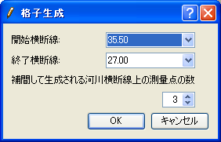
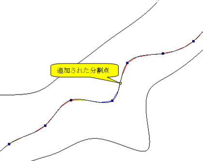

河川測量データから生成 (一次元構造格子を生成)
==========================================================

河川測量データから格子を生成します。各河川横断線の中心点のほか、
河川中心線に分割点を設定してそこに格子線を配置します。
各格子点では、横断形状の情報を持ちます。このアルゴリズムによって生成される格子の例を
:numref:`image_riv_data_1d_example_grid`
に示します。

このアルゴリズムを選択するには、あらかじめ河川測量データを
インポートしておく必要があります。

.. _image_riv_data_1d_example_grid:

   河川測量データから生成する格子の形状例

河川測量データの、河川中心点と、河川中心線上に追加した分割点に
格子点を生成します。分割点を追加した場合、分割点上に生成される格子点での
横断形状の情報は、前後の河川横断線の情報を元に自動生成されます。

メニューから「格子生成」を選択すると、
:numref:`image_riv_data_1d_grid_creation_dialog`
に示すようなダイアログが表示されます。格子を生成する領域を指定して「OK」ボタンを
押すと、分割点に基づいて格子が生成されます。分割点の操作は、
:ref:`riv_data_1d_menuitems` で示すメニューから行います。

.. _image_riv_data_1d_grid_creation_dialog:

   格子生成ダイアログ 表示例

.. _riv_data_1d_menuitems:

メニュー構成
---------------

河川測量データから生成するアルゴリズムを選択している時の、
格子 (G) --> 格子生成条件 (C) サブメニューの構成を
:numref:`riv_data_1d_menuitems_table` に示します。

.. _riv_data_1d_menuitems_table:

.. list-table:: 河川測量データから生成するアルゴリズムのメニューの構成
   :header-rows: 1

   * - メニュー
     - 説明
   * - 分割点の追加(A)
     - 選択した線上に、分割点を追加します
   * - 分割点の一括追加(R)
     - 分割点を複数の河川中心線、左岸、右岸上に一括追加します。
   * - 分割点の削除(D)
     - 選択した分割点を削除します
   * - 分割点の移動(M)
     - 選択した分割点を移動します
   * - 分割点の再配置(P)
     - 選択した分割点を再配置します

分割点の追加(A)
-------------------------

選択した線上に分割点を追加します。

まず、分割点を追加したい線 (河川中心線)
上をマウスでクリックして選択します。線が選択されている時の画面例を
:numref:`image_riv_data_1d_example_selected_line` に示します。
この状態で「分割点の追加」をメニューで選択すると、分割点の追加ダイアログ
(:numref:`image_riv_data_1d_add_div_points_dialog` 参照)
が表示されます。分割数などを指定して「OK」ボタンを押すと、分割点が追加されます
(:numref:`image_riv_data_1d_example_add_div_points` 参照)。

.. _image_riv_data_1d_example_selected_line:

.. figure:: images/riv_data_1d_example_selected_line.png

   線の選択時の画面例

.. _image_riv_data_1d_add_div_points_dialog:

   分割点の追加ダイアログ

.. _image_riv_data_1d_example_add_div_points:

   分割点の追加後の表示例

分割点の一括追加(R)
------------------------------------

分割点を複数の河川中心線上に一括追加します。

分割点の一括追加ダイアログ
(:numref:`image_riv_data_1d_add_div_points_regionally_dialog` 参照)
が表示されますので、分割点を追加する範囲と分割数を指定して「OK」ボタンを押します。

.. _image_riv_data_1d_add_div_points_regionally_dialog:

.. figure:: images/riv_data_1d_add_div_points_regionally_dialog.png

   分割点の一括追加ダイアログ

分割点の削除(D)
----------------------

選択した分割点を削除します。操作例を
:numref:`image_riv_data_1d_example_delete_div_points` に示します。

.. _image_riv_data_1d_example_delete_div_points:

   分割点の削除 操作例

分割点の移動(M)
---------------------

選択した分割点を移動します。同一の線上の連続した分割点を選択している時のみ可能です。

分割点の移動ダイアログ
(:numref:`image_riv_data_1d_move_div_points_dialog` 参照)
が表示されますので、移動量を設定して「OK」ボタンを押します。

.. _image_riv_data_1d_move_div_points_dialog:

   分割点の移動ダイアログ

分割点の再配置(P)
--------------------------------

選択した分割点を再配置します。同一の線上の連続した分割点を選択している
時のみ可能です。

分割点の再配置ダイアログ
(:numref:`image_riv_data_1d_reposition_div_point_dialog` 参照)
が表示されますので、再配置条件を設定して「OK」ボタンを押します。

.. _image_riv_data_1d_reposition_div_point_dialog:

   分割点の再配置ダイアログ
