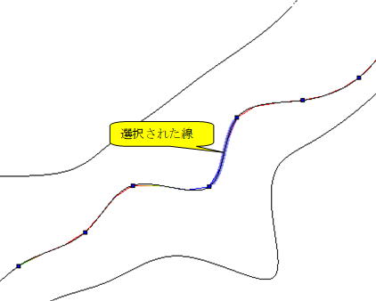
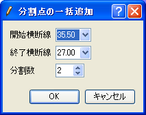

[Create grid from River Survey Data] (1-D structured grid)
==========================================================

**Description**: Creates a grid from River Survey Data. In addition to the
center point of transverse lines being set, division points are set on
the transverse lines, the river centerline and left/right bank lines.
Each node holds cross-sectional information.
:numref:`image_riv_data_1d_example_grid` shows an
example of a grid created by this algorithm.

Before using this algorithm, you need to import River Survey Data.

.. _image_riv_data_1d_example_grid:

.. figure:: images/riv_data_1d_example_grid.png
   :width: 280pt

   Example of a grid created from River Survey Data

When you select this, in River Survey Data, the nodes are made on the
river center points and on the division points that have been added to
the river centerline. When division points are added, the
cross-sectional shape data of nodes created on the division points are
automatically created from adjoining river transverse line data.

Select [Grid Creation] from the menu. The [Grid Creation] dialog
(:numref:`image_riv_data_1d_grid_creation_dialog`)
will open. Specify the region where the grid is to be made and
click on [OK]. The grid is generated according to the division points.
Manipulation of division points is done from the menu shown in
:ref:`riv_data_1d_menuitems`.

.. _image_riv_data_1d_grid_creation_dialog:

.. figure:: images/riv_data_1d_grid_creation_dialog.png
   :width: 160pt

   The [Grid Creation] dialog

.. _riv_data_1d_menuitems:

Menu items
----------

:numref:`riv_data_1d_menuitems_table` shows the menu items of the submenu of
[Grid] (G) --> [Grid Creating Conditions] (C) when
[Create grid from River Survey Data] is selected as the grid creating algorithm.

.. _riv_data_1d_menuitems_table:

.. list-table:: Menu items for algorithm [Create grid from River Survey Data]
   :header-rows: 1

   * - Menu
     - Description
   * - [Add Division Points] (A)
     - Adds division points to the selected line.
   * - [Add Division Points Regionally] (R)
     - Simultaneously adds division points to the river centerline and/or left/right bank lines.
   * - [Delete Division Points] (D)
     - Deletes the selected division points.
   * - Move Division Points (M)
     - Moves the selected division point.
   * - Reposition Division Point (P)
     - Repositions the selected division points.

[Add Division Points] (A)
-------------------------

**Description**: Adds division points to the selected line.

Select the line to which you want to add division points (e.g., river
centerline) by clicking on it.
:numref:`image_riv_data_1d_example_selected_line` shows an example
of the display after selecting a line. Then, select [Add Division Points]
from the menu. The [Add Division Point] dialog
(:numref:`image_riv_data_1d_add_div_points_dialog`) will open.
Input the number of divisions, select the division method, and click on
[OK]. Division points are added to the line
(:numref:`image_riv_data_1d_example_add_div_points`).

.. _image_riv_data_1d_example_selected_line:

   Example of a selected line

.. _image_riv_data_1d_add_div_points_dialog:

.. figure:: images/riv_data_1d_add_div_points_dialog.png
   :width: 160pt

   The [Add Division Points] dialog

.. _image_riv_data_1d_example_add_div_points:

.. figure:: images/riv_data_1d_example_add_div_points.png
   :width: 280pt

   Example of the display after division points have been added

[Add Division Points Regionally] (R)
------------------------------------

**Description**: Simultaneously adds division points on several river
centerlines.

When this is selected, the [Add Division Point Regionally] dialog
(:numref:`image_riv_data_1d_add_div_points_regionally_dialog`)
will open. Set the area where division points are added
to centerlines and the number of divisions, and click on [OK].

.. _image_riv_data_1d_add_div_points_regionally_dialog:

   The [Add Division Points Regionally] dialog

[Remove Division Points] (D)
----------------------------

**Description**: Deletes the selected division points.
:numref:`image_riv_data_1d_example_delete_div_points` shows an
example.

.. _image_riv_data_1d_example_delete_div_points:

.. figure:: images/riv_data_1d_example_delete_div_points.png
   :width: 420pt

   Example of deleting division points

[Move Division Points] (M)
--------------------------

**Description**: Moves the selected division point. This is possible when
selecting continuous division points on the same line.

When this is selected, the [Move Division Points] dialog
(:numref:`image_riv_data_1d_move_div_points_dialog`)
will open. Set [Transfer Quality] and click on [OK].

.. _image_riv_data_1d_move_div_points_dialog:

.. figure:: images/riv_data_1d_move_div_points_dialog.png
   :width: 150pt

   The [Move Division Points] dialog

[Reposition Division Points] (P)
--------------------------------

**Description**: Relocates the selected division points. This is possible
when selecting continuous division points on the same line.

When this is selected, the [Reposition Division Point] dialog
(:numref:`image_riv_data_1d_reposition_div_point_dialog`)
will open. Select [Reposition Method] and click on [OK].

.. _image_riv_data_1d_reposition_div_point_dialog:

.. figure:: images/riv_data_1d_reposition_div_point_dialog.png
   :width: 180pt

   [Reposition Division Point] dialog
