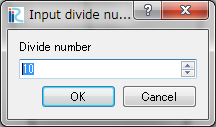

.. _sec_grid_creation_polygon:

ポリゴン形状から生成
================================

格子を生成する領域をポリゴンで指定して、非構造格子を生成します。
格子生成領域内部に、再分割領域、障害物領域を定義することもできます。
このアルゴリズムによって生成される格子の例を
:numref:`image_polygon_example_grid` に示します。

.. _image_polygon_example_grid:

   ポリゴン形状から生成する格子の形状例

このアルゴリズムを選択したら、まずは描画領域でのマウスクリックで、
格子を生成する領域をポリゴンで指定します。ダブルクリックもしくは
改行キーを押すと格子生成領域の指定が完了します。格子生成領域の指定が完了した時の
画面の表示例を
:numref:`image_polygon_after_grid_create_area` に示します。

中心線の指定が完了したら、メニューから「格子生成」を選択します。
:numref:`image_polygon_grid_creation_dialog`
に示すダイアログが表示されます。格子生成条件を設定して
「OK」ボタンを押すと、格子が生成されます。

.. _image_polygon_after_grid_create_area:

.. figure:: images/polygon_after_grid_create_area.png

   格子生成領域の定義完了時の表示例

.. _image_polygon_grid_creation_dialog:

.. figure:: images/polygon_grid_creation_dialog.png

   格子生成条件ダイアログ

メニュー構成
-------------

ポリゴンから生成するアルゴリズムを選択している時の、
格子 (G) --> 格子生成条件 (C) サブメニューの構成を
:numref:`polygon_menuitems_table` に示します。

.. _polygon_menuitems_table:

.. list-table:: ポリゴンから生成するアルゴリズムのメニューの構成
   :header-rows: 1

   * - メニュー
     - 説明
   * - 再分割領域の追加 (R)
     - セルを再分割する領域を追加します
   * - 障害物領域の追加 (H)
     - 障害物領域 (格子を生成しない領域) を追加します
   * - 分割線の追加 (B)
     - 分割線を追加します
   * - 頂点の追加 (A)
     - 選択しているポリゴンに、頂点を追加します
   * - 頂点の削除 (R)
     - 選択しているポリゴンから、頂点を削除します
   * - 座標の編集 (C)
     - 選択しているポリゴンの頂点座標を編集します
   * - セルの最大面積の編集 (M)
     - 選択している再分割領域のセルの最大面積を編集します
   * - 分割線の再分割
     - 分割数を指定して、分割線を再分割します
   * - ポリゴンの削除 (D)
     - 選択しているポリゴンを削除します
   * - 初期状態に戻す (R)
     - 格子生成条件を破棄し、初期の状態に戻します

再分割領域の追加 (R)
---------------------------

格子生成領域内に、再分割領域を追加します。

再分割領域にはセルの最大面積を設定でき、再分割領域の中だけ細かい
(もしくは荒い)
格子を生成することができます。再分割領域は、赤い線で囲まれたポリゴンとして
表示されます。

メニューを選択後、マウスクリックで再分割領域をポリゴンで指定します。
ダブルクリックもしくは改行キーを押すと再分割領域の指定が完了し、
:numref:`image_polygon_refinement_max_area_dialog`
で示すダイアログが表示されます。ここでセルの最大面積を設定して
「OK」ボタンを押すと、再分割領域の設定が完了します。

再分割領域の指定が完了した時の画面の表示例を
:numref:`image_polygon_after_def_refinement_region`
に示します。この設定に基づいて格子を生成した結果の例を
:numref:`image_polygon_refine_example_grid`
に示します。

また、iRIC 3.0 では、再分割領域の内部に更に再分割領域を作成する機能が
追加されました。入れ子構造の数に制限はありません。例を
:numref:`image_polygon_refine_recursive_example`
に示します。

.. _image_polygon_refinement_max_area_dialog:

.. figure:: images/polygon_refinement_max_area_dialog.png

   再分割領域 セル最大面積の指定ダイアログ

.. _image_polygon_after_def_refinement_region:

.. figure:: images/polygon_after_def_refinement_region.png

   再分割領域の指定直後の画面例

.. _image_polygon_refine_example_grid:

   格子生成例

.. _image_polygon_refine_recursive_example:

   再分割領域内に再分割領域を作成した例

障害物領域の追加 (H)
---------------------

格子生成領域内に、障害物領域を追加します。

障害物領域には、格子セルが生成されません。障害物領域は、
青い線で囲まれたポリゴンとして表示されます。

メニューを選択後、マウスクリックで障害物領域をポリゴンで指定します。
ダブルクリックもしくは改行キーを押すと障害物領域の指定が完了します。

障害物領域の指定が完了した時の画面の表示例を
:numref:`image_polygon_iric_after_def_hole`
に示します。この設定に基づいて格子を生成した結果の例を
:numref:`image_polygon_hole_grid_example`
に示します。

.. _image_polygon_iric_after_def_hole:

.. figure:: images/polygon_iric_after_def_hole.png

   障害物領域の指定直後の画面例

.. _image_polygon_hole_grid_example:

   格子生成例

分割線の追加 (B)
--------------------

分割線を追加します。

追加したい分割線の頂点の位置を順にクリックしてください。
最後にダブルクリックするか、リターンキーを押すと、追加が完了します。
分割線は、作成する格子セルの境界となります。

分割線を定義して格子を生成した結果の例を
:numref:`image_polygon_breakline_grid_example`
に示します。

iRIC 3.0 以降では、分割線を格子生成領域からはみ出した形で定義することが
できるようになりました。分割線が格子生成領域からはみ出した状態で
生成した格子の例を
:numref:`image_polygon_breakline_outside_example`
に示します。

.. _image_polygon_breakline_grid_example:

.. figure:: images/polygon_breakline_grid_example.png

   分割線の定義した場合の格子生成例

.. _image_polygon_breakline_outside_example:

   格子生成領域からはみ出した分割線を定義した場合の格子生成例

頂点の追加 (A)
----------------

選択しているポリゴンまたは分割線に頂点を追加します。

このメニューを選択した後、選択しているポリゴンまたは分割線の線の上に
カーソルを移動すると、
:numref:`image_polygon_add_vertex_cursor`
で示すカーソルに変化します。この状態でマウスの左ボタンを押してドラッグすると、
新しい頂点が追加できます。マウスの左ボタンを離すと、頂点の位置が確定します。

.. _image_polygon_add_vertex_cursor:

.. figure:: images/polygon_add_vertex_cursor.png

   頂点の追加が可能な時のマウスカーソル

頂点の削除 (R)
-------------------

選択しているポリゴンまたは分割線の頂点を削除します。

このメニューを選択した後、選択しているポリゴンまたは分割線の頂点の上に
カーソルを移動すると、
:numref:`image_polygon_remove_vertex_cursor`
で示すカーソルに変化します。この状態でマウスの左ボタンを押すと、
頂点が削除されます。

.. _image_polygon_remove_vertex_cursor:

   頂点の削除が可能な時のマウスカーソル

座標の編集 (C)
----------------------

選択しているポリゴンの頂点の座標を編集します。

ポリゴンの頂点座標を編集するダイアログ
(:numref:`image_gridgen_polygon_coordinates_dialog` 参照)
が表示されますので、座標を編集して「OK」ボタンを押します。

.. _image_gridgen_polygon_coordinates_dialog:

.. figure:: images/polygon_coordinates_dialog.png

   ポリゴンの頂点座標編集ダイアログ

セルの最大面積の編集 (M)
---------------------------------

選択している再分割領域での、セルの最大面積を編集します。

セルの最大面積を編集するダイアログ
(:numref:`image_polygon_ref_max_area_dialog` 参照)
が表示されますので、編集して「OK」ボタンを押します。

.. _image_polygon_ref_max_area_dialog:

.. figure:: images/polygon_ref_max_area_dialog.png

   セルの最大面積を編集するダイアログ

分割線の再分割 (R)
--------------------------------

分割線を再分割することで、分割線に沿って生成されるセルの辺の長さを調整します。

「分割数の入力」ダイアログ
(:numref:`image_polygon_redivide_breakline_dialog` 参照) が表示されます
ので、分割数を編集して「OK」ボタンを押します。

分割線の再分割の操作の例を
:numref:`image_polygon_breakline_redivide_example` に示します。

.. _image_polygon_redivide_breakline_dialog:

   「分割数の入力」ダイアログ

.. _image_polygon_breakline_redivide_example:

   分割線の再分割の操作例

ポリゴンの削除(D)
---------------------------------

選択しているポリゴンを削除します。

格子生成領域のポリゴンを削除した場合、自動的に格子生成領域を指定する状態になります。

初期状態に戻す(R)
----------------------

格子生成条件を破棄し、初期状態に戻します。
