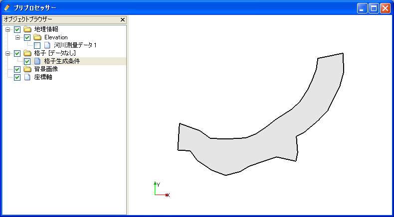
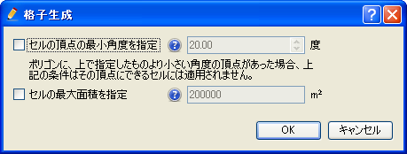
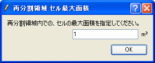
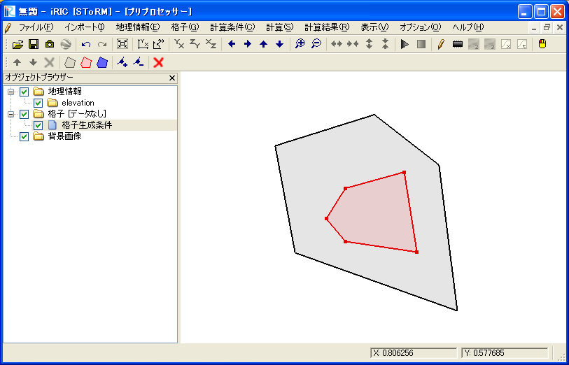
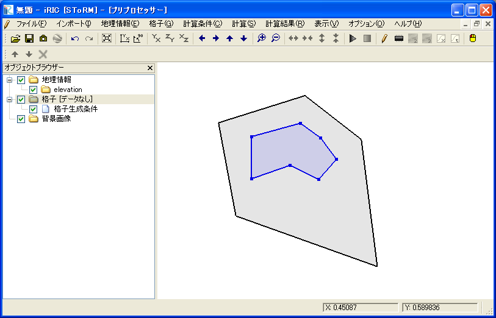
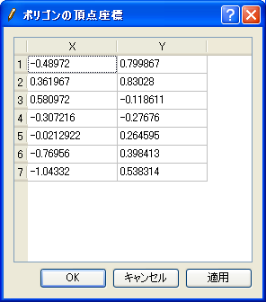

.. _sec_grid_creation_polygon:

[Create grid from polygon shape]
================================

**Description:** Specifies the Polygonal area where the grid is to be
created, and generates an unstructured grid. You can also specify a
re-division area and an obstacle area within the area as grid creating
condition. :numref:`image_polygon_example_grid` shows an example of
a grid created by this algorithm.

.. _image_polygon_example_grid:

.. figure:: images/polygon_example_grid.png
   :width: 300pt

   Example of a grid created based on the shape of the Polygon

After selecting this algorithm, click on the canvas to specify an area
for creating the grid by Polygon. To finish, press the Enter key or
double click. :numref:`image_polygon_after_grid_create_area` shows an
example of the display after specifying the grid creation area.

After setting the center line, select [Create Grid] from [Grid] in the
menu.

The [Grid Creation] dialog (:numref:`image_polygon_grid_creation_dialog`)
will open. Specify the area
where the grid is to be made and click on [OK]. The grid is generated
according to the division points.

.. _image_polygon_after_grid_create_area:

   Example of the display when an area for grid creation has been specified

.. _image_polygon_grid_creation_dialog:

   [Grid Creation] dialog

Menu items
----------

:numref:`polygon_menuitems_table` shows the menu items for the submenu of [Grid] (G)
--> [Grid Creating Conditions] (R) when [Create grid from Polygonal lines and
widths] is selected as the grid creating algorithm.

.. _polygon_menuitems_table:

.. list-table:: Menu items for algorithm [Create grid from polygon shape]
   :header-rows: 1

   * - Menu
     - Description
   * - [Add Refinement region] (R)
     - Adds an area where cells are devided with a different aximum area condition.
   * - [Add Hole Region] (H)
     - Adds an obstacle area (an area where no grid is created)
   * - [Add Break Line]
     - Adds a break line. Break line is always used as cell boundaries.
   * - [Add Vertex] (A)
     - Adds vertices to the selected Polygon.
   * - [Remove Vertex] (R)
     - Removes vertices from the selected Polygon.
   * - [Edit Coordinates] (C)
     - Edits the coordinates of the selected Polygon.
   * - [Edit Maximum Area For Cells] (M)
     - The maximum area of the cell in the selected refinement region.
   * - [Redivide Break Line] (D)
     - Redivide break line by specifying the division number.
   * - [Delete Region or Break Line] (D)
     - Removes the selected Region or Break line.
   * - [Reset to Default] (R)
     - Discards the grid creating conditions and reset to the default state.

[Add Refinement Region] (R)
---------------------------

**Description:** Adds a refinement region to the grid creation area. The
maximum area of cells can be set for the refined region. It is possible
to set a fine (or coarse) grid exclusively in the refinement region. The
refinement region is displayed as a red polygon.

After you select [Add Refinement Region], click on the canvas to define
a refinement region as polygon. Finish defining by double-clicking or by
pressing Enter key. The [Refinement maximum area] dialog
(:numref:`image_polygon_refinement_max_area_dialog`)
will open. Set the maximum area of the cell and click on [OK].

:numref:`image_polygon_after_def_refinement_region` shows an example
of the refinement region, and :numref:`image_polygon_refine_example_grid`
shows the grid created under this setting.

From iRIC 3.0, it is now possible to define refinement Regions inside a
refinement region. There is no limit about the number of recursion.
:numref:`image_polygon_refine_recursive_example`
shows an example.

.. _image_polygon_refinement_max_area_dialog:

   [Refinement maximum area] dialog

.. _image_polygon_after_def_refinement_region:

   iRIC window after defining refinement region

.. _image_polygon_refine_example_grid:

.. figure:: images/polygon_refine_example_grid.png
   :width: 160pt

   Example of a created grid

.. _image_polygon_refine_recursive_example:

.. figure:: images/polygon_refine_recursive_example.png
   :width: 320pt

   Example of defining refinement region inside refinement region

[Add Hole Region] (H)
---------------------

**Description:** Adds a hole region to the grid creation area. The hole
region is displayed as a blue polygon.

After you select [Add Hole Region], click on the canvas to define a hole
region as polygon. Finish defining by double-clicking or by pressing
Enter key.

:numref:`image_polygon_iric_after_def_hole` shows an example of the hole
region, and :numref:`image_polygon_hole_grid_example`
shows the grid created under this setting.

.. _image_polygon_iric_after_def_hole:

   iRIC window after defining hole region

.. _image_polygon_hole_grid_example:

.. figure:: images/polygon_hole_grid_example.png
   :width: 160pt

   Example of a created grid

[Add Break Line] (B)
--------------------

**Description:** Adds a break line to the grid creation area. The break line
is displayed as a bold line

After you select [Add Break Line], click on the canvas to define a break
line as polygonal line. Finish defining by double-clicking or by
pressing Enter key.

:numref:`image_polygon_breakline_grid_example` shows the grid created
with a break line.

With iRIC 3.0, it is now possible to define a break line that run over
the grid region.
:numref:`image_polygon_breakline_outside_example` shows an example
of such a case.

.. _image_polygon_breakline_grid_example:

.. figure:: images/polygon_breakline_grid_example.png
   :width: 180pt

   Example of a created grid with a break line

.. _image_polygon_breakline_outside_example:

.. figure:: images/polygon_breakline_outside_example.png
   :width: 120pt

   Example of a created grid with a break line, that run over the grid region

[Add Vertex] (A)
----------------

**Description:** Adds vertices to the selected region or break line.

Select this and move the cursor to the Polygon line. The cursor changes
to the graphic shown in :numref:`image_polygon_add_vertex_cursor`.
Left click on the line and drag it to add a new vertex.
The vertex is placed wherever you release the left click button.

.. _image_polygon_add_vertex_cursor:

   The mouse cursor display when adding a vertex is possible

[Remove Vertex] (R)
-------------------

**Description:** Deletes the vertex of the selected break line.

When this is selected and you move the cursor onto the vertex of the
Polygon, the cursor shape will change
(:numref:`image_polygon_remove_vertex_cursor`).
Left clicking will remove the vertex.

.. _image_polygon_remove_vertex_cursor:

.. figure:: images/polygon_remove_vertex_cursor.png
   :width: 20pt

   The mouse cursor when removing the vertex is possible

[Edit Coordinates] (C)
----------------------

**Description:** Edits the coordinates of the selected region or break line.

When you select [Edit Coordinates], the [Polygon Coordinates] dialog
(:numref:`image_gridgen_polygon_coordinates_dialog`) will open.
Edit the coordinates and click on [OK].

.. _image_gridgen_polygon_coordinates_dialog:

   [Polygon Coordinates] dialog

[Edit Maximum Area for Cells] (M)
---------------------------------

**Description:** Edits the maximum area of the cell in the selected,
refinement region.

When you select [Edit Maximum Area for Cells], the [Refinement Maximum
Area] dialog (:numref:`image_polygon_ref_max_area_dialog`)
will open. Edit the maximum area and click on [OK].

.. _image_polygon_ref_max_area_dialog:

   [Refinement maximum area] dialog

[Redivide Break Line] (R)
--------------------------------

**Description:** Redivide break line to control the grid cell length
on the break line.

When you select [Redivide Break Line], the [Input divide number]
dialog (:numref:`image_polygon_redivide_breakline_dialog`)
will open. Edit the divide number and click on [OK].

:numref:`image_polygon_breakline_redivide_example` shows
an example of redividing a break line.

.. _image_polygon_redivide_breakline_dialog:

.. figure:: images/polygon_redivide_breakline_dialog.png
   :width: 130pt

   [Input divide number] dialog

.. _image_polygon_breakline_redivide_example:

.. figure:: images/polygon_breakline_redivide_example.png
   :width: 240pt

   Example of redividing break line

[Delete Region or Break Line] (D)
---------------------------------

**Description:** Deletes the selected Region or Break Line.

When deleting a Polygon in an area where a grid has been created, a new
grid creation area can be specified.

[Reset to Default] (R)
----------------------

**Description**: Discards the grid creating conditions and restores the
default state.
