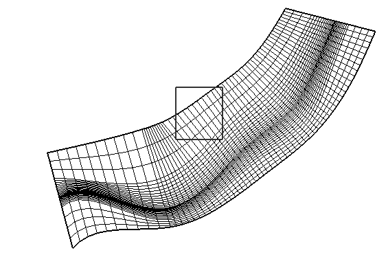
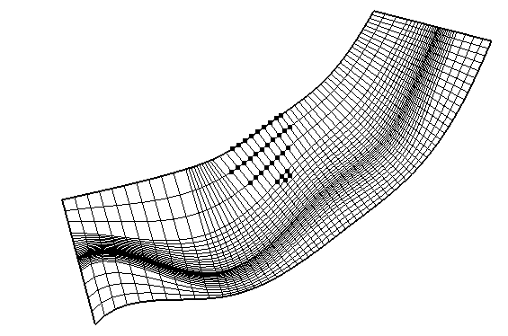

.. _sec_grid_edit_select_node:

格子点の選択
=================

格子点を選択します。

この操作は、オブジェクトブラウザーで以下のいずれかの項目を選択していた
時にのみ有効です。

-  「格子」の下の「格子形状」要素
-  「格子」の下の「格子点の属性」の下の任意の要素
-  「格子」の下の「セルの属性」の下の任意の要素

描画領域で、左ドラッグを行います。すると、:numref:`image_node_select_pre`
で示したように、四角が表示されます。マウスボタンを離してドラッグ操作を完了すると、
:numref:`image_pre_after_node_select` で示したように、
四角の中にあった点が選択され、大きな黒い四角で表示されます。
オブジェクトブラウザーで「セルの属性」の下の要素を選択していた場合は、
四角の中にあったセルが太い黒線で強調表示されます。

.. _image_node_select_pre:

   描画領域でドラッグ中のiRIC 表示例

.. _image_pre_after_node_select:

   格子点選択後の iRIC 表示例
