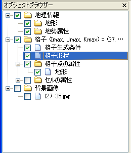

.. _sec_grid_edit_node_coordinates:

Edit the node coordinates
============================

**Description**: Edits the coordinates of the node.

This is used when you want to adjust the coordinates of the created grid
or to edit the coordinates of a grid whose data are read from an
external file.

Grid coordinates are edited as follows:

1. In [Object Browser], select [Grid] - [Grid shape] (:numref:`image_object_browser_with_gridshape_selected`).
2. Select the node whose coordinates you want to edit. (Refer to
   :ref:`sec_grid_edit_select_node`)
3. Edit the coordinates of the selected node.

.. _image_object_browser_with_gridshape_selected:

   Example of the [Object Browser] window when [Grid shape] is selected

Edits the selected node (3) as follow:

**Menu bar**: [Grid] (G) --> [Edit] (E) --> [Grid Coordinates] (V)

When two or more nodes are selected, the [Edit grid coordinates] dialog
(:numref:`image_edit_grid_coords_dialog_for_multi`) will open.
When only one node is selected, the [Grid coordinates edit dialog]
(:numref:`image_edit_grid_coords_dialog_for_single`) will open.

Input the quantity of movement of the node in the [Edit Grid
Coordinates] dialog
(:numref:`image_edit_grid_coords_dialog_for_multi`) and
the new coordinate of the node in
the [Grid coordinates edit dialog] dialog
(:numref:`image_edit_grid_coords_dialog_for_single`).
The [Grid Coordinates Edit] (:numref:`image_edit_grid_coords_dialog_for_single`)
dialog also displays the index of the
selected node. (Index numbers start from 1.)

.. _image_edit_grid_coords_dialog_for_multi:

.. figure:: images/edit_grid_coords_dialog_for_multi.png

   The [Edit grid coordinates] dialog (shown when editing two or more nodes)

   .. _image_edit_grid_coords_dialog_for_single:

   .. figure:: images/edit_grid_coords_dialog_for_single.png

      The [Grid coordinates edit dialog]

The node coordinates can be edited by mouse. When the mouse cursor is on
a node, the cursor shape changes to an "open hand". Left drag the node
to move it.
