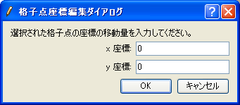
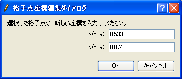

.. _sec_grid_edit_node_coordinates:

格子点座標の編集
============================

格子点の座標を編集します。

生成した格子の座標を微調整した時や、外部ファイルから読み込んだ格子の
座標を編集したい場合に利用します。

格子点座標の編集は以下の手順で行います。

#. オブジェクトブラウザーで、編集したい格子の「格子形状」を選択します。
   (:numref:`image_object_browser_with_gridshape_selected` 参照)
#. 座標を編集する格子点を選択します。(:ref:`sec_grid_edit_select_node` 参照)
#. 選択した格子点の座標を編集します。

.. _image_object_browser_with_gridshape_selected:

.. figure:: images/object_browser_with_gridshape_selected.png
   :width: 150pt

   格子形状を選択した時のオブジェクトブラウザー 表示例

3. の、選択した格子点の座標の編集は以下の操作で行います。

**メニューバー ：** 格子 (G) --> 編集 (E) --> 格子点座標 (V)

複数の格子点を選択していた場合は
:numref:`image_edit_grid_coords_dialog_for_multi`
に示すダイアログが、格子点を1つ選択していた場合は
:numref:`image_edit_grid_coords_dialog_for_single`
に示すダイアログがそれぞれ表示されます。

:numref:`image_edit_grid_coords_dialog_for_multi`
に示すダイアログでは格子点の移動量を、
:numref:`image_edit_grid_coords_dialog_for_single`
に示すダイアログでは格子点の新しい座標をそれぞれ入力します。
:numref:`image_edit_grid_coords_dialog_for_single`
のダイアログでは、選択された格子点のインデックスも表示されます
(インデックスは 1 から始まります)。

.. _image_edit_grid_coords_dialog_for_multi:

   格子点座標編集ダイアログ (複数の格子点を編集する場合)

.. _image_edit_grid_coords_dialog_for_single:

   格子点座標編集ダイアログ (単一の格子点を編集する場合)

なお、格子点座標の編集は、マウス操作によって行うこともできます。
選択した格子点の上にマウスカーソルを移動すると、
開いた手の形のカーソルに変わります。
その時に左ドラッグ操作を行うと、格子点を移動できます。
