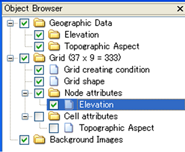
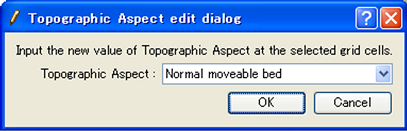

.. _sec_grid_edit_node_atts:

格子点属性の編集
==========================

格子点属性を編集します。

格子点属性の編集は以下の手順で行います。

1. オブジェクトブラウザーで、編集したい格子点属性を選択します。
   (:numref:`image_object_browser_node_att_selected` 参照)
2. 属性を編集する格子点を選択します。
   (:ref:`sec_grid_edit_select_node` 参照)
3. 選択した格子点の属性を編集します。

.. _image_object_browser_node_att_selected:

   格子点属性を選択した時のオブジェクトブラウザー 表示例

3. の、選択した格子点の属性の編集は以下の操作で行います。

**メニューバー:** 格子 (G) --> 編集 (E) --> 格子点属性 (N)

すると、格子点属性を編集するダイアログ
(:numref:`image_topo_aspect_edit_dialog` 参照)
が表示されますので、属性の値を編集して「OK」ボタンを押します。
なお、ダイアログは編集する属性によって異なります。

.. _image_topo_aspect_edit_dialog:

   格子点属性の編集ダイアログ 表示例
