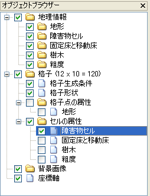

.. _sec_grid_edit_cell_atts:

セル属性の編集
==========================

セル属性を編集します。

セル属性の編集は以下の手順で行います。

1. オブジェクトブラウザーで、編集したいセル属性を選択します。
   (:numref:`image_object_browser_cell_att_selected` 参照)
2. 属性を編集したいセルを囲むすべての格子点を選択します。
   (:ref:`sec_grid_edit_select_node` 参照)

3. 選択した格子点で囲まれたセルの属性を編集します。

.. _image_object_browser_cell_att_selected:

   セル属性を選択した時のオブジェクトブラウザー 表示例

3. の、選択したセルの属性の編集は以下の操作で行います。

**メニューバー:** 格子 (G) --> 編集 (E) --> セル属性 (C)

すると、セル属性を編集するダイアログ
(:numref:`image_topo_aspect_edit_dialog2` 参照)
が表示されますので、属性の値を編集して「OK」ボタンを押します。
なお、ダイアログは編集する属性によって異なります。

.. _image_topo_aspect_edit_dialog2:

.. figure:: images/topo_aspect_edit_dialog.png

   格子点属性の編集ダイアログ 表示例
