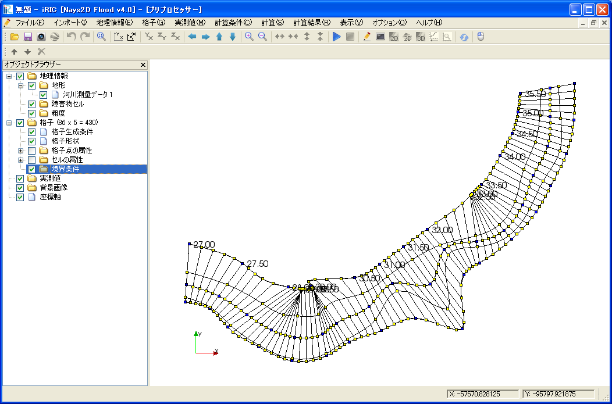
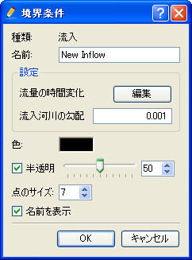
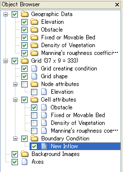

境界条件の編集(B)
===========================

境界条件を格子点に設定します。

境界条件の編集は以下の手順で行います。

1. オブジェクトブラウザーで、境界条件を選択した状態でマウス右クリックし
   (:numref:`image_object_browser_boundary_cond_selected` 参照)、
   (境界条件名)の追加」を選択すると境界条件ダイアログが表示されます。
   (:numref:`image_boundary_condition_dialog` 参照)
   ただし、ダイアログの内容はソルバと境界条件の種類により異なります。

2. 必要な設定を行い、境界条件ダイアログのOKを押すと、オブジェクトブラウザーに
   境界条件が追加されます。
3. オブジェクトブラウザーで、設定したい境界条件を選択します。
   (:numref:`image_object_browser_boundary_cond_item_selected` 参照)

4. 境界条件を設定する格子点を選択します。
   (:ref:`sec_grid_edit_select_node` 参照)

5. 選択した格子点に境界条件を設定します。

.. _image_object_browser_boundary_cond_selected:

   境界条件の選択

.. _image_boundary_condition_dialog:

   境界条件ダイアログ

.. _image_object_browser_boundary_cond_item_selected:

   境界条件を選択した時のオブジェクトブラウザー 表示例

選択した格子点への境界条件の設定は以下の操作で行います。

**メニューバー:** 格子 (G) --> 境界条件 (B) --> 追加(A) / 削除 (R)

なお、境界条件自体の追加、編集、削除も、以下のサブメニュー下にあります。
項目は、利用するソルバーによって異なります。

**メニューバー:** 格子 (G) --> 境界条件 (B)
