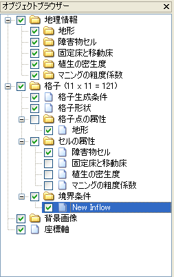

Edit Boundary Conditions
===========================

**Description**: Edits the boundary conditions.

Boundary conditions are edited in the following procedure:

1. Select the boundary condition you want to edit in [Object Browser]
   (:numref:`image_object_browser_boundary_cond_selected`).
   Select [Add (Condition Name)] in the right-clicking
   menu, and the [Boundary Condition] dialog will open
   (:numref:`image_boundary_condition_dialog`).
2. Click [OK] in [Boundary Condition] dialog, a boundary condition will
   be added.
3. Select the boundary condition you want to edit in [Object Browser]
   (:numref:`image_object_browser_boundary_cond_item_selected`).
4. Select the grid nodes (or grid cells) you want to set boundary
   condition (Refer to :ref:`sec_grid_edit_select_node`).
5. Set boundary condition to the selected grid nodes (or grid cells).

.. _image_object_browser_boundary_cond_selected:

.. figure:: images/object_browser_boundary_cond_selected.png
   :width: 380pt

   [Object Browser] when selecting Boundary Condition

.. _image_boundary_condition_dialog:

.. figure:: images/boundary_condition_dialog.png
   :width: 140pt

   Example of the [Boundary Condition] dialog

.. _image_object_browser_boundary_cond_item_selected:

   [Object Browser] when selecting a boundary condition item

You can set (or unset) boundary condition as follows:

**Menu bar**: [Grid] (G) --> [Boundary Condition] (B) --> [Assign Condition] (A) / [Release Condition] (R)

When you want to add or remove boundary condition, use sub menus under
the following sub menu. The items in this submenu differ depending
on the solver you use.

**Menu bar**: [Grid] (G) --> [Boundary Condition] (B)
