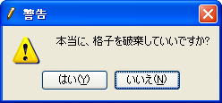

Delete (D)
============

**Description**: Deletes the grid.

When this is selected, the [Warning] dialog
(:numref:`image_delete_grid_warning_dialog`) to ask
whether you want to discard the grid data will open. Select [Yes] (Y).

.. _image_delete_grid_warning_dialog:

   The [Warning] dialog
