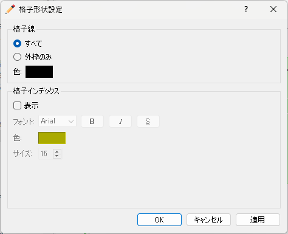

.. _sec_pre_grid_display_setting:

表示設定
==================

格子の表示設定を行います。表示設定サブメニューの構成を
:numref:`table_grid_displaysettings_menu` に示します。

.. list-table:: 表示設定のメニューの構成
   :name: table_grid_displaysettings_menu
   :header-rows: 1

   * - メニュー
     - 説明
   * - 格子形状 (S)
     - 格子形状の表示設定を行います
   * - 格子点属性 (N)
     - 格子点属性の表示設定を行います
   * - セル属性 (C)
     - セル属性の表示設定を行います
   * - 凡例の設定 (U)
     - 凡例の表示設定を行います

格子形状 (S)
------------------

格子形状の表示設定を行います。

設定ダイアログ (:numref:`image_grid_shape_display_dialog` 参照)
が表示されますので、設定を行って「OK」ボタンを押します。
表示を「外枠のみ」と設定した時と、「すべて」と設定した時の表示例を
:numref:`image_example_grid_shape` にそれぞれ示します。

「格子インデックス」の設定は、「格子線」で「すべて」を選択した時
にのみ操作できます。

.. _image_grid_shape_display_dialog:

   格子形状の表示設定ダイアログ

.. _image_example_grid_shape:

.. figure:: images/example_grid_shape.png
   :width: 420pt

   格子の形状の表示設定ごとの表示例

格子点属性(N)
---------------------

格子点属性の表示設定を行います。格子点属性の表示設定は、
「格子」の下の「格子点属性」の下の要素を選択している時にのみ実行できます。

設定ダイアログ (:numref:`image_grid_node_attr_display_setting_dialog` 参照)
が表示されますので、設定を行って「OK」ボタンを押します。

このダイアログでの設定項目の詳細は :ref:`sec_colormap` を参照してください。

モードごとの表示例を
:numref:`image_example_grid_node_attr_display` に示します。

.. _image_grid_node_attr_display_setting_dialog:

.. figure:: images/grid_node_attr_display_setting_dialog.png
   :width: 460pt

   格子点属性の表示設定ダイアログ

.. _image_example_grid_node_attr_display:

.. figure:: images/example_grid_node_attr_display.png
   :width: 320pt

   モードごとの表示例

セル属性(C)
--------------------

セル属性の表示設定を行います。セル属性の表示設定は、
「格子」の下の「セルの属性」の下の要素を選択している時にのみ実行できます。

設定ダイアログ (:numref:`image_grid_cell_attr_display_setting_dialog` 参照)
が表示されますので、設定を行って「OK」ボタンを押します。
「半透明」をチェックし、数値を調整することで、セル属性の表示を半透明にすることができます。

なお、表示されるダイアログは、選択したセルの属性によって異なります。

.. _image_grid_cell_attr_display_setting_dialog:

   セル属性の表示設定ダイアログ
