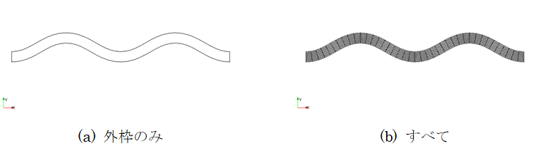

Display Settings
==================

**Description**: Sets grid diplay settings. Sub items of this menu are shown
in :numref:`table_grid_displaysettings_menu`.

.. _table_grid_displaysettings_menu:

.. list-table:: Menu items in [Display Settings]
   :header-rows: 1

   * - Menu
     - Description
   * - [Grid Shape] (S)
     - Edits display settings on grid shape.
   * - [Node Attribute] (N)
     - Edits display settings on grid node attribute.
   * - [Cell Attribute] (C)
     - Edits display settings on grid cell attribute.
   * - [Set Up Scalarbar (U)
     - Edits display settings on colorbar.

[Grid Shape] (S)
------------------

**Description**: Set up display setting of grid shape.

When you select [Grid Shape], the [Grid Shape Display] dialog
(:numref:`image_grid_shape_display_dialog`). Modify the setting
and click on [OK]. :numref:`image_example_grid_shape` shows an
example of grid shape with Grid lines setting [Outline Only] and [All]
respectively.

[Visible] checkbox in [Grid indices] group box is enabled
only when [All] is selected in [Grid lines] group box.

.. _image_grid_shape_display_dialog:

.. figure:: images/grid_shape_display_dialog.png

   The [Grid Shape Display] dialog

.. _image_example_grid_shape:

   Example of grid shapes

Node Attribute (N)
---------------------

**Description**: Sets up display setting of grid node attribute.
This item is enabled only when a grid node attribute is selected
in [Object Browser] of [Pre-processing Window].

When you select [Node Attribute], the [Grid Node Attribute Display
Setting] dialog (:numref:`image_grid_node_attr_display_setting_dialog`)
will open. Modify the setting and click on [OK].

Please refer to :ref:`sec_geo_common_color_setting` about the dialog
that is shown when you select
[Custom] as [Colormap] and click on [Setting…] button.

:numref:`image_example_grid_node_attr_display` shows examples
for [Contour setting] with [Color Fringe],
[Contour Figure], and [Isolines] for each.

.. _image_grid_node_attr_display_setting_dialog:

.. figure:: images/grid_node_attr_display_setting_dialog.png

   The [Grid Node Attribute Display Setting] dialog

.. _image_example_grid_node_attr_display:

   Examples of grid node attribute displays

Cell Attribute (C)
--------------------

**Description**: Sets up display setting of grid cell attribute.
This item is enabled only when a grid cell attribute is selected
in [Object Browser] of [Pre-processing Window].

When you select [Cell Attribute], the [Grid Cell Attribute Display
Setting] dialog
(:numref:`image_grid_cell_attr_display_setting_dialog`)
will open. Modify the setting and click on [OK].

.. _image_grid_cell_attr_display_setting_dialog:

.. figure:: images/grid_cell_attr_display_setting_dialog.png

   The [Grid Cell Attribute Display Setting] dialog

Set Up Scalarbar (U)
----------------------

**Description**: Sets up color bar setting. :numref:`image_example_scalar_bar`
shows an example of color bar.

.. _image_example_scalar_bar:

.. figure:: images/example_scalar_bar.png

   Example of scalar bar

When you select [Set Up Scalarbar], the [Scalarbar Setting] dialog
(:numref:`image_scalar_bar_setting_dialog`) will open.
When you want to show color bar, check on the
[Visible] check box and select the attribute, and click on [OK].

If you click on [Edit], the [Color legend Setting] dialog
(:numref:`image_color_legend_setting_dialog`)
will open.

.. _image_scalar_bar_setting_dialog:

.. figure:: images/scalar_bar_setting_dialog.png

   The [Scalarbar Setting] dialog

.. _image_color_legend_setting_dialog:

.. figure:: images/color_legend_setting_dialog.png

   The [Color Legend Setting] dialog
