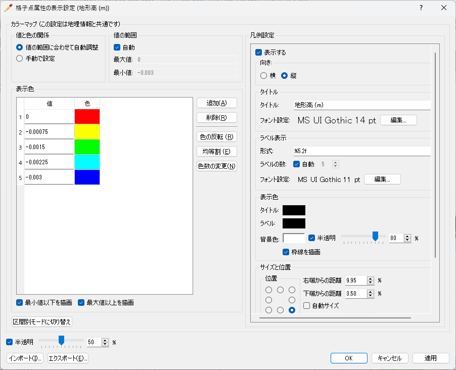

表示設定
==================

格子の表示設定を行います。表示設定サブメニューの構成を
:numref:`table_grid_displaysettings_menu` に示します。

.. _table_grid_displaysettings_menu:

.. list-table:: 表示設定のメニューの構成
   :header-rows: 1

   * - メニュー
     - 説明
   * - 格子形状 (S)
     - 格子形状の表示設定を行います
   * - 格子点属性 (N)
     - 格子点属性の表示設定を行います
   * - セル属性 (C)
     - セル属性の表示設定を行います
   * - 凡例の設定 (U)
     - 凡例の表示設定を行います

格子形状 (S)
------------------

格子形状の表示設定を行います。

設定ダイアログ (:numref:`image_grid_shape_display_dialog` 参照)
が表示されますので、設定を行って「OK」ボタンを押します。
表示を「外枠のみ」と設定した時と、「すべて」と設定した時の表示例を
:numref:`image_example_grid_shape` にそれぞれ示します。

「格子インデックス」の設定は、「格子線」で「すべて」を選択した時
にのみ操作できます。

.. _image_grid_shape_display_dialog:

.. figure:: images/grid_shape_display_dialog.png
   :width: 100pt

   格子形状の表示設定ダイアログ

.. _image_example_grid_shape:

.. figure:: images/example_grid_shape.png
   :width: 420pt

   格子の形状の表示設定ごとの表示例

格子点属性(N)
---------------------

格子点属性の表示設定を行います。格子点属性の表示設定は、
「格子」の下の「格子点属性」の下の要素を選択している時にのみ実行できます。

設定ダイアログ (:numref:`image_grid_node_attr_display_setting_dialog` 参照)
が表示されますので、設定を行って「OK」ボタンを押します。
「最大値」、「最小値」を編集するには、「自動」チェックボックスをチェックします。
「分割数」は、「コンター設定」で「面塗りコンター」または「コンター」を
選択した時にのみ設定できます。｢半透明｣は、「コンター設定」で、
「カラーフリンジ」または「面塗りコンター」を選択した時にのみ設定できます。

カラーマップで「手動」を選択し、「設定」ボタンを押した場合に表示される
ダイアログについては、:ref:`sec_geo_common_color_setting`
を参照して下さい。

コンター設定ごとの表示例を
:numref:`image_example_grid_node_attr_display` に示します。

.. _image_grid_node_attr_display_setting_dialog:

   格子点属性の表示設定ダイアログ

.. _image_example_grid_node_attr_display:

.. figure:: images/example_grid_node_attr_display.png
   :width: 440pt

   コンター設定の値ごとの表示例

セル属性(C)
--------------------

セル属性の表示設定を行います。セル属性の表示設定は、
「格子」の下の「セルの属性」の下の要素を選択している時にのみ実行できます。

設定ダイアログ (:numref:`image_grid_cell_attr_display_setting_dialog` 参照)
が表示されますので、設定を行って「OK」ボタンを押します。
「半透明」をチェックし、数値を調整することで、セル属性の表示を半透明にすることができます。

なお、表示されるダイアログは、選択したセルの属性によって異なります。

.. _image_grid_cell_attr_display_setting_dialog:

.. figure:: images/grid_cell_attr_display_setting_dialog.png
   :width: 180pt

   セル属性の表示設定ダイアログ

凡例の設定 (U)
----------------------

凡例の表示設定を行います。凡例の表示例を
:numref:`image_example_scalar_bar` に示します。

.. _image_example_scalar_bar:

.. figure:: images/example_scalar_bar.png
   :width: 300pt

   凡例 表示例

設定ダイアログ (:numref:`image_scalar_bar_setting_dialog` 参照)
が表示されますので、凡例を表示する場合は、
「表示する」チェックボックスをチェックし、
凡例を表示する属性を選択して「OK」ボタンを押します。

「編集」ボタンを押すと、凡例表示の詳細設定ダイアログが表示され
(:numref:`image_color_legend_setting_dialog` 参照)、
設定を編集することができます。表示されるダイアログは、
凡例設定ダイアログで選択した属性によって異なります。

.. _image_scalar_bar_setting_dialog:

.. figure:: images/scalar_bar_setting_dialog.png
   :width: 160pt

   凡例設定ダイアログ

.. _image_color_legend_setting_dialog:

.. figure:: images/color_legend_setting_dialog.png
   :width: 180pt

   凡例の詳細設定ダイアログ
