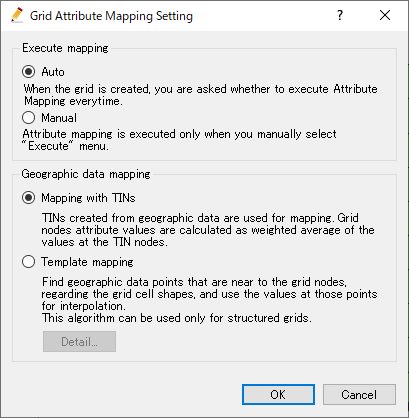

.. _sec_pre_attribute_grid:

属性のマッピング
===================

属性のマッピング機能について説明します。

iRIC では、格子に属性を保持させることができます。
属性は格子の以下の位置に保持させることができます。どの位置にどのような属性を保持させる
かはソルバ開発者が決めます。

- 格子点
- セル

格子の属性は、地理情報からマッピングすることができます。地理情報のフォルダ内に複数の
地理情報がある時は、オブジェクトブラウザで上にあるものほど優先的にマッピングされます。

格子の属性のマッピングは、デフォルトでは格子の生成直後に行われます。また、ユーザが
地理情報を編集した後、手動で実行することもできます。

実行 (E)
-----------

属性のマッピングを実行します。

属性のマッピングを実行するには、以下の操作を行います。

**メニューバー:** 格子 (G) --> 属性のマッピング (A) --> 実行 (E)

:numref:`image_mapping_exec_dialog` に示すダイアログが表示されるので、
マッピングを実行したい属性の横にチェックを入れ、「OK」ボタンを押します。すると、
チェックした属性の地理情報が、格子の属性にマッピングされます。

.. _image_mapping_exec_dialog:

   属性のマッピング ダイアログ

設定 (S)
------------

属性のマッピングに関する設定を行います。

属性のマッピングの設定を行うには、以下の操作を行います。

**メニューバー:** 格子 (G) --> 属性のマッピング (A) --> 設定 (S)

:numref:`image_mapping_setting_dialog` に示すダイアログが表示されるので、
設定を行い、「OK」ボタンを押します。

.. _image_mapping_setting_dialog:

   格子属性のマッピング設定 ダイアログ

.. _sec_geodata_mapping:

地理情報のマッピングについて
-----------------------------

ここでは、地理情報がどのように格子属性にマッピングされるかについて説明します。

点群データ
~~~~~~~~~~~~

**格子点の属性**

デフォルトでは、TIN によるマッピングが行われます。格子点の座標が含まれる三角形をみつけ、
その三角形の3つの頂点での値の重み付け平均によって、格子点での値を求めて設定します。

**セルの属性**

TIN によるマッピングが行われます。セルの中心点が含まれる三角形をみつけ、
その三角形の3つの頂点での値の重み付け平均によって、セルでの値を求めて設定します。

横断測量データ
~~~~~~~~~~~~~~~~~~

**格子点の属性**

横断線ごとに定義された断面データの値を、以下のような方法で補間してマッピングします。

横断線の左岸・右岸・中心点などをそれぞれ3次スプライン曲線で結びます。
各格子点での値は、その点を通るスプライン曲線の、上流側と下流側の横断線での標高から
内挿補間により求めます。内挿補間する時の重みは、上流側・下流側それぞれからの距離から
求めます。

**セルの属性**

河川測量データは、セルの属性へのマッピングに対応していません。

ラスターデータ
~~~~~~~~~~~~~~~

**格子点の属性**

格子点の座標が含まれるピクセル (四角形) を見つけ、そのピクセルでの値を設定します。

**格子セルの属性**

セルの中心点が含まれるピクセル (四角形) を見つけ、そのピクセルでの値を設定します。

ポリゴンデータ
~~~~~~~~~~~~~~~

**格子点の属性**

格子点がポリゴンに含まれている時、そのポリゴンに設定された値が設定されます。

**セルの属性**

セルの中心点がポリゴンに含まれている時、そのポリゴンに設定された値が設定されます。

.. note:: 仕様変更について

   iRIC 3.0.3 までは、格子セルを構成するすべての頂点がポリゴンの内部にあった時に
   マッピングされる仕様でした。

ラインデータ
~~~~~~~~~~~~~~~

**格子点の属性**

格子点を端点とする辺をラインデータが横切っているとき、そのラインデータに設定された値が設定されます。

**セルの属性**

セルの中をラインデータが横切っているとき、そのラインデータに設定された値が設定されます。
