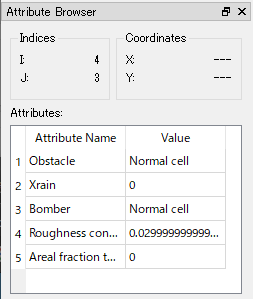

格子属性関連機能
================

格子の属性について利用できる機能について説明します。

ここで説明する機能は、オブジェクトブラウザで「格子点の属性」の下の
「地形」などを選択している時、右クリックメニューから利用できます。

このデータから点群データを生成
--------------------------------

選択した格子属性の値から、点群データを生成します。
点群データは、選択した格子属性に対応する「地理情報」グループの下に生成されます。
点群を生成するとき、点の座標はそれぞれ以下のようになります。

* **格子点の属性**: 格子点の座標
* **セルの属性**: セルの中心座標

エクスポート
-------------

選択した格子属性の値から点群データを生成し、地勢データ (\*.tpo) ファイルに保存します。
地勢データファイルのフォーマットについては
:ref:`sec_file_tpo` を参照してください。

属性ブラウザの表示
------------------

属性ブラウザを表示します。

このメニューを選択すると、オブジェクトブラウザの下に属性ブラウザが表示されます。
属性ブラウザの表示例を :numref:`image_attribute_browser` に示します。

.. _image_attribute_browser:

   属性ブラウザ 表示例

属性ブラウザが表示されている間は、以下の操作を行えます。

* マウスカーソルを格子の上を移動すると、カーソルの下の 格子点 (もしくはセル) の属性の値の一覧が表示されます。
* 左クリックすると、表示対象が固定され、その後マウスカーソルを移動しても、同じ格子点 (もしくはセル) での値が表示され続けます。
* 格子の範囲の外側で左クリックすると、表示対象がクリアされます。
