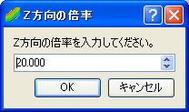

鳥瞰図ウィンドウを開く(B)
====================================

:numref:`image_grid_birds_eye_window`
に示すような鳥瞰図ウィンドウが新しく開きます。

鳥瞰図ウィンドウのメニュー構成を、
:numref:`table_grid_birdseye_window_menu` に示します。
:numref:`table_grid_birdseye_window_menu` に示すメニューは、
鳥瞰図ウィンドウがアクティブな時、「インポート」メニューと
「計算」メニューの間に表示されます。

.. _image_grid_birds_eye_window:

.. figure:: images/grid_birds_eye_window.png

   鳥瞰図ウィンドウ　表示例

.. _table_grid_birdseye_window_menu:

.. list-table:: 鳥瞰図ウィンドウ固有のメニュー構成
   :header-rows: 1

   * - メニュー
     -
     - 説明
   * - 描画設定 (D)
     - 表示設定 (D)
     - 格子色の設定をします
   * -
     - 背景色 (B)
     - 背景色の設定をします
   * -
     - Z方向の倍率 (Z)
     - Z方向の倍率の設定をします

表示設定(D)
----------------------

格子色の設定をします。

:numref:`image_birds_eye_display_setting_dialog`
で示すダイアログが表示されますので、色を表示する項目、色、
座標軸表示の設定をして、「OK」ボタンを押します。

.. _image_birds_eye_display_setting_dialog:

   表示設定ダイアログ

背景色(B)
------------------------

鳥瞰図ウィンドウの背景色を変更します。

この機能は、表示メニューに含まれるものと同じです
(:ref:`sec_view_background_color` 参照)。

色を選択するダイアログが表示されますので、設定したい背景色を選んで
「OK」ボタンを押します。

Z方向の倍率 (Z)
------------------------

Z方向の表示の倍率を設定します。

この機能は、表示メニューに含まれるものと同じです
(:ref:`sec_view_z_scale` 参照)。

:numref:`image_birds_eye_zdir_scale_dialog`
に示すダイアログが表示されますので、値を入力して「OK」ボタンを押します。

鳥瞰図ウィンドウでの操作例を
:numref:`image_example_change_z_scale` に示します。

.. _image_birds_eye_zdir_scale_dialog:

   Z方向の倍率ダイアログ

.. _image_example_change_z_scale:

   Z方向の倍率　操作例
