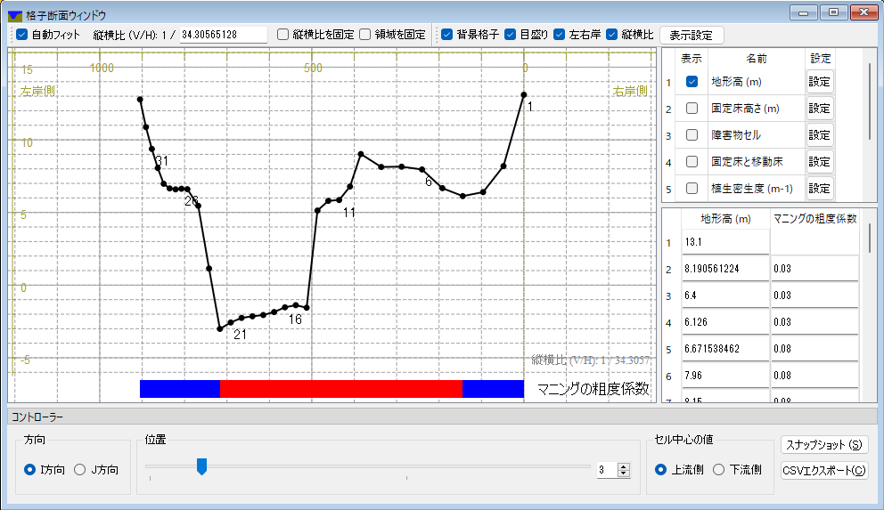

格子断面ウィンドウ
=====================

格子点を選択した状態で描画領域で右クリックメニューを開くと、「横断面ウィンドウを開く」「縦断面ウィンドウを開く」というメニュー
が表示されます。これを選択すると、格子断面ウィンドウが表示され、特定の断面での複数の属性の値をまとめて可視化することができます。

格子断面ウィンドウの表示例を :numref:`image_grid_crosssection_window` に示します。

格子断面ウィンドウの使い方の詳細は、 :ref:`sec_cross-section` を参照してください。

.. _image_grid_crosssection_window:

   格子断面ウィンドウ 表示例
