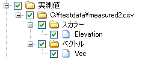
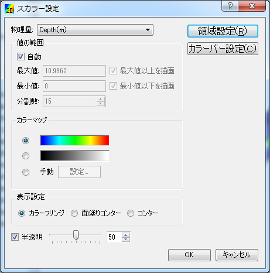
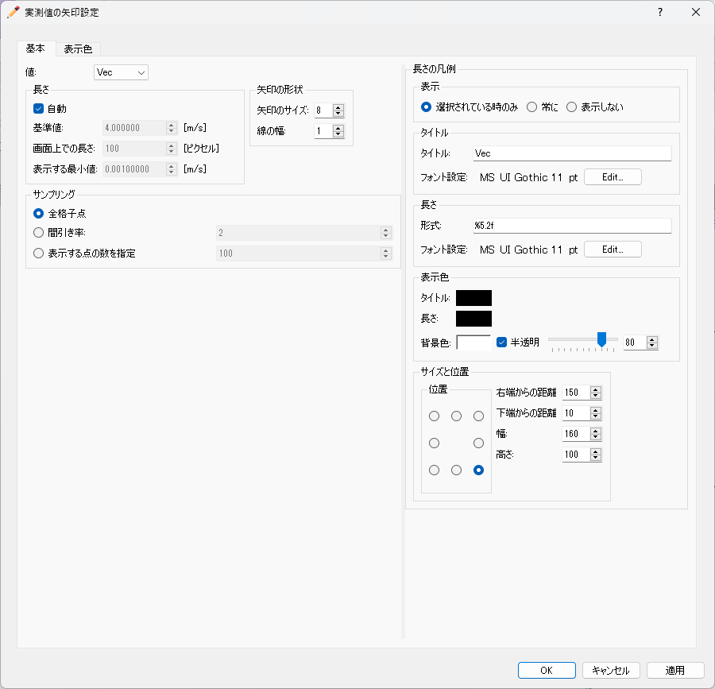

.. _sec_pre_measured_data:

[Measured Data] (M)
====================

The functions for importing and displaying [Measured Data] are explained
in the following sections. Refer to :ref:`sec_abst_load_measured_data`
for the abstract of [Measured Data].

Operations related to [Measured Data] are available from [Measured Data]
menu when the [Pre-processing Window] or [Post-Processing (2D)] Window
is active.

Measured Data consists of the positions of measured data, and measured
values (scalar values and vector values).
:numref:`image_example_measured_values_ob` shows an example
of measured data shown in [Object Browser].

Refer to :ref:`sec_pre_measured_data_scalar` for display setting of
scalar values, :ref:`sec_pre_measured_data_arrows` for vector
values.

For importing [Measured Data], refer to :ref:`sec_file_import_measured_data`.

.. _image_example_measured_values_ob:

   Example of imported Measured Values on [Object Browser]

.. _sec_pre_measured_data_scalar:

[Scalar] (S)
-------------

**Description**: Sets the display setting of scalar values

When you select this, the [Scalar Setting] dialog
(:numref:`image_example_scalar_setting_dialog`) will
open. Set the display setting of scalar values and click on [OK].

.. _image_example_scalar_setting_dialog:

   Example of [Scalar Setting] dialog

.. _sec_pre_measured_data_arrows:

[Arrows] (A)
-------------

**Description**: Sets the display setting of arrows for vector values

When you select this, the [Arrow Setting] dialog
(:numref:`image_example_arrow_setting_dialog`) will
open. Set the arrow display setting and click on [OK].

.. _image_example_arrow_setting_dialog:

   Example of [Arrow Setting] dialog

[Import] (I)
-------------

**Description**: Imports measured data from CSV file.

The function of this item is the same to [Measure Data] under [Import]
menu under [File] menu. Refer to :ref:`sec_file_import_measured_data`.
