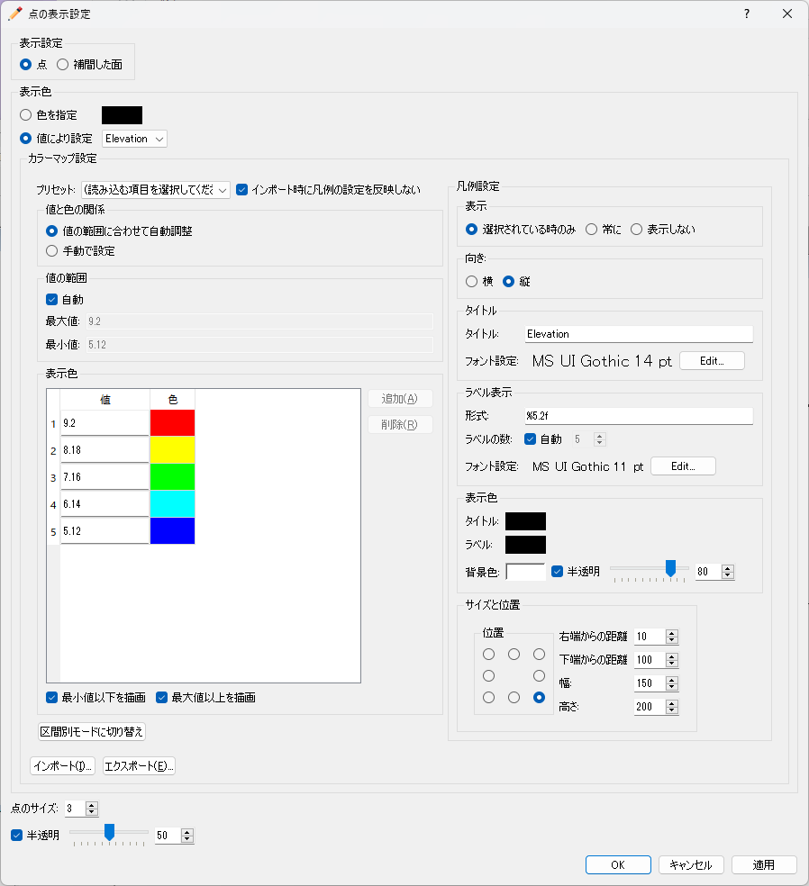

.. _sec_pre_measured_data:

実測値 (M)
====================

実測値に関係する機能について説明します。実測値関連の機能の概要については、
:ref:`sec_abst_load_measured_data` を参照してください。

実測値の関連機能は、プリプロセッサーもしくは可視化ウィンドウ (2D)
がアクティブな時に「実測値(M)」メニューから行えます。

実測値としては、観測位置とそこでの観測値 (スカラー量もしくはベクトル量)
を読み込みます。実測値の読み込み後のオブジェクトブラウザでの表示例を
:numref:`image_example_measured_values_ob` に示します。

スカラー量の観測値の表示設定については
:ref:`sec_pre_measured_data_scalar` を、
ベクトル量の観測値の表示設定については
:ref:`sec_pre_measured_data_arrows`
を参照してください。

観測値のインポートについては
:ref:`sec_file_import_measured_data` を参照してください。

.. _image_example_measured_values_ob:

   実測値の読み込み後の表示例

.. _sec_pre_measured_data_scalar:

スカラー(S)
-------------

スカラー量の実測値の表示について設定します。

スカラー量の実測値の表示設定ダイアログ
(:numref:`image_example_scalar_setting_dialog`)
が表示されますので設定し、「OK」ボタンを押します。

カラーマップで「手動」を選択し、「設定」ボタンを押した場合に表示される
ダイアログについては、4.4.1.1
を参照して下さい。

.. _image_example_scalar_setting_dialog:

   スカラー量の実測値の表示設定ダイアログ

.. _sec_pre_measured_data_arrows:

ベクトル(V)
-------------

ベクトル量の実測値の表示について設定します。

ベクトル量の実測値の表示設定ダイアログ
(:numref:`image_example_arrow_setting_dialog`)
が表示されますので設定し、「OK」ボタンを押します。

.. _image_example_arrow_setting_dialog:

   ベクトル量の実測値の表示設定ダイアログ

インポート(I)
--------------

実測値をインポートします。

この機能は、ファイルメニューの下のインポートメニューに
含まれるものと同じです。
:ref:`sec_file_import_measured_data` を参照してください。
