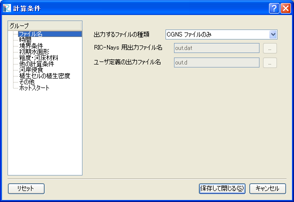

.. _sec_calc_cond:

計算条件
==========================

計算条件に関係する機能について説明します。

計算条件の設定は、プリプロセッサーがアクティブな時に「計算条件(C)」
メニューから行えます。以下で、各メニュー項目の機能を説明します。

設定 (S)
--------------
計算条件を設定します。

計算条件を設定するダイアログ (:numref:`image_calc_cond_dialog` 参照)
が表示されますので、計算条件を設定し、「保存して閉じる」ボタンを押します。
「リセット」ボタンを押すと、計算条件はデフォルト値にリセットされます。

なお、設定する計算条件は、利用するソルバーによって異なります。

.. _image_calc_cond_dialog:

   計算条件ダイアログ

インポート(I)
--------------

計算条件をインポートします。

この機能は、ファイルメニューの下のインポートメニューに含まれる「計算条件」と同じです。
:ref:`sec_file_import_calc_cond`
を参照してください。

エクスポート(E)
------------------

計算条件をエクスポートします。

この機能は、ファイルメニューの下のエクスポートメニューに含まれる「計算条件」と同じです。
:ref:`sec_file_export_calc_cond` を参照してください。
