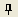

.. _sec_pre_bg_image_data:

背景画像
==================

背景画像に関する機能について説明します。

背景画像とは、外部から読み込まれた画像ファイルのことです。
ユーザは解析対象の領域について上空から撮影した画像を背景画像として
読み込むことで、地理情報や格子情報を編集する際に参考にするのに利用できます。

iRIC では、以下の種類の画像を背景画像として取り込むことができます。

-  JPEG 画像
-  PNG 画像
-  TIFF 画像

背景画像と同じフォルダに地理参照ファイルがあった場合は、
自動的に読み込まれて位置あわせに利用されます。

地理参照ファイルがなかった場合、読み込まれた背景画像は
現在読み込まれた地理情報や格子と同じ領域に表示されるように
自動的に位置あわせを行います。その後、ユーザは手動で
画像の位置合わせを行うことができます。

背景画像の関連機能は、プリプロセッサーがアクティブな時に行えます。
以下で、各メニュー項目の機能を説明します。

インポート(I)
----------------

背景画像をインポートします。以下の操作のいずれかにより行えます。

**メニューバー:** ファイル (F) --> インポート(I) --> 背景画像(B)

**メニューバー:** インポート(I) --> 背景画像(B)

インポートする背景画像を選択するダイアログ
(:numref:`bg_open_image_file_dialog` 参照)
が表示されますので、インポートしたい画像ファイルを選択して「開く」ボタンを押します。

すると、背景画像が読み込まれ、オブジェクトブラウザーに項目が追加されます。
背景画像を読み込んだ後の iRIC 表示例を
:numref:`image_iric_after_bg_import` に示します。

.. _bg_open_image_file_dialog:

   背景画像選択ダイアログ

.. _image_iric_after_bg_import:

.. figure:: images/iric_after_bg_import.png

   背景画像読み込み後のiRIC 表示例

位置合わせ
-------------------

背景画像を位置あわせします。

オブジェクトブラウザーで、位置合わせを行いたい背景画像を選択した状態で、描画領域で
:numref:`bg_image_operations_table` に示した操作を行って位置合わせします。

.. |cursor_rotate| image:: images/cursor_rotate.png

.. list-table:: 背景画像の位置合わせ操作
   :name: bg_image_operations_table
   :header-rows: 1

   * - 位置合わせ操作
     - 操作内容
     - 操作中のカーソル
   * - 移動
     - 左ドラッグ
     - |cursor_translate|
   * - 拡大・縮小
     - 中央ボタン(ホイール)ドラッグ、またはホイールの前後回転
     - |cursor_zoom|
   * - 回転
     - 右ドラッグ
     - |cursor_rotate|

また、操作ツールバーの |icon_pin_free|
ボタンを押すことで、位置が固定され、アイコンが |icon_pin_fix|
に変化します。位置が固定されている時は、
オブジェクトブラウザーで背景画像を選択していても、位置合わせ操作が無効になります。

もう一度ボタンをクリックすると、位置の固定が解除されます。

また、右クリックメニューから「プロパティ」を選択することで、
:numref:`image_bg_image_position_dialog`
に示すダイアログを表示し、数字を指定して位置を合わせることもできます。

.. _image_bg_image_position_dialog:

.. figure:: images/bg_image_position_dialog.png

   背景画像の位置合わせダイアログ
