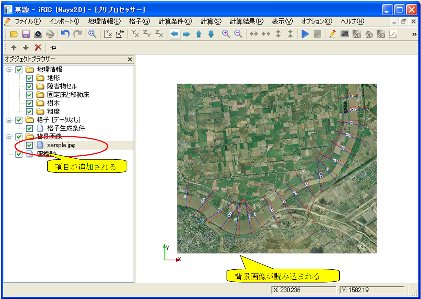

.. _sec_pre_bg_image_data:

Background Image
==================

Below are the functions for editing the background image.

A background image means an imported image file. An imported aerial
photograph of the area to be analyzed can be used to edit the geographic
data and grid information.

The following types of image files can be imported for the iRIC
background image:

-  jpeg
-  png
-  tiff

When a geographic reference file (refer to the *iRIC Related File
Manual*) is in the same folder as an image file, the file is
automatically read and used to adjust the positions.

When there is no geographic reference file, the position of the imported
background image is automatically adjusted such that it is displayed in
the same area as the already imported geographic data and grid. After
that, the user can manually adjust the image.

Functions related to the background image are available only when the
Pre-processor is active. The function of each menu item is explained
here.

[Import] (I)
-------------

**Description**: Imports the background image. A background image can be
imported by either of the following operations:

**Menu bar**: [File] (F) --> [Import] (I) --> Background image (B)

**Menu bar**: [Import] (I) --> Background image (B)

Then, the [Open Image File] dialog (:numref:`bg_open_image_file_dialog`)
will open. Select the image data file you want to import and
click on [OK].

Then, the background image is imported and the item is added to [Object
Browser]. :numref:`image_iric_after_bg_import` shows an example of
the iRIC display after a background image has been imported.

.. _bg_open_image_file_dialog:

.. figure:: images/bg_open_image_file_dialog.png

   [Open Image File] dialog

.. _image_iric_after_bg_import:

   Example of the iRIC display after a background image has been imported

Adjusting Positions
----------------------

**Description**: Adjusts the background image locations.

In [Object Browser], select the background image whose position you want
to adjust. Perform the procedure explained in :numref:`bg_image_operations_table`
on the canvas to adjust the position of the background image.

.. |cursor_zoom| image:: images/cursor_zoom.png
.. |cursor_translate| image:: images/cursor_translate.png

.. list-table:: Procedure for adjusting the position of the background image
   :name: bg_image_operations_table
   :header-rows: 1

   * - Adjusting operation
     - Action
     - Cursor
   * - Rotate
     - Left drag
     - |cursor_rotate|
   * - Zoom in/out
     - Drag or scroll up/down the mouse wheel
     - |cursor_zoom|
   * - Translate
     - Right drag
     - |cursor_translate|

.. |icon_pin_fix| image:: images/icon_pin_fix.png
.. |icon_pin_free| image:: images/icon_pin_free.png

To fix the position of the background image, select |icon_pin_free| in the
Operation Toolbar (the icon changes to |icon_pin_fix|). When the position of
the background image is at a fixed point, the adjusting operation is
disabled, even if [Background Image] is selected in [Object Browser].

Click again to make the background image movable.

By selecting [Property] from right-clicking menu, you can open
[Background Image Position] dialog
(:numref:`image_bg_image_position_dialog`) and specify the
position by editing values.

.. _image_bg_image_position_dialog:

   The [Background Image Position] dialog
