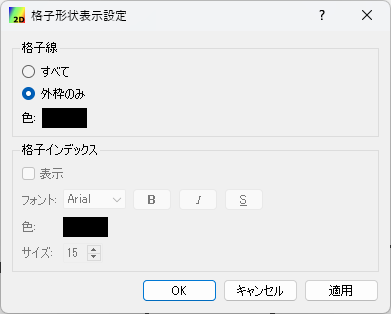
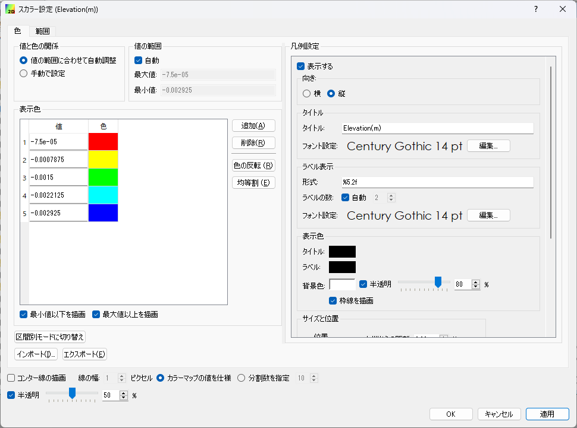
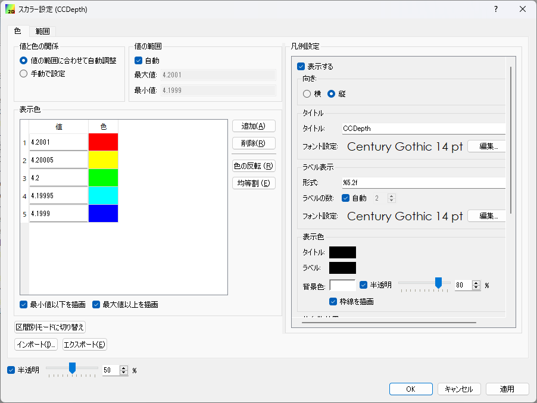
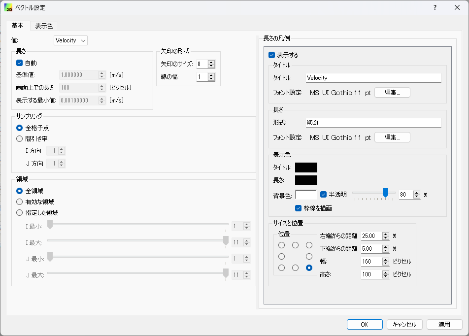
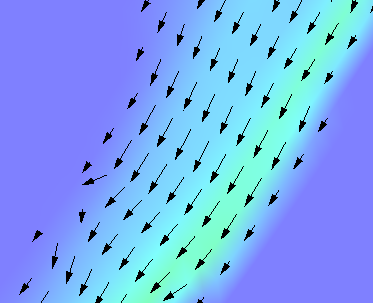
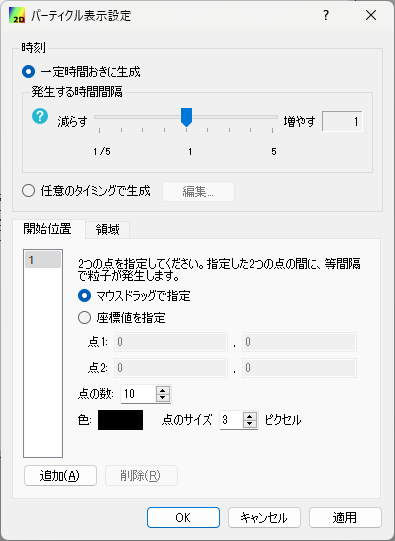

.. _sec_2d_vis_func:

二次元可視化機能
============================

二次元での計算結果を可視化する機能について説明します。

二次元での可視化は、可視化ウィンドウ (2D) を利用して行います。

新しい可視化ウィンドウ (2D) を開く
-------------------------------------

.. |post2d-window-icon| image:: images/post2d-window-icon.png

新しい可視化ウィンドウ (2D) を開くには、以下のいずれかの操作を行います。

**メニューバー:** 計算結果 (R) --> 新しい可視化ウィンドウ (2D)を開く

**ツールバー:** |post2d-window-icon|

すると、 :numref:`image_post2d_window_example` に示すような
可視化ウィンドウ (2D) が新しく開きます。

.. _image_post2d_window_example:

.. figure:: images/post2d_window_example.png
   :width: 380pt

   可視化ウィンドウ (2D) 表示例

メニュー構成
----------------------

可視化ウィンドウ (2D) 固有のメニュー構成を、 :numref:`table_post2d_window_menu`
に示します。 :numref:`table_post2d_window_menu`
に示すメニューは、可視化ウィンドウ (2D)
がアクティブな時、「インポート」メニューと「計算」メニューの間に表示されます。

.. _table_post2d_window_menu:

.. list-table:: 可視化ウィンドウ (2D) 固有のメニュー構成
   :header-rows: 1

   * - メニュー
     -
     - 説明
   * - 描画設定 (D)
     - 格子形状 (G)
     - 格子形状の設定をします
   * -
     - コンター (C)
     - コンターの設定をします
   * -
     - コンター (セル中心) (L)
     - セル中心で出力された計算結果についてのコンターの設定をします
   * -
     - ベクトル (A)
     - ベクトルの設定をします
   * -
     - 流線 (S)
     - 流線の設定をします
   * -
     - パーティクル (P)
     - パーティクルの設定をします
   * -
     - セル属性 (C)
     - セル属性の設定をします
   * -
     - タイトル (T)
     - タイトルの設定をします
   * -
     - 時刻 (M)
     - 時刻の設定をします
   * - 実測値(M)
     - スカラー (S)
     - スカラー量の実測値の表示設定をします
   * -
     - ベクトル (V)
     - ベクトル量の実測値の表示設定をします
   * -
     - インポート (I)
     - 実測値をファイルからインポートします

オブジェクトブラウザー構成
------------------------------

オブジェクトブラウザーの表示例を :numref:`image_post2d_window_objbrowser_example`
に示します。

.. _image_post2d_window_objbrowser_example:

   オブジェクトブラウザーの表示例

可視化ウィンドウ(2D) のオブジェクトブラウザーに表示される項目の設定は、
主に描画設定メニュー、実測値メニューから行います。「座標軸」、「距離計測」の
操作についてはそれぞれ :ref:`sec_pre_axes`,
:ref:`sec_pre_distance_measures` を参照して下さい。

属性ブラウザ
-----------------------------

可視化ウィンドウ (2D) では、属性ブラウザを用いて、格子点での属性を
一覧表示することができます。

属性ブラウザの表示例を :numref:`image_post2d_attribute_browser`
に示します。

属性ブラウザは、以下のいずれかの操作によって表示できます。

* **メニューバー**: 表示 (V) -> 属性ブラウザ (A)
* **右クリックメニュー**: オブジェクトブラウザで スカラー (格子点) などを選択した状態
  で、右クリックメニューから「属性ブラウザの表示」を選択

属性ブラウザが表示された状態では、マウス操作によって以下が行えます。

* 点を選択していない状態では、マウスカーソルを計算結果がある領域上で動かすと、
  マウスカーソルに一番近い点での計算結果の値が属性ブラウザに表示され続けます。
  現在値を表示している格子点の上には、大きめの四角が表示されます。

* 属性ブラウザに値が表示されている状態でマウスを左クリックすると、点が選択
  され、マウスカーソルを動かしても選択した点が表示され続ける状態になります。
  別の点の上で左クリックすると、新しい点が選択されます。

* 計算結果がない領域で左クリックすると点の選択状態が解除されて、マウスカーソルの移動
  によって連続的に値が表示される状態に戻ります。

.. _image_post2d_attribute_browser:

.. figure:: images/post2d_attribute_browser.png
   :width: 200pt

   属性ブラウザの表示例

格子形状 (G)
------------------

格子形状の表示設定をします。

格子形状の表示設定ダイアログ (:numref:`image_post2d_grid_shape_dialog` 参照)
が表示されますので、設定を行って「OK」ボタンを押します。表示を「外枠のみ」と設定した時と、
「すべて」と設定した時の表示例を
:numref:`image_post2d_grid_shape_wireframe_lines` にそれぞれ示します。

「格子インデックス」の設定は、「格子線」で「すべて」を選択した時にのみ操作できます。

.. _image_post2d_grid_shape_dialog:

   格子表示設定ダイアログ 表示例

.. _image_post2d_grid_shape_wireframe_lines:

   格子形状の表示設定ごとの表示例

コンター (C)
---------------

コンターの表示設定をします。

コンターの表示設定ダイアログが表示されます (:numref:`image_post2d_contour_dialog` 参照)
ので、設定を行って「OK」ボタンを押します。表示する領域の範囲を調整するには、
「領域設定 (R)｣ボタンを押して領域設定ダイアログを表示し、設定を行って
「OK」ボタンを押します（:numref:`image_post2d_contour_region_structured_dialog`、
:numref:`image_post2d_contour_region_unstructured_dialog` 参照）。
凡例の表示方法を調整するには、「カラーバー設定(C)」ボタンを押して
カラーバー設定ダイアログを表示し、設定を行って「OK」ボタンを押します
（:numref:`image_post2d_contour_colorbar_setting_dialog` 参照）。

カラーマップで「手動」を選択し、「設定」ボタンを押した場合に表示されるダイアログに
ついては、:ref:`sec_geo_common_color_setting` を参照して下さい。

コンター設定ごとの表示例を :numref:`image_post2d_contours_by_displaysetting`
に示します。

コンターは、iRIC 3.0 では複数の計算結果について同時に表示できるようになっています。
複数のコンターを同時に表示するには、オブジェクトブラウザで、複数の項目の横の
チェックボックスをチェックして下さい。

.. _image_post2d_contour_dialog:

   コンター表示設定ダイアログ 表示例

.. _image_post2d_contour_region_structured_dialog:

.. figure:: images/post2d_contour_region_structured_dialog.png
   :width: 140pt

   コンター表示 領域設定ダイアログ 表示例 (構造格子)

.. _image_post2d_contour_region_unstructured_dialog:

.. figure:: images/post2d_contour_region_unstructured_dialog.png
   :width: 120pt

   コンター表示 領域設定ダイアログ 表示例 (非構造格子)

.. _image_post2d_contour_colorbar_setting_dialog:

.. figure:: images/post2d_contour_colorbar_setting_dialog.png
   :width: 150pt

   コンター表示 カラーバー設定ダイアログ 表示例

.. _image_post2d_contours_by_displaysetting:

.. figure:: images/post2d_contours_by_displaysetting.png
   :width: 420pt

   コンター設定の値ごとの表示例

コンター (セル中心) (L)
-----------------------

セル中心で定義された計算結果に関するコンターの表示設定をします。

コンターの表示設定ダイアログが表示されます (:numref:`image_post2d_contour_dialog` 参照)
ので、設定を行って「OK」ボタンを押します。

表示する領域の範囲を調整するには、
「領域設定 (R)｣ボタンを押して領域設定ダイアログを表示し、設定を行って
「OK」ボタンを押します（:numref:`image_post2d_cellcenter_contour_region_structured_dialog`、
:numref:`image_post2d_cellcenter_contour_region_unstructured_dialog` 参照）。

凡例の表示方法を調整するには、「カラーバー設定(C)」ボタンを押して
カラーバー設定ダイアログを表示し、設定を行って「OK」ボタンを押します
（:numref:`image_post2d_cellcenter_contour_colorbar_setting_dialog` 参照）。

カラーマップで「手動」を選択し、「設定」ボタンを押した場合に表示されるダイアログに
ついては、:ref:`sec_geo_common_color_setting` を参照して下さい。

コンター設定ごとの表示例を :numref:`image_post2d_cellcenter_contours_by_displaysetting`
に示します。

コンターは、複数の計算結果について同時に表示できます。
複数のコンターを同時に表示するには、オブジェクトブラウザで、複数の項目の横の
チェックボックスをチェックして下さい。

.. _image_post2d_cellcenter_contour_dialog:

   コンター表示設定ダイアログ 表示例

.. _image_post2d_cellcenter_contour_region_structured_dialog:

.. figure:: images/post2d_contour_region_structured_dialog.png
   :width: 150pt

   コンター表示 領域設定ダイアログ 表示例 (構造格子)

.. _image_post2d_cellcenter_contour_region_unstructured_dialog:

.. figure:: images/post2d_contour_region_unstructured_dialog.png
   :width: 130pt

   コンター表示 領域設定ダイアログ 表示例 (非構造格子)

.. _image_post2d_cellcenter_contour_colorbar_setting_dialog:

.. figure:: images/post2d_contour_colorbar_setting_dialog.png
   :width: 160pt

   コンター表示 カラーバー設定ダイアログ 表示例

.. _image_post2d_cellcenter_contours_by_displaysetting:

.. figure:: images/post2d_cellcenter_contours_by_displaysetting.png
   :width: 400pt

   コンター設定の値ごとの表示例

ベクトル (A)
-------------

ベクトルの表示設定をします。

ベクトルの表示設定ダイアログ (:numref:`image_post2d_arrow_setting_dialog_structured`
、 :numref:`image_post2d_arrow_setting_dialog_unstructured` 参照)
が表示されますので、設定を行って「OK」ボタンを押します。

ベクトルの表示例を :numref:`image_post2d_arrow_example` に表示します。

.. _image_post2d_arrow_setting_dialog_structured:

   ベクトル表示設定ダイアログ 表示例 (構造格子)

.. _image_post2d_arrow_setting_dialog_unstructured:

.. figure:: images/post2d_arrow_setting_dialog_unstructured.png
   :width: 200pt

   ベクトル表示設定ダイアログ 表示例 (非構造格子)

.. _image_post2d_arrow_region_structured_dialog:

.. figure:: images/post2d_arrow_region_structured_dialog.png
   :width: 150pt

   ベクトル表示 領域設定ダイアログ 表示例 (構造格子)

.. _image_post2d_arrow_region_unstructured_dialog:

.. figure:: images/post2d_arrow_region_unstructured_dialog.png
   :width: 140pt

   ベクトル表示 領域設定ダイアログ 表示例 (非構造格子)

.. _image_post2d_arrow_example:

   ベクトル表示例

流線 (S)
------------------

流線の表示設定をします。

流線の表示設定ダイアログ (:numref:`image_post2d_streamline_structured_dialog`、
:numref:`image_post2d_streamline_unstructured_dialog` 参照)
が表示されますので、設定を行って「OK」ボタンを押します。

流線の表示例を :numref:`image_post2d_streamline_example` に示します。

.. _image_post2d_streamline_structured_dialog:

   流線の表示設定ダイアログ (構造格子)

.. _image_post2d_streamline_unstructured_dialog:

   流線の表示設定ダイアログ (非構造格子)

.. _image_post2d_streamline_example:

.. figure:: images/post2d_streamline_example.png
   :width: 320pt

   流線表示例

パーティクル(P)
------------------

パーティクルの表示設定をします。

パーティクルの表示設定ダイアログ (:numref:`image_post2d_particles_structured_dialog`,
:numref:`image_post2d_particles_unstructured_dialog` 参照)
が表示されますので、設定を行って「OK」ボタンを押します。

パーティクルの表示例を :numref:`image_post2d_particles_example` に示します。

.. _image_post2d_particles_structured_dialog:

.. figure:: images/post2d_particles_structured_dialog.png
   :width: 230pt

   パーティクル設定ダイアログ 表示例 (構造格子)

.. _image_post2d_particles_unstructured_dialog:

   パーティクル設定ダイアログ 表示例 (非構造格子)

.. _image_post2d_particles_example:

.. figure:: images/post2d_particles_example.png
   :width: 230pt

   パーティクル 表示例

セル属性 (C)
-----------------------

セル属性について、表示色と表示順序を設定します。

セル属性の設定ダイアログ (:numref:`image_post2d_cellattributes_dialog` 参照)
が表示されますので、設定を行って「OK」ボタンを押します。
「半透明」をチェックし、数値を調整することで、表示を半透明にすることができます。

.. _image_post2d_cellattributes_dialog:

.. figure:: images/post2d_cellattributes_dialog.png
   :width: 230pt

   セル属性の設定ダイアログ 表示例

背景画像
--------

背景画像を表示します。

この機能は、プリプロセッサに実装されている機能と同じです。
詳細は :ref:`sec_pre_bg_image_data` を参照して下さい。

タイトル (T)
--------------

タイトルの表示設定をします。

タイトルの表示設定ダイアログ (:numref:`image_post2d_title_setting_dialog` 参照)
が表示されますので、設定を行って「OK」ボタンを押します。

.. _image_post2d_title_setting_dialog:

   タイトルの表示設定ダイアログ 表示例

時刻 (M)
------------

時刻の表示設定をします。

時刻の表示設定ダイアログ (:numref:`image_post2d_time_setting_dialog` 参照)
が表示されますので、設定を行って「OK」ボタンを押します。

.. _image_post2d_time_setting_dialog:

.. figure:: images/post2d_time_setting_dialog.png
   :width: 100pt

   時刻の表示設定ダイアログ 表示例

実測値 (M)
-------------

可視化ウィンドウ (2D)
で利用できる実測値の関連機能は、プリプロセッサで利用できる機能と同じです。
:ref:`sec_pre_measured_data` を参照してください。
