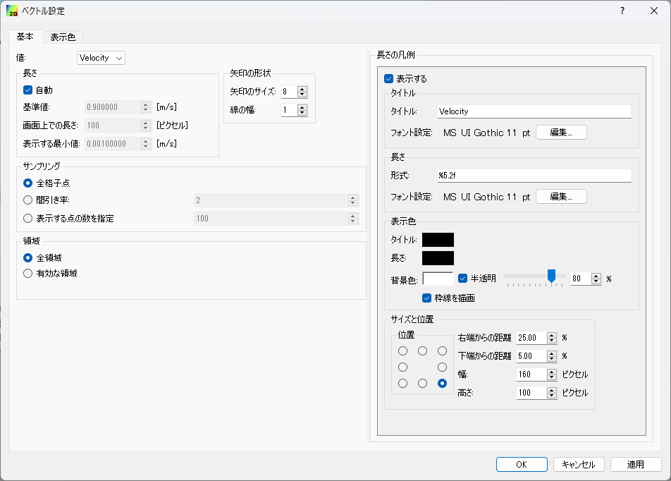
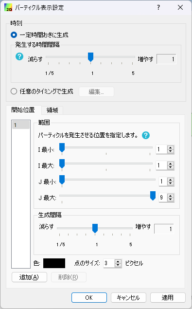
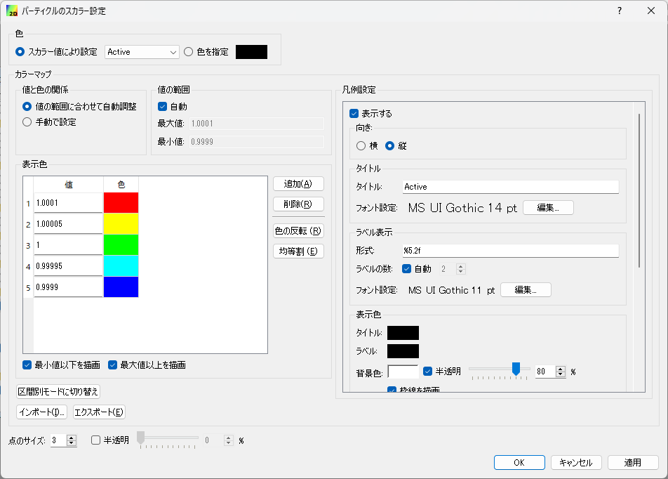
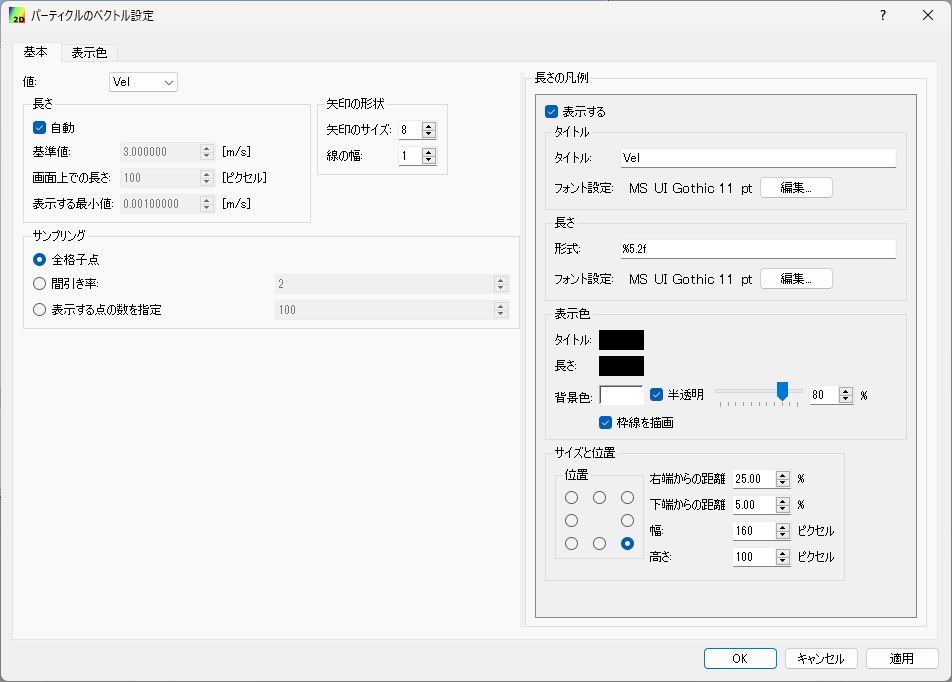
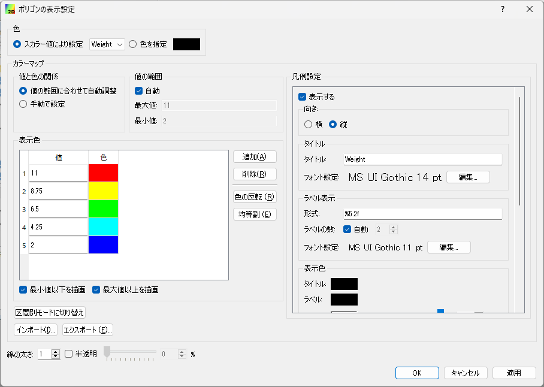
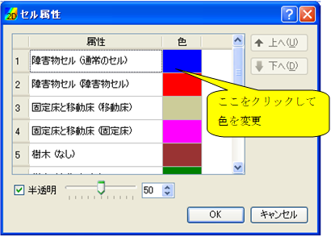
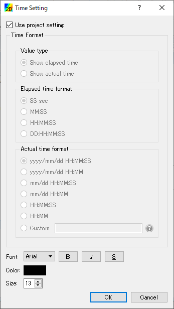

.. _sec_2d_vis_func:

2D visualization functions
============================

The functions for visualizing the 2D calculation results are explained.

Use [2D Post-processing Window] for 2D visualization of simulation
results as explained below.

[Open New 2D Post-processing Window]
-------------------------------------

.. |post2d-window-icon| image:: images/post2d-window-icon.png

Either of the following actions opens a new [2D Post-processing Window].

**Menu bar:** [Calculation Results] (R) --> [Open New 2D Post-processing Window]

**Operation Toolbar:** |post2d-window-icon|

The new [2D Post-processing Window] (:numref:`image_post2d_window_example`)
will open.

.. _image_post2d_window_example:

   [2D Post-processing Window]

Additional menu items
----------------------

:numref:`table_post2d_window_menu` shows the additional menu items for
the [2D Post-processing Window] display.
The additional menus are shown between [Import] and
[Simulation] when [2D Post-processing Window] is active.

.. _table_post2d_window_menu:

.. list-table:: Additional menu items for [2D Post-processing Window]
   :header-rows: 1

   * - Menu
     -
     - Description
   * - [Display Setting] (D)
     - [Grid Shape] (G)
     - Displays the [Grid Shape] dialog.
   * -
     - [Contours (node)] (C)
     - Displays the [Contour] dialog for results defined at grid nodes.
   * -
     - [Contours (cell center)]
     - Displays the [Contour] dialog for results defined at cell centers.
   * -
     - [Arrow] (A)
     - Displays the [Arrow] (i.e., vector) dialog.
   * -
     - [Streamline] (S)
     - Displays the [Streamline] dialog.
   * -
     - [Particles] (P)
     - Displays the [Particles] dialog.
   * -
     - [Polygon] (O)
     - Displays the [Polygons] dialog.
   * -
     - [Cell Attributes]
     - Displays the [Cell Attributes] dialog.
   * -
     - [Title]
     - Displays the [Title] dialog.
   * -
     - [Time]
     - Displays the [Time] dialog.
   * - [Measured Data] (M)
     - [Scalar] (S)
     - Displays the [Scalar Setting] dialog.
   * -
     - [Arrows] (A)
     - Displays the [Arrows Setting] dialog.
   * -
     - [Import] (I)
     - Import [Measured Data]

[Object Browser]
------------------

:numref:`image_post2d_window_objbrowser_example` shows an example
of the [Object Browser] of [2D
Post-processing Window].

.. _image_post2d_window_objbrowser_example:

.. figure:: images/post2d_window_objbrowser_example.png
   :width: 160pt

   The [Object Browser] of the [2D Post-processing Window]

Settings on the elements shown in the [Object Browser] of [2D
Post-processing Window] can be edited mainly from [Draw] menu and
[Measured Data] menu. For operations on [Axes] and [Distance Measures],
refer to :ref:`sec_pre_axes` and :ref:`sec_pre_distance_measures`
respectively.

[Attribute Browser]
-----------------------------

You can use [Attribute Browser] to see the values of attributes
defined at grid nodes.

:numref:`image_post2d_attribute_browser` shows an example of
[Attribute Browser].

You can open [Attribute Browser] with the following operations:

* **Menu bar**: [View] (V) -> [Attribute Browser] (A)
* **Right-clicking menu**: Select [Scalar (node)] etc. in [Object Browser],
  and select [Show Attribute Browser] from right-clicking menu.

While [Attribute Browser] is shown, you can do the following operations
using mouse:

* When no point is selected, you can see the values of attributes 
  defined at the grid node, by moving the mouse cursor. The attribute values
  defined at the point nearest to the mouse cursor is shown continuously.
  The grid node which is selected to show attributes is highlighted
  with a big black square.

* If you left-click on grid node when values are shown in [Attribute Browser],
  the grid node is selected, and values at that point is shown, until you select
  another point or clear selection. When you left-click on another grid node,
  the new node is selected.

* If you left-click on point which is outside or the region where calculation
  result is defined, selection is cleared.

.. _image_post2d_attribute_browser:

   Example of [Attribute Browser]

[Grid Shape] (G)
------------------

**Description**: Sets the grid shape settings.

When you select [Grid Shape], the [Grid Shape Setting] dialog
(:numref:`image_post2d_grid_shape_dialog`) will open.
Set it and click on [OK].
:numref:`image_post2d_grid_shape_wireframe_lines` shows examples of
the display when the setting is for [Wireframe] and [Grid line],
respectively.

.. _image_post2d_grid_shape_dialog:

.. figure:: images/post2d_grid_shape_dialog.png
   :width: 100pt

   [Grid Shape] dialog

.. _image_post2d_grid_shape_wireframe_lines:

.. figure:: images/post2d_grid_shape_wireframe_lines.png
   :width: 380pt

   Examples of graphics displayed by the [Grid Shape] setting

[Contour (nodes)] (C)
-------------------------

**Description**: Sets the contour settings for calculation results
defined at grid nodes.

When you select [Contour], the [Contour Setting] dialog
(:numref:`image_post2d_contour_dialog`) will open.
Set it and click on [OK].

When you click on [Region Setting] button, [Region Setting]
dialog (:numref:`image_post2d_contour_region_structured_dialog` or
:numref:`image_post2d_contour_region_unstructured_dialog`) will open.

When you click on [Color Bar Setting] button, [Color Legend Setting]
dialog (:numref:`image_post2d_contour_colorbar_setting_dialog`) will open.

Please refer to :ref:`sec_geo_common_color_setting` about the dialog
that is shown when you select
[Custom] as [Colormap] and click on [Setting] button.

:numref:`image_post2d_contours_by_displaysetting` shows an example of
displayed contours for each [Display Setting] setting.

With iRIC 3.0, it is now possible to visualize contours for multiple
calculation results at the same time. To visualize multiple contours,
please check on the check boxes for multiple items in the object browser.

.. _image_post2d_contour_dialog:

.. figure:: images/post2d_contour_dialog.png
   :width: 240pt

   [Contour Setting] dialog

.. _image_post2d_contour_region_structured_dialog:

.. figure:: images/post2d_contour_region_structured_dialog.png
   :width: 140pt

   [Region Setting] dialog (Structured grid)

.. _image_post2d_contour_region_unstructured_dialog:

.. figure:: images/post2d_contour_region_unstructured_dialog.png
   :width: 120pt

   [Region Setting] dialog (Unstructured grid)

.. _image_post2d_contour_colorbar_setting_dialog:

.. figure:: images/post2d_contour_colorbar_setting_dialog.png
   :width: 150pt

   [Color Legend Setting] dialog

.. _image_post2d_contours_by_displaysetting:

.. figure:: images/post2d_contours_by_displaysetting.png
   :width: 420pt

   Examples of the contour display by the [Display Setting] setting

[Contour (Cell center)] (L)
-------------------------------

**Description**: Sets the contour settings for calculation Results
defined at cell centers.

When you select [Contour], the [Contour Setting] dialog
(:numref:`image_post2d_cellcenter_contour_dialog`) will open.
Set it and click on [OK].

When you click on [Region Setting] button,
[Region Setting] dialog
(:numref:`image_post2d_cellcenter_contour_region_structured_dialog` or
:numref:`image_post2d_cellcenter_contour_region_unstructured_dialog`)
will open.

When you click on [Color Bar Setting] button, [Color Legend Setting] dialog
(:numref:`image_post2d_cellcenter_contour_colorbar_setting_dialog`)
will open.

Please refer to :ref:`sec_geo_common_color_setting`
about the dialog that is shown when you select [Custom]
as [Colormap] and click on [Setting] button.

:numref:`image_post2d_cellcenter_contours_by_displaysetting`
shows an example of
displayed contours for each [Display Setting] setting.

With iRIC 3.0, it is now possible to visualize contours for multiple
calculation results at the same time. To visualize multiple contours,
please check on the check boxes for multiple items in the object browser.

.. _image_post2d_cellcenter_contour_dialog:

.. figure:: images/post2d_cellcenter_contour_dialog.png
   :width: 250pt

   [Contour Setting] dialog

.. _image_post2d_cellcenter_contour_region_structured_dialog:

.. figure:: images/post2d_contour_region_structured_dialog.png
   :width: 150pt

   [Region Setting] dialog (Structured grid)

.. _image_post2d_cellcenter_contour_region_unstructured_dialog:

.. figure:: images/post2d_contour_region_unstructured_dialog.png
   :width: 130pt

   [Region Setting] dialog (Unstructured grid)

.. _image_post2d_cellcenter_contour_colorbar_setting_dialog:

.. figure:: images/post2d_contour_colorbar_setting_dialog.png
   :width: 160pt

   [Color Legend Setting] dialog

.. _image_post2d_cellcenter_contours_by_displaysetting:

.. figure:: images/post2d_cellcenter_contours_by_displaysetting.png
   :width: 400pt

   Examples of the contour display by the [Display Setting] setting

[Arrow] (A)
-------------

**Description**: Sets the [Arrow] display.

When you select [Arrow], the [Arrow Setting] dialog
(:numref:`image_post2d_arrow_setting_dialog_structured` or
:numref:`image_post2d_arrow_setting_dialog_unstructured`) will open.
Set it and click on [OK]. :numref:`image_post2d_arrow_example`
shows an example of the [Arrow] display.

.. _image_post2d_arrow_setting_dialog_structured:

.. figure:: images/post2d_arrow_setting_dialog_structured.png
   :width: 200pt

   [Arrow Setting] dialog (structured)

.. _image_post2d_arrow_setting_dialog_unstructured:

   [Arrow Setting] dialog (unstructured)

.. _image_post2d_arrow_region_structured_dialog:

.. figure:: images/post2d_arrow_region_structured_dialog.png
   :width: 150pt

   [Region Setting] dialog (Structured grid)

.. _image_post2d_arrow_region_unstructured_dialog:

.. figure:: images/post2d_arrow_region_unstructured_dialog.png
   :width: 130pt

   [Region Setting] dialog (Unstructured grid)

.. _image_post2d_arrow_example:

.. figure:: images/post2d_arrow_example.png
   :width: 240pt

   Example of the [Arrow] display

[Streamline] (S)
------------------

**Description**: Sets the streamline settings.

When you select [Streamline], the [Streamline Setting] dialog
(:numref:`image_post2d_streamline_structured_dialog` or
:numref:`image_post2d_streamline_unstructured_dialog`)
will open. Set it and click on [OK].
:numref:`image_post2d_streamline_example` shows an example
of the streamline display.

.. _image_post2d_streamline_structured_dialog:

.. figure:: images/post2d_streamline_structured_dialog.png
   :width: 260pt

   [Streamline Setting] dialog (Structured)

.. _image_post2d_streamline_unstructured_dialog:

.. figure:: images/post2d_streamline_unstructured_dialog.png
   :width: 260pt

   [Streamline Setting] dialog (Unstructured)

.. _image_post2d_streamline_example:

   Example of the [Streamline] display

[Particles (auto)] (P)
--------------------------

**Description**: Sets the particle settings.

[Particles (auto)] is the function to generate particles
in GUI, and simulate where where the particles will move to, 
using velocity in calculation result, and visualize the particles.

When you select [Particles], the [Particle Setting] dialog
(:numref:`image_post2d_particles_structured_dialog` or
:numref:`image_post2d_particles_unstructured_dialog`)
will open. Set it and click on [OK].
:numref:`image_post2d_particles_example`
shows an example of the [Particles] display.

.. _image_post2d_particles_structured_dialog:

   [Particle Setting] dialog (Structured)

.. _image_post2d_particles_unstructured_dialog:

.. figure:: images/post2d_particles_unstructured_dialog.png
   :width: 240pt

   [Particle Setting] dialog (Unstructured)

.. _image_post2d_particles_example:

   Example of the [Particles] display

[Particles] (R)
------------------

**Description**: Sets the particle settings.

[Particles] is the function to load particles output by solber,
and visualize the particles.

When scalar attributes are output, user can change particle colors.
When vector attributes are output, user can show arrows.

When you select [Property] menu in right-clicking menu of
[Scalar] and [Vector] Folder under [Particles], the dialogs in 
:numref:`image_post2d_particles_solver_scalar_dialog`, 
:numref:`image_post2d_particles_solver_vector_dialog` will be shown.
Please edit the setting, and click on [OK] button.

:numref:`image_post2d_particles_solver_example`
shows an example of the [Particles] display.

.. _image_post2d_particles_solver_scalar_dialog:

   [Particle Scalar Setting] dialog

.. _image_post2d_particles_solver_vector_dialog:

   [Arrow Setting] dialog

.. _image_post2d_particles_solver_example:

   Example of the [Particles] display

[Polygons] (O)
------------------

**Description**: Sets the polygon settings

You can open polygon settings dialog, when user select the folder under
"Polygon" folder in the [Object Browser].

When you select [Polygons], the [Polygon Setting] dialog
(:numref:`image_post2d_polygons_dialog`)
will open. Update setting and click on [OK].
:numref:`image_post2d_polygons_example`
shows an example of the [Polygons] display.

.. _image_post2d_polygons_dialog:

   [Polygon Setting] dialog

.. _image_post2d_polygons_example:

   Example of the [Polygons] display

[Cell Attributes] (C)
-----------------------

**Description**: Sets the cell color and the order of display for
cell attributes.

When you select [Cell Attributes], the [Cell Attributes] dialog
(:numref:`image_post2d_cellattributes_dialog`) will open.
Set it and click on [OK].

.. _image_post2d_cellattributes_dialog:

   [Cell Attributes] dialog

[Background Image]
--------------------

**Description**: Shows background images.

This function is same to the function implemented on Pre-processor Window.
Please refer to :ref:`sec_pre_bg_image_data` for detail.

[Background Image (Internet)]
---------------------------------------

**Description**: Shows background images got from Internet.

This function is same to the function implemented on Pre-processor Window.
Please refer to :ref:`sec_pre_ob_bg_internet` for detail.

[Title] (T)
------------

**Description**: Sets the title settings.

When you select [Title], the [Title Setting] dialog
(:numref:`image_post2d_title_setting_dialog`) will open.
Set it and click on [OK].

.. _image_post2d_title_setting_dialog:

.. figure:: images/post2d_title_setting_dialog.png
   :width: 200pt

   [Title Setting] dialog

[Time] (M)
------------

**Description**: Sets the time settings.

When you select [Time], the [Time Setting] dialog
(:numref:`image_post2d_time_setting_dialog`)
will open. Set it and click on [OK].

.. _image_post2d_time_setting_dialog:

   [Time Setting] dialog

[Measured Data] (M)
---------------------

The functions related to [Measured Data] that are available in [2D
Post-processing Window] are the same to those in [Pre-processing
Window]. Refer to :ref:`sec_pre_measured_data`.
