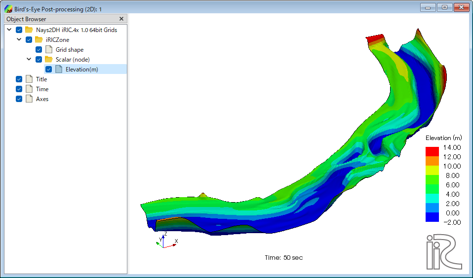
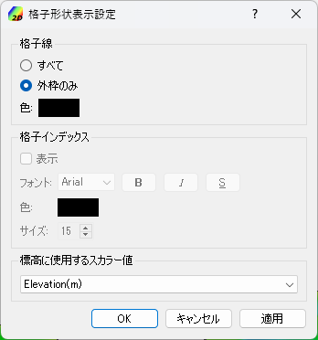
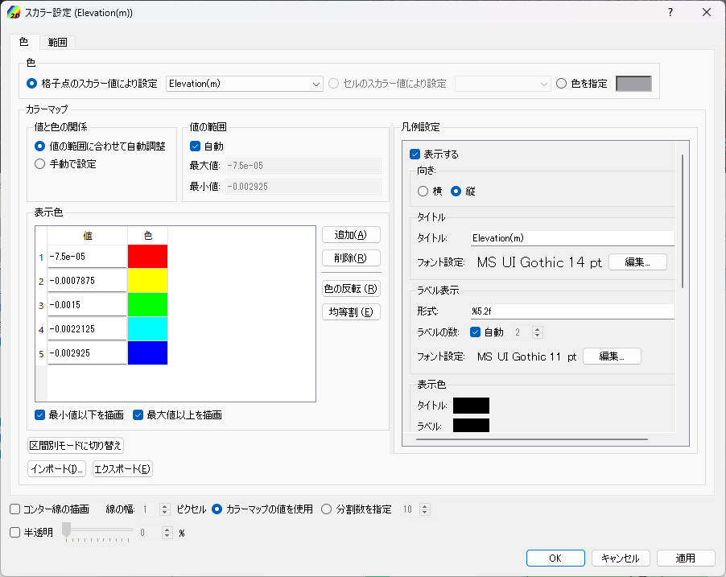
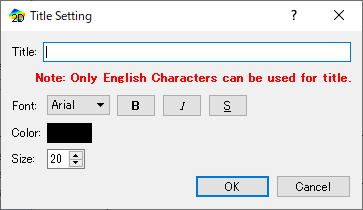
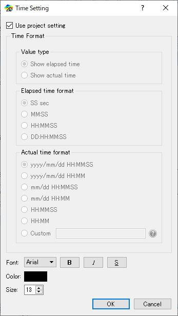
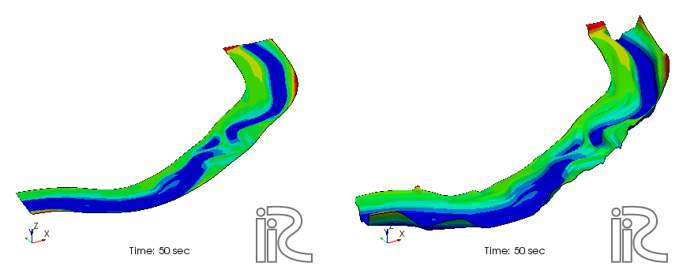

.. _sec_2dbirdeye_vis_func:

鳥瞰図可視化機能
=======================

二次元での計算結果を鳥瞰図として可視化する機能について説明します。

鳥瞰図可視化は、鳥瞰図可視化ウィンドウ (2D) を利用して行います。

新しい鳥瞰図可視化ウィンドウ (2D) を開く
-------------------------------------------------------

.. |post2dbirdeye-window-icon| image:: images/post2dbirdeye-window-icon.png

新しい鳥瞰図可視化ウィンドウ (2D)
を開くには、以下のいずれかの操作を行います。

**メニューバー:** 計算結果 (R) --> 新しい鳥瞰図可視化ウィンドウ (2D) を開く

**ツールバー:** |post2dbirdeye-window-icon|

すると、:numref:`image_post2dbirdeye_window_example` に示すような
鳥瞰図可視化ウィンドウ (2D) が新しく開きます。

.. _image_post2dbirdeye_window_example:

   鳥瞰図可視化ウィンドウ (2D) 表示例

メニュー構成
--------------

鳥瞰図可視化ウィンドウ (2D) 固有のメニュー構成を、
:numref:`table_post2dbirdeye_window_menu` に示します。
:numref:`table_post2dbirdeye_window_menu`
に示すメニューは、鳥瞰図可視化ウィンドウ (2D)
がアクティブな時、「インポート」メニューと「計算」メニューの間に表示されます。

.. _table_post2dbirdeye_window_menu:

.. list-table:: 鳥瞰図可視化ウィンドウ (2D) 固有のメニュー構成
   :header-rows: 1

   * - メニュー
     -
     - 説明
   * - 描画設定 (D)
     - 格子形状 (G)
     - 格子形状の設定をします
   * -
     - コンター (格子点) (C)
     - 格子点で定義された計算結果のコンターの設定をします
   * -
     - コンター (セル中心) (L)
     - セル中心で定義された計算結果のコンターの設定をします
   * -
     - タイトル (T)
     - タイトルの設定をします
   * -
     - 時刻 (M)
     - 時刻の設定をします
   * -
     - 背景色 (B)
     - 背景色の設定をします
   * -
     - Z方向の倍率 (Z)
     - Z方向の倍率の設定をします

オブジェクトブラウザー構成
----------------------------

オブジェクトブラウザーの表示例を
:numref:`image_post2dbirdeye_window_objbrowser_example` に示します。

.. _image_post2dbirdeye_window_objbrowser_example:

.. figure:: images/post2dbirdeye_window_objbrowser_example.png
   :width: 140pt

   オブジェクトブラウザーの表示例

鳥瞰図可視化ウィンドウ (2D) のオブジェクトブラウザーに表示される項目の設定は、
主に描画設定メニューから行います。「座標軸」の操作については :ref:`sec_pre_axes`
を参照して下さい。

格子形状 (G)
-------------------

格子形状の表示設定をします。

格子形状の表示設定ダイアログ (:numref:`image_post2dbirdeye_grid_shape_dialog` 参照)
が表示されますので、設定を行って「OK」ボタンを押します。表示を「外枠のみ」と設定した時と、
「すべて」と設定した時の表示例を
:numref:`image_post2dbirdeye_grid_shape_wireframe_lines`
に示します。

「格子インデックス」の設定は、「格子線」で「すべて」を選択した時にのみ操作できます。

.. _image_post2dbirdeye_grid_shape_dialog:

   格子表示設定ダイアログ 表示例

.. _image_post2dbirdeye_grid_shape_wireframe_lines:

.. figure:: images/post2dbirdeye_grid_shape_wireframe_lines.png
   :width: 360pt

   格子形状の表示設定ごとの表示例

コンター (格子点) (C)
-------------------------

格子点で定義された計算結果のコンターの表示設定をします。

コンターの表示設定ダイアログが表示されます
(:numref:`image_post2dbirdeye_contour_dialog` 参照)
ので、設定を行って「OK」ボタンを押します。

表示する領域の範囲を調整するには、
「領域設定(R)｣ボタンを押して領域設定ダイアログを表示し、設定を行って「OK」ボタンを
押します（:numref:`image_post2dbirdeye_contour_dialog`,
:numref:`image_post2dbirdeye_contour_region_unstructured_dialog` 参照）。

凡例の表示方法を調整するには、「カラーバー設定(C)」ボタンを押して
カラーバー設定ダイアログを表示し、設定を行って「OK」ボタンを押します
（:numref:`image_post2dbirdeye_contour_colorbar_setting_dialog` 参照）。

コンター設定ごとの表示例を
:numref:`image_post2dbirdeye_contours_by_displaysetting` に示します。

コンターは、iRIC 3.0 では複数の計算結果について同時に表示できるようになっています。
複数のコンターを同時に表示するには、オブジェクトブラウザで、複数の項目の横の
チェックボックスをチェックして下さい。

.. _image_post2dbirdeye_contour_dialog:

   コンター表示設定ダイアログ 表示例

.. _image_post2dbirdeye_contour_region_structured_dialog:

.. figure:: images/post2dbirdeye_contour_region_structured_dialog.png
   :width: 150pt

   コンター表示 領域設定ダイアログ 表示例 (構造格子)

.. _image_post2dbirdeye_contour_region_unstructured_dialog:

.. figure:: images/post2dbirdeye_contour_region_unstructured_dialog.png
   :width: 130pt

   コンター表示 領域設定ダイアログ 表示例 (非構造格子)

.. _image_post2dbirdeye_contour_colorbar_setting_dialog:

.. figure:: images/post2dbirdeye_contour_colorbar_setting_dialog.png
   :width: 160pt

   コンター表示 カラーバー設定ダイアログ 表示例

.. _image_post2dbirdeye_contours_by_displaysetting:

.. figure:: images/post2dbirdeye_contours_by_displaysetting.png
   :width: 420pt

   コンター設定の値ごとの表示例

コンター (セル中心) (L)
-----------------------

セル中心で定義された計算結果に関するコンターの表示設定をします。

コンターの表示設定ダイアログが表示されます (:numref:`image_post2dbirdeye_contour_dialog` 参照)
ので、設定を行って「OK」ボタンを押します。

表示する領域の範囲を調整するには、
「領域設定 (R)｣ボタンを押して領域設定ダイアログを表示し、設定を行って
「OK」ボタンを押します（:numref:`image_post2dbirdeye_cellcenter_contour_region_structured_dialog`、
:numref:`image_post2dbirdeye_cellcenter_contour_region_unstructured_dialog` 参照）。

凡例の表示方法を調整するには、「カラーバー設定(C)」ボタンを押して
カラーバー設定ダイアログを表示し、設定を行って「OK」ボタンを押します
（:numref:`image_post2dbirdeye_cellcenter_contour_colorbar_setting_dialog` 参照）。

カラーマップで「手動」を選択し、「設定」ボタンを押した場合に表示されるダイアログに
ついては、:ref:`sec_geo_common_color_setting` を参照して下さい。

コンター設定ごとの表示例を :numref:`image_post2dbirdeye_cellcenter_contours_by_displaysetting`
に示します。

コンターは、複数の計算結果について同時に表示できます。
複数のコンターを同時に表示するには、オブジェクトブラウザで、複数の項目の横の
チェックボックスをチェックして下さい。

.. _image_post2dbirdeye_cellcenter_contour_dialog:

.. figure:: images/post2dbirdeye_cellcenter_contour_dialog.png
   :width: 300pt

   コンター表示設定ダイアログ 表示例

.. _image_post2dbirdeye_cellcenter_contour_region_structured_dialog:

.. figure:: images/post2dbirdeye_contour_region_structured_dialog.png
   :width: 150pt

   コンター表示 領域設定ダイアログ 表示例 (構造格子)

.. _image_post2dbirdeye_cellcenter_contour_region_unstructured_dialog:

.. figure:: images/post2dbirdeye_contour_region_unstructured_dialog.png
   :width: 120pt

   コンター表示 領域設定ダイアログ 表示例 (非構造格子)

.. _image_post2dbirdeye_cellcenter_contour_colorbar_setting_dialog:

.. figure:: images/post2dbirdeye_contour_colorbar_setting_dialog.png
   :width: 160pt

   コンター表示 カラーバー設定ダイアログ 表示例

.. _image_post2dbirdeye_cellcenter_contours_by_displaysetting:

   コンター設定の値ごとの表示例

タイトル (T)
-------------

タイトルの表示設定をします。

タイトルの表示設定ダイアログ
(:numref:`image_post2dbirdeye_title_setting_dialog` 参照)
が表示されますので、設定を行って「OK」ボタンを押します。

.. _image_post2dbirdeye_title_setting_dialog:

   タイトルの表示設定ダイアログ 表示例

時刻 (M)
-------------

時刻の表示設定をします。

時刻の表示設定ダイアログ (:numref:`image_post2dbirdeye_time_setting_dialog` 参照)
が表示されますので、設定を行って「OK」ボタンを押します。

.. _image_post2dbirdeye_time_setting_dialog:

   時刻の表示設定ダイアログ 表示例

背景色 (B)
-------------------------

鳥瞰図可視化ウィンドウ（2D）の背景色を変更します。

この機能は、表示メニューに含まれるものと同じです（:ref:`sec_view_background_color` 参照）。

色を選択するダイアログが表示されますので、設定したい背景色を選んで「OK」ボタンを押します。

Z方向の倍率 (Z)
-------------------------

Z方向の表示の倍率を設定します。

この機能は、表示メニューに含まれるものと同じです（:ref:`sec_view_z_scale` 参照）。

:numref:`image_post2dbirdeye_zscale_dialog`
に示すダイアログが表示されますので、値を入力して「OK」ボタンを押します。

鳥瞰図可視化ウィンドウ（2D）での操作例を
:numref:`image_post2dbirdeye_zscale_example` に示します。

.. _image_post2dbirdeye_zscale_dialog:

.. figure:: images/post2dbirdeye_zscale_dialog.png
   :width: 90pt

   Z方向の倍率ダイアログ 表示例

.. _image_post2dbirdeye_zscale_example:

   Z方向の倍率 操作例
