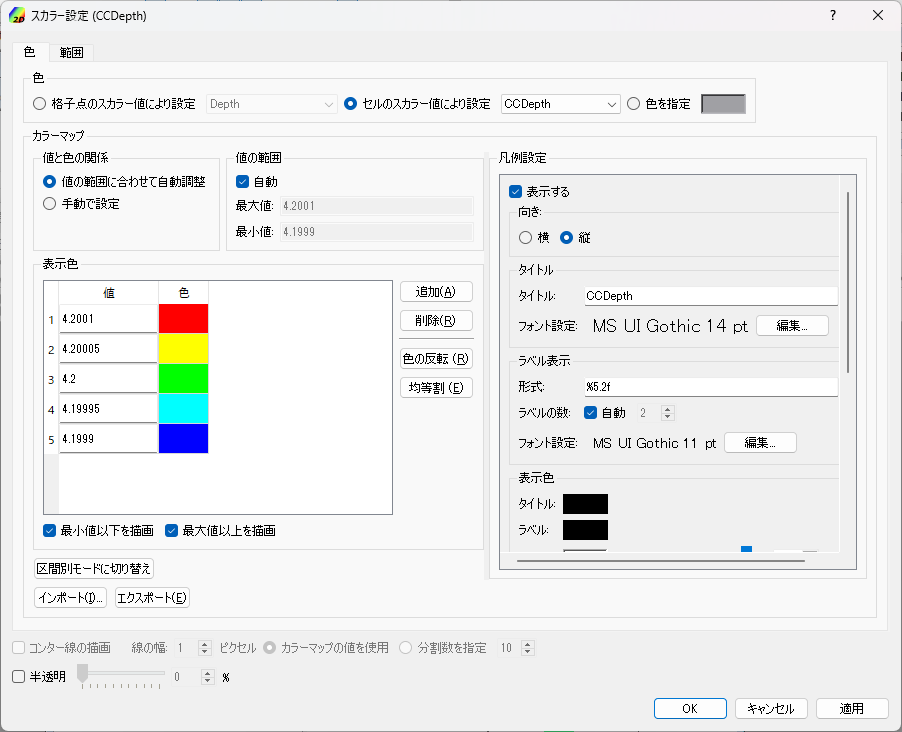
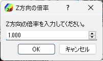

.. _sec_2dbirdeye_vis_func:

Bird's-Eye View 2D Visualization Functions
==============================================

The functions for visualizing the 2D calculation results in Bird's-eye
view are explained.

Use [Bird's Eye 2D Post-processing Window] for bird's eye view 2D
visualization of simulation result as explained below.

[Open new 2D Bird's Eye Post-processing Window]
-------------------------------------------------------

.. |post2dbirdeye-window-icon| image:: images/post2dbirdeye-window-icon.png

Either of the following actions opens a new [Bird's-Eye Post-Processing Window].

**Menu bar:** [Calculation Results] (R) --> [Open New Bird's Eye 2D Post-processing Window]

**Operation Toolbar:** |post2dbirdeye-window-icon|

When you select [Open new 2D Bird's Eye Post-processing Window], the new
[Bird's-Eye 2D Post-processing Window]
(:numref:`image_post2dbirdeye_window_example`) will open.

.. _image_post2dbirdeye_window_example:

.. figure:: images/post2dbirdeye_window_example.png

   [Bird's Eye 2D Post-processing Window]

Menu items
------------

:numref:`table_post2dbirdeye_window_menu` shows the unique
menu configuration of the [Bird's Eye 2D Post-processing Window] display.
The menu is displayed between [Import]
and [Simulation] on the Menu bar when [Bird's Eye 2D Post-processing
Window] is active.

.. _table_post2dbirdeye_window_menu:

.. list-table:: Additional menu items of [Bird's-Eye 2D Post-processing Window]
   :header-rows: 1

   * - Menu
     -
     - Description
   * - [Display Setting] (D)
     - [Grid Shape] (G)
     - Displays the [Grid Shape] dialog.
   * -
     - [Contours (node)] (C)
     - Displays the [Contour] dialog for results defined at grid nodes.
   * -
     - [Contours (cell center)] (L)
     - Displays the [Contour] dialog for results defined at cell centers.
   * -
     - [Title] (T)
     - Displays the [Title] dialog.
   * -
     - [Time] (M)
     - Displays the [Time] dialog.
   * -
     - [Background Color] (B)
     - Displays the [Background color] dialog.
   * -
     - [Z-direction Scale]
     - Edits scale for Z-direction.

[Object Browser]
-------------------

An example of the [Object Browser] of [Bird's-Eye 2D Post-processing Window]
is shown in :numref:`image_post2dbirdeye_window_objbrowser_example`.

.. _image_post2dbirdeye_window_objbrowser_example:

   [Object Browser] of the [Bird's-Eye 2D Post-processing Window]

Settings on the elements shown in the [Object Browser] of [Bird's Eye 2D
Post-processing Window] can be edited mainly from [Draw] menu. For
operations on [Axes], refer to :ref:`sec_pre_axes`.

[Grid Shape] (G)
-------------------

**Description**: Sets the grid shape settings.

When you select [Grid Shape], the [Grid Shape Setting] dialog
(:numref:`image_post2dbirdeye_grid_shape_dialog`)
will open. Set it and click on [OK].
:numref:`image_post2dbirdeye_grid_shape_wireframe_lines`
shows examples of the display when the setting is
for [Outline] and [All] respectively.

.. _image_post2dbirdeye_grid_shape_dialog:

.. figure:: images/post2dbirdeye_grid_shape_dialog.png

   [Grid Shape] dialog

.. _image_post2dbirdeye_grid_shape_wireframe_lines:

   Examples of graphics displayed by the [Grid Shape] setting

[Contours (node)] (C)
------------------------

**Description**: Sets the contour settings for calculation results
defined at grid nodes.

When you select [Contour], the [Contour Setting] dialog
(:numref:`image_post2dbirdeye_contour_dialog`) will open.
Set it and click on [OK].

When you click on [Region Setting] button, [Region Setting]
dialog (:numref:`image_post2dbirdeye_contour_region_structured_dialog` or
:numref:`image_post2dbirdeye_contour_region_unstructured_dialog`) will open.

When you click on [Color Bar Setting] button, [Color Legend Setting]
dialog (:numref:`image_post2dbirdeye_contour_colorbar_setting_dialog`) will open.

Please refer to :ref:`sec_geo_common_color_setting` about the dialog
that is shown when you select
[Custom] as [Colormap] and click on [Setting] button.

:numref:`image_post2dbirdeye_contours_by_displaysetting` shows an example of
displayed contours for each [Display Setting] setting.

With iRIC 3.0, it is now possible to visualize contours for multiple
calculation results at the same time. To visualize multiple contours,
please check on the check boxes for multiple items in the object browser.

.. _image_post2dbirdeye_contour_dialog:

.. figure:: images/post2dbirdeye_contour_dialog.png

   [Contour Setting] dialog

.. _image_post2dbirdeye_contour_region_structured_dialog:

.. figure:: images/post2dbirdeye_contour_region_structured_dialog.png

   [Region Setting] dialog (Structured grid)

.. _image_post2dbirdeye_contour_region_unstructured_dialog:

.. figure:: images/post2dbirdeye_contour_region_unstructured_dialog.png

   [Region Setting] dialog (Unstructured grid)

.. _image_post2dbirdeye_contour_colorbar_setting_dialog:

.. figure:: images/post2dbirdeye_contour_colorbar_setting_dialog.png

   [Color Legend Setting] dialog

.. _image_post2dbirdeye_contours_by_displaysetting:

   Examples of the contour display by the [Display Setting] setting

[Contour (Cell center)] (L)
------------------------------

**Description**: Sets the contour settings for calculation Results
defined at cell centers.

When you select [Contour], the [Contour Setting] dialog
(:numref:`image_post2dbirdeye_cellcenter_contour_dialog`) will open.
Set it and click on [OK].

When you click on [Region Setting] button,
[Region Setting] dialog
(:numref:`image_post2dbirdeye_cellcenter_contour_region_structured_dialog` or
:numref:`image_post2dbirdeye_cellcenter_contour_region_unstructured_dialog`)
will open.

When you click on [Color Bar Setting] button, [Color Legend Setting] dialog
(:numref:`image_post2dbirdeye_cellcenter_contour_colorbar_setting_dialog`)
will open.

Please refer to :ref:`sec_geo_common_color_setting`
about the dialog that is shown when you select [Custom]
as [Colormap] and click on [Setting] button.

:numref:`image_post2dbirdeye_cellcenter_contours_by_displaysetting`
shows an example of
displayed contours for each [Display Setting] setting.

It is possible to visualize contours for multiple
calculation results at the same time. To visualize multiple contours,
please check on the check boxes for multiple items in the object browser.

.. _image_post2dbirdeye_cellcenter_contour_dialog:

   [Contour Setting] dialog

.. _image_post2dbirdeye_cellcenter_contour_region_structured_dialog:

.. figure:: images/post2dbirdeye_contour_region_structured_dialog.png

   [Region Setting] dialog (Structured grid)

.. _image_post2dbirdeye_cellcenter_contour_region_unstructured_dialog:

.. figure:: images/post2dbirdeye_contour_region_unstructured_dialog.png

   [Region Setting] dialog (Unstructured grid)

.. _image_post2dbirdeye_cellcenter_contour_colorbar_setting_dialog:

.. figure:: images/post2dbirdeye_contour_colorbar_setting_dialog.png

   [Color Legend Setting] dialog

.. _image_post2dbirdeye_cellcenter_contours_by_displaysetting:

.. figure:: images/post2dbirdeye_cellcenter_contours_by_displaysetting.png

   Examples of the contour display by the [Display Setting] setting

[Title] (T)
-------------

**Description**: Sets the title settings.

When you select [Title], the [Title Setting] dialog
(:numref:`image_post2dbirdeye_title_setting_dialog`)
will open. Set it and click on [OK].

.. _image_post2dbirdeye_title_setting_dialog:

.. figure:: images/post2dbirdeye_title_setting_dialog.png

   [Title Setting] dialog

[Time] (M)
-------------

**Description**: Sets the time settings.

When you select [Time], the [Time Setting] dialog
(:numref:`image_post2dbirdeye_time_setting_dialog`)
will open. Set it and click on [OK].

.. _image_post2dbirdeye_time_setting_dialog:

.. figure:: images/post2dbirdeye_time_setting_dialog.png

   [Time Setting] dialog

[Background Color] (B)
-------------------------

**Description**: Changes the background color of the [Bird's-Eye 2D
Post-processing Window].

The function of this item is the same to that under [View] menu. Refer
to :ref:`sec_view_background_color`.

[Z-direction Scale] (Z)
-------------------------

**Description**: Changes the scale factor in the Z-direction.

The function of this item is the same to that under [View] menu. Refer
to :ref:`sec_view_z_scale`.

:numref:`image_post2dbirdeye_zscale_example` shows an example of
before and after changing Z-direction scale.

.. _image_post2dbirdeye_zscale_dialog:

   [Z-direction Scale] dialog

.. _image_post2dbirdeye_zscale_example:

.. figure:: images/post2dbirdeye_zscale_example.png

   Example of changing Z-direction scalr
