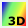
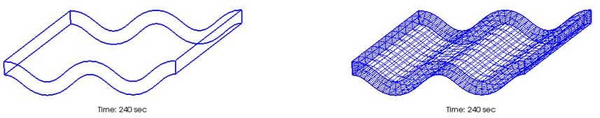

.. _sec_3d_vis_func:

3D visualization functions
===========================

Below are the functions for visualizing the 3D calculation results.

Use [3D Post-processing Window] for 3D visualization of simulation
results as explained below.

[Open New 3D Post-processing Window]
--------------------------------------

Either of the following actions opens a new [3D Post-processing Window].

**Menu bar:** [Calculation Results] (R) --> [Open New 3D Post-processing Window]

**Operation Toolbar:** Select |post3d-window-icon|

The new [3D Post-processing Window] (:numref:`image_post3d_window_example`) will open.

.. _image_post3d_window_example:

.. figure:: images/post3d_window_example.png

   [3D Post-processing Window]

Menu items
------------

:numref:`table_post3d_window_menu` shows the additional menu items for
the [3D Post-processing Window]. The additional menu items are shown
between [Import] and [Simulation] on the Menu bar when the [3D
Post-processing Window] is active.

.. _table_post3d_window_menu:

.. list-table:: Additional menu items for [3D Post-processing Window]
   :header-rows: 1

   * - Menu
     -
     - Description
   * - [Display Setting] (D)
     - [Grid Shape] (G)
     - Sets the [Grid Shape] dialog.
   * -
     - [Contour] (C)
     - Sets the [Contour] dialog.
   * -
     - [Iso Surface] (I)
     - Sets the [Isosurface] dialog.
   * -
     - [Arrow] (A)
     - Sets the [Arrow] (i.e., vector) dialog.
   * -
     - [Streamline] (S)
     - Sets the [Streamline] dialog.
   * -
     - [Particles] (P)
     - Sets the [Particles] dialog.
   * -
     - [Title] (T)
     - Sets the [Title] dialog.
   * -
     - [Time] (M)
     - Sets the [Time] dialog.

[Object Browser]
-------------------

:numref:`image_post3d_window_objbrowser_example` shows an example
of the [Object Browser] of [3D Post-processing Window].

.. _image_post3d_window_objbrowser_example:

.. figure:: images/post3d_window_objbrowser_example.png

   The [Object Browser] of the [3D Post-processing Window]

Settings on the elements shown in the [Object Browser] of [3D
Post-processing Window] can be edited mainly from [Draw] menu. For
operations on [Axes], refer to :ref:`sec_pre_axes`.

[Grid Shape] (G)
------------------

**Description**: Sets the grid shape settings.

When you select [Grid Shape], the [Grid Shape Setting] dialog
(:numref:`image_post3d_grid_shape_dialog`) will open.
Set it and click on [OK].
:numref:`image_post3d_grid_shape_wireframe_lines` shows examples
of the display when the setting is for [Wireframe] and [Grid line],
respectively.

.. _image_post3d_grid_shape_dialog:

.. figure:: images/post3d_grid_shape_dialog.png

   [Grid Shape] dialog

.. _image_post3d_grid_shape_wireframe_lines:

   Examples of graphics displayed by the [Grid Shape] setting

[Contour] (C)
---------------

**Description**: Sets the contour settings.

When you select [Contour], the [Contour Group Setting] dialog
(:numref:`image_post3d_contour_dialog`) will open.
Set it and click on [OK].
:numref:`image_post3d_contours_by_displaysetting`
shows examples of the contour display for the
[Counter] setting.

Please refer to :ref:`sec_geo_common_color_setting`
about the dialog that is shown when you select
[Custom] as [Colormap] and click on [Setting…] button.

.. _image_post3d_contour_dialog:

   [Contour Group Setting] dialog

.. _image_post3d_contour_colorbar_setting_dialog:

.. figure:: images/post3d_contour_colorbar_setting_dialog.png

   [Color Legend Setting] dialog

.. _image_post3d_contours_by_displaysetting:

.. figure:: images/post3d_contours_by_displaysetting.png

   Examples of the contour display by the [Display Setting] setting

[Iso Surface]
--------------

**Description**: Sets the iso-surface settings.

When you select [Iso Surface], the [Iso Surface Setting] dialog
(:numref:`image_post3d_isosurface_setting_dialog`)
will open. Set it and click on [OK].
:numref:`image_post3d_isosurface_example` shows examples of
the iso surface display.

.. _image_post3d_isosurface_setting_dialog:

   [Iso Surface Setting] dialog

.. _image_post3d_isosurface_example:

.. figure:: images/post3d_isosurface_example.png

   The Isosurface example

[Arrow] (A)
------------

**Description**: Sets the arrow (or vector) group settings.

When you select [Arrow], the [Arrow Group Setting] dialog
(:numref:`image_post3d_arrow_setting_dialog`)
will open. Set it and click on [OK].
:numref:`image_post3d_arrow_example` shows an example
of the [Arrow] display.

.. _image_post3d_arrow_setting_dialog:

.. figure:: images/post3d_arrow_setting_dialog.png

   [Arrow Group Setting] dialog

.. _image_post3d_arrow_example:

.. figure:: images/post3d_arrow_example.png

   Example of the [Arrow] display

[Streamline] (S)
-----------------

**Description**: Sets the streamline settings.

When you select [Streamline], the [Streamline Setting] dialog
(:numref:`image_post3d_streamline_setting_dialog`)
will open. Set it and click on [OK].
:numref:`image_post3d_streamline_example` shows an example
of the streamline display.

.. _image_post3d_streamline_setting_dialog:

.. figure:: images/post3d_streamline_setting_dialog.png

   [Streamline Setting] dialog

.. _image_post3d_streamline_example:

.. figure:: images/post3d_streamline_example.png

   Example of the [Streamline] display

[Particles] (P)
-----------------

**Description**: Sets the particle settings.

When you select [Particles], the [Particle Setting] dialog
(:numref:`image_post3d_particle_dialog`)
will open. Set it and click on [OK].
:numref:`image_post3d_particles_example` shows an example
of the [Particles] display.

.. _image_post3d_particle_dialog:

.. figure:: images/post3d_particle_dialog.png

   [Particle Setting] dialog

.. _image_post3d_particles_example:

.. figure:: images/post3d_particles_example.png

   Example of the [Particles] display

[Title] (T)
------------

**Description**: Sets the title settings.

When you select [Title], the [Title Setting] dialog
(:numref:`image_post3d_title_setting_dialog`) will open.
Set it and click on [OK].

.. _image_post3d_title_setting_dialog:

.. figure:: images/post3d_title_setting_dialog.png

   [Title Setting] dialog

[Time] (M)
------------

**Description**: Sets the time settings.

When you select [Time], the [Time Setting] dialog
(:numref:`image_post3d_time_setting_dialog`)
will open. Set it and click on [OK].

.. _image_post3d_time_setting_dialog:

.. figure:: images/post3d_time_setting_dialog.png

   [Time Setting] dialog
