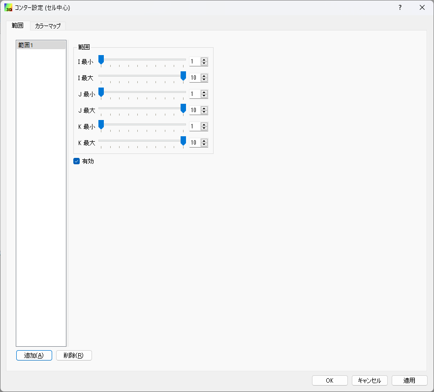
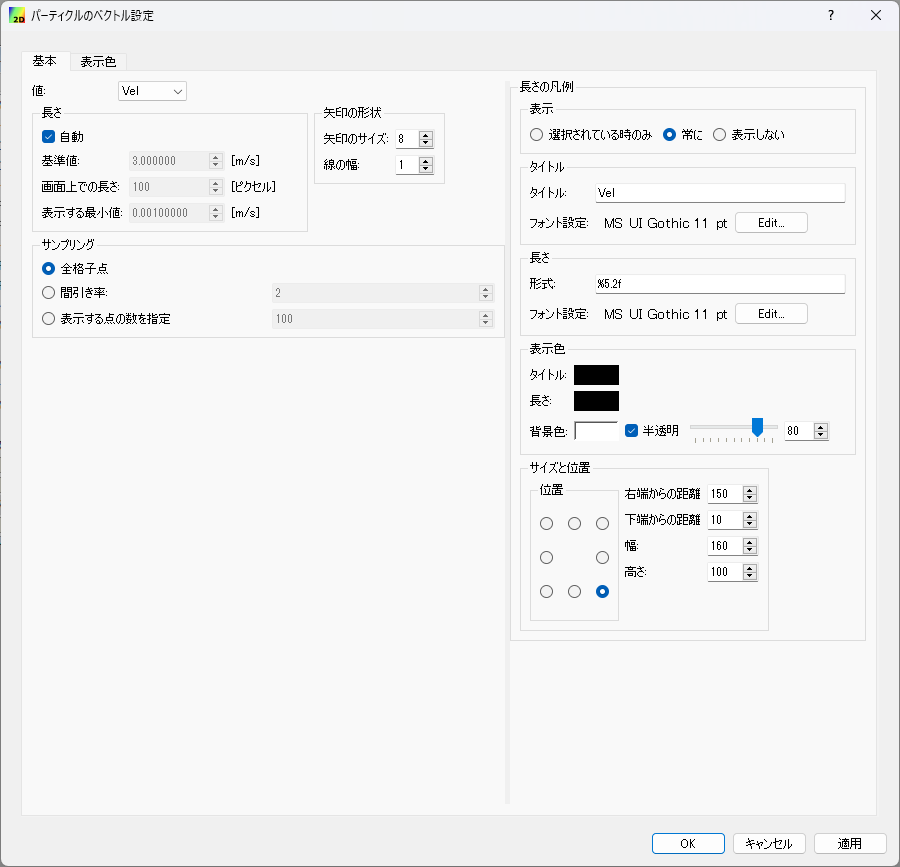

.. _sec_3d_vis_func:

三次元可視化機能
====================

三次元での計算結果を可視化する機能について説明します。

三次元での可視化は、可視化ウィンドウ (3D) を利用して行います。

新しい可視化ウィンドウ (3D) を開く
----------------------------------

.. |post3d-window-icon| image:: images/post3d-window-icon.png

新しい可視化ウィンドウ (3D) を開くには、以下のいずれかの操作を行います。

**メニューバー:** 計算結果 (R) --> 新しい可視化ウィンドウ (3D) を開く

**ツールバー:** |post3d-window-icon|

すると、:numref:`image_post3d_window_example` に示すような
可視化ウィンドウ (3D) が新しく開きます。

.. _image_post3d_window_example:

.. figure:: images/post3d_window_example.png
   :width: 320pt

   可視化ウィンドウ (3D) 表示例

メニュー構成
---------------

可視化ウィンドウ (3D) 固有のメニュー構成を、
:numref:`table_post3d_window_menu` に示します。
:numref:`table_post3d_window_menu`
に示すメニューは、可視化ウィンドウ (3D)
がアクティブな時、「インポート」メニューと「計算」メニューの間に表示されます。

.. _table_post3d_window_menu:

.. list-table:: 可視化ウィンドウ (3D) 固有のメニュー構成
   :header-rows: 1

   * - メニュー
     -
     - 説明
   * - 描画設定 (D)
     - 格子形状 (G)
     - 格子形状の設定をします
   * -
     - コンター (C)
     - コンターの設定をします
   * -
     - 等値面 (I)
     - 等値面の設定をします
   * -
     - コンター (セル中心)
     - セル中心の計算結果に基づいたコンターの設定をします
   * -
     - ベクトル (A)
     - ベクトルの設定をします
   * -
     - 流線 (S)
     - 流線の設定をします
   * -
     - パーティクル (P)
     - パーティクルの設定をします
   * -
     - タイトル (T)
     - タイトルの設定をします
   * -
     - 時刻 (M)
     - 時刻の設定をします

オブジェクトブラウザー構成
-----------------------------

オブジェクトブラウザーの表示例を
:numref:`image_post3d_window_objbrowser_example` に示します。

.. _image_post3d_window_objbrowser_example:

.. figure:: images/post3d_window_objbrowser_example.png
   :width: 240pt

   オブジェクトブラウザーの表示例

可視化ウィンドウ (3D) のオブジェクトブラウザーに表示される項目の設定は、
主に描画設定メニューから行います。「座標軸」の操作については
:ref:`sec_pre_axes` を参照して下さい。

格子形状 (G)
------------------

格子形状の表示設定をします。

格子形状の表示設定ダイアログ
(:numref:`image_post3d_grid_shape_dialog` 参照)
が表示されますので、設定を行って「OK」ボタンを押します。
表示を「外枠のみ」と設定した時と「すべて」と設定した時の表示例を
:numref:`image_post3d_grid_shape_wireframe_lines`
にそれぞれ示します。「格子インデックス」の設定は、
「格子線」で「すべて」を選択した時にのみ操作できます。

.. _image_post3d_grid_shape_dialog:

.. figure:: images/post3d_grid_shape_dialog.png
   :width: 240pt

   格子表示設定ダイアログ 表示例

.. _image_post3d_grid_shape_wireframe_lines:

.. figure:: images/post3d_grid_shape_wireframe_lines.png
   :width: 400pt

   格子の表示設定ごとの表示例

コンター (C)
---------------

コンターの表示設定をします。

コンターの表示設定ダイアログ (:numref:`image_post3d_contour_dialog` 参照)
が表示されますので、設定を行って「OK」ボタンを押します。

設定項目について以下で説明します。

描画面設定
   方向
      面がどの軸に垂直な向きかを指定します。

   範囲
      面を定義する範囲を指定します。

カラーマップ
   カラーマップの設定を行います。

   カラーマップ機能の詳細は :ref:`sec_colormap` を参照して下さい。

コンター線の描画
   チェックすると、面を塗る代わりにコンター線を描画します。
   コンター線の描画機能は、色で「格子点のスカラー値により設定」を選択した時のみ有効です。

   コンター表示機能の詳細は :ref:`sec_contour` を参照して下さい。

半透明
   チェックボックスをチェックすると、透明度を指定できます。

照光処理
   チェックすると、カメラに対する面の角度によってコンターの色を変えて表示します。

.. _image_post3d_contour_dialog:

.. figure:: images/post3d_contour_dialog.png
   :width: 440pt

   コンター表示設定ダイアログ 表示例

等値面 (I)
--------------

等値面の表示設定をします。

等値面の表示設定ダイアログ (:numref:`image_post3d_isosurface_setting_dialog` 参照)
が表示されますので、設定を行って「OK」ボタンを押します。

等値面の表示例を
:numref:`image_post3d_isosurface_example` に示します。

.. _image_post3d_isosurface_setting_dialog:

.. figure:: images/post3d_isosurface_setting_dialog.png
   :width: 180pt

   等値面表示設定ダイアログ 表示例

.. _image_post3d_isosurface_example:

.. figure:: images/post3d_isosurface_example.png
   :width: 300pt

   等値面表示 表示例

コンター (セル中心) (C)
--------------------------

コンターの表示設定をします。

コンターの表示設定ダイアログ (:numref:`image_post3d_cell_contour_dialog` 参照)
が表示されますので、設定を行って「OK」ボタンを押します。

範囲設定
~~~~~~~~~~~~~~~~

設定項目について以下で説明します。

範囲
   セルの描画範囲を指定します。

カラーマップ
~~~~~~~~~~~~~~~~

カラーマップの設定を行います。

カラーマップ機能の詳細は :ref:`sec_colormap` を参照して下さい。

.. _image_post3d_cell_contour_dialog:

   コンター表示設定ダイアログ 表示例

.. _image_post3d_cell_contour_example:

   コンターの表示例

ベクトル (A)
------------

ベクトルの表示設定をします。

ベクトルの表示例を :numref:`image_post3d_arrow_example` に表示します。

.. _image_post3d_arrow_example:

.. figure:: images/post3d_arrow_example.png
   :width: 260pt

   ベクトル表示例

基本
~~~~~~~~~~~~~~~

ベクトル表示機能の基本的な設定を行います。
表示例を :numref:`image_post3d_arrow_setting_dialog_basic` に示します。

設定項目については :ref:`sec_arrows` を参照して下さい。

.. _image_post3d_arrow_setting_dialog_basic:

   ベクトルの表示設定ダイアログ (「基本」タブ) 表示例

描画面設定
~~~~~~~~~~~~~~~

ベクトルを描画する面の設定を行います。
表示例を :numref:`image_post3d_arrow_setting_dialog_face` に示します。

.. _image_post3d_arrow_setting_dialog_face:

   ベクトルの表示設定ダイアログ (「描画面設定」タブ) 表示例

設定項目について以下で説明します。

方向
   面がどの軸に垂直な向きかを指定します。

範囲
   面を定義する範囲を指定します。

サンプリング
   矢印を全データに表示するのではなく、間引いて表示したい時に指定します。

表示色
   矢印の色を指定します。「スカラー値により設定」をチェックすると、「編集」ボタンからカラーマップの設定が行なえます。
   カラーマップ機能については :ref:`sec_colormap` を参照して下さい。

矢印の形状
   矢印の形状を決めるパラメータを指定します。

   矢印のサイズ
      矢印の先端から三角形の付け根までの長さ (単位: ピクセル)
   
   線の幅
      線の幅 (単位: ピクセル)

流線 (S)
-----------------

流線の表示設定をします。

流線の表示設定ダイアログ (:numref:`image_post3d_streamline_setting_dialog`
参照) が表示されますので、設定を行って「OK」ボタンを押します。

流線の表示例を
:numref:`image_post3d_streamline_example` に示します。

.. _image_post3d_streamline_setting_dialog:

.. figure:: images/post3d_streamline_setting_dialog.png
   :width: 200pt

   流線の表示設定ダイアログ

.. _image_post3d_streamline_example:

   流線表示例

パーティクル (自動) (P)
-----------------------

パーティクル (自動) の表示設定をします。

パーティクル (自動) は、GUI でパーティクルを発生させ、計算結果の流速によって
パーティクルがどこに移動するかを計算して可視化する機能です。

パーティクルの表示設定ダイアログ (:numref:`image_post3d_particle_dialog` 参照)
が表示されますので、設定を行って「OK」ボタンを押します。

パーティクルの表示例を :numref:`image_post3d_particles_example`
に示します。

.. _image_post3d_particle_dialog:

.. figure:: images/post3d_particle_dialog.png
   :width: 180pt

   パーティクル設定ダイアログ 表示例

.. _image_post3d_particles_example:

.. figure:: images/post3d_particles_example.png

   パーティクル 表示例

パーティクル (R)
--------------------

パーティクルの表示設定をします。

パーティクルは、ソルバが出力したパーティクルの情報を読み込んで可視化する機能です。

パーティクルは、スカラー値の属性が出力されていれば、色を変えて表示することが、
ベクトル値の属性が出力されていれば、矢印を表示することができます。

パーティクルの表示例を :numref:`image_post3d_particles_solver_example` に示します。

.. _image_post3d_particles_solver_example:

.. figure:: images/post3d_particles_example.png
   :width: 230pt

   パーティクル 表示例

スカラー
~~~~~~~~~~~~~~

オブジェクトブラウザの「スカラー」のフォルダで右クリックメニューから
「プロパティ」メニューを選択すると
:numref:`image_post3d_particles_solver_scalar_dialog` が表示されます。

.. _image_post3d_particles_solver_scalar_dialog:

.. figure:: images/post3d_particles_solver_scalar_dialog.png
   :width: 440pt

   パーティクル スカラー設定ダイアログ 表示例

設定項目について以下で説明します。

色
   粒子の色を指定します。

   「色を指定」をチェックすると、全てのパーティクルを指定した色で表示します。

   「スカラー値により設定」をチェックすると、指定したスカラー量の値で、カラーマップ機能で色を変えて表示します。

   カラーマップ機能の詳細は :ref:`sec_colormap` を参照して下さい。

点のサイズ
   点のサイズを指定します (単位: ピクセル)。

半透明
   チェックボックスをチェックすると、透明度を指定できます。

ベクトル
~~~~~~~~~~~~

オブジェクトブラウザの「ベクトル」のフォルダで右クリックメニューから
「プロパティ」メニューを選択すると
:numref:`image_post3d_particles_solver_vector_dialog` が表示されます。

.. _image_post3d_particles_solver_vector_dialog:

   パーティクル ベクトル設定ダイアログ 表示例

ベクトル表示機能の詳細は :ref:`sec_arrows` を参照して下さい。

ラベル
--------

計算結果に基づき、ラベルを表示します。

ラベルは、格子点、格子セル、格子エッジなどで定義された
計算結果を、文字列として可視化ウィンドウに表示する機能です。

ラベルの表示例を :numref:`image_post3d_label_example` に示します。

詳細は :ref:`sec_label_func` を参照してください。

.. _image_post3d_label_example:

   ラベル表示例

タイトル (T)
------------

タイトルの表示設定をします。

タイトルの表示設定ダイアログ (:numref:`image_post3d_title_setting_dialog` 参照)
が表示されますので、設定を行って「OK」ボタンを押します。

.. _image_post3d_title_setting_dialog:

.. figure:: images/post3d_title_setting_dialog.png
   :width: 200pt

   タイトルの表示設定ダイアログ 表示例

時刻 (M)
------------

時刻の表示設定をします。

時刻の表示設定ダイアログ (:numref:`image_post3d_time_setting_dialog` 参照)
が表示されますので、設定を行って「OK」ボタンを押します。

.. _image_post3d_time_setting_dialog:

.. figure:: images/post3d_time_setting_dialog.png
   :width: 180pt

   時刻の表示設定ダイアログ 表示例
