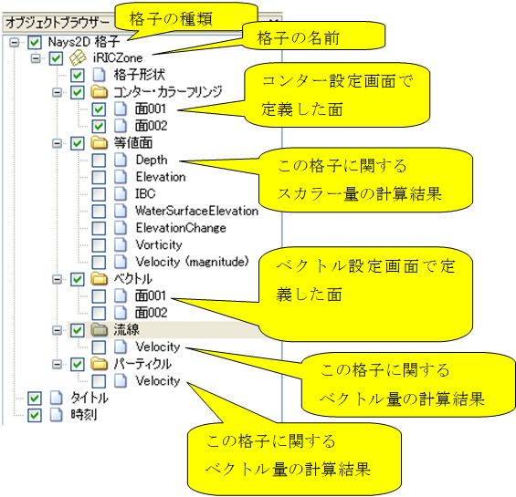
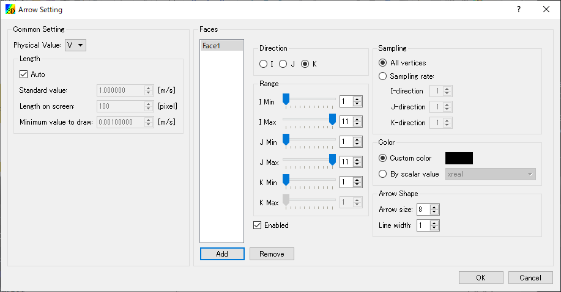
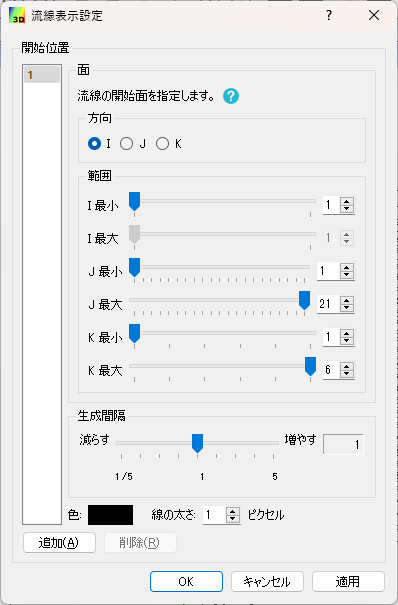
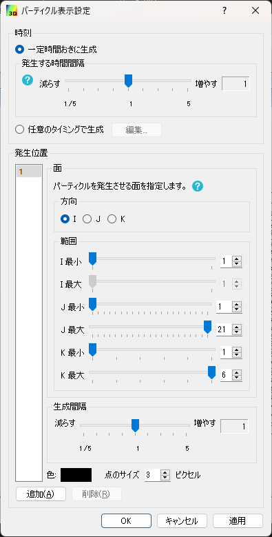
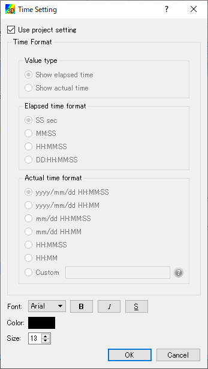

.. _sec_3d_vis_func:

三次元可視化機能
====================

三次元での計算結果を可視化する機能について説明します。

三次元での可視化は、可視化ウィンドウ (3D) を利用して行います。

新しい可視化ウィンドウ (3D) を開く
----------------------------------

.. |post3d-window-icon| image:: images/post3d-window-icon.png

新しい可視化ウィンドウ (3D) を開くには、以下のいずれかの操作を行います。

**メニューバー:** 計算結果 (R) --> 新しい可視化ウィンドウ (3D) を開く

**ツールバー:** |post3d-window-icon|

すると、:numref:`image_post3d_window_example` に示すような
可視化ウィンドウ (3D) が新しく開きます。

.. _image_post3d_window_example:

   可視化ウィンドウ (3D) 表示例

メニュー構成
---------------

可視化ウィンドウ (3D) 固有のメニュー構成を、
:numref:`table_post3d_window_menu` に示します。
:numref:`table_post3d_window_menu`
に示すメニューは、可視化ウィンドウ (3D)
がアクティブな時、「インポート」メニューと「計算」メニューの間に表示されます。

.. _table_post3d_window_menu:

.. list-table:: 可視化ウィンドウ (3D) 固有のメニュー構成
   :header-rows: 1

   * - メニュー
     -
     - 説明
   * - 描画設定 (D)
     - 格子形状 (G)
     - 格子形状の設定をします
   * -
     - コンター (C)
     - コンターの設定をします
   * -
     - 等値面 (I)
     - 等値面の設定をします
   * -
     - ベクトル (A)
     - ベクトルの設定をします
   * -
     - 流線 (S)
     - 流線の設定をします
   * -
     - パーティクル (P)
     - パーティクルの設定をします
   * -
     - タイトル (T)
     - タイトルの設定をします
   * -
     - 時刻 (M)
     - 時刻の設定をします

オブジェクトブラウザー構成
-----------------------------

オブジェクトブラウザーの表示例を
:numref:`image_post3d_window_objbrowser_example` に示します。

.. _image_post3d_window_objbrowser_example:

   オブジェクトブラウザーの表示例

可視化ウィンドウ (3D) のオブジェクトブラウザーに表示される項目の設定は、
主に描画設定メニューから行います。「座標軸」の操作については
:ref:`sec_pre_axes` を参照して下さい。

格子形状 (G)
------------------

格子形状の表示設定をします。

格子形状の表示設定ダイアログ
(:numref:`image_post3d_grid_shape_dialog` 参照)
が表示されますので、設定を行って「OK」ボタンを押します。
表示を「外枠のみ」と設定した時と「すべて」と設定した時の表示例を
:numref:`image_post3d_grid_shape_wireframe_lines`
にそれぞれ示します。「格子インデックス」の設定は、
「格子線」で「すべて」を選択した時にのみ操作できます。

.. _image_post3d_grid_shape_dialog:

.. figure:: images/post3d_grid_shape_dialog.png
   :width: 100pt

   格子表示設定ダイアログ 表示例

.. _image_post3d_grid_shape_wireframe_lines:

.. figure:: images/post3d_grid_shape_wireframe_lines.png
   :width: 400pt

   格子の表示設定ごとの表示例

コンター (C)
---------------

格子の表示設定をします。

コンターの表示設定ダイアログ (:numref:`image_post3d_contour_dialog` 参照)
が表示されますので、設定を行って「OK」ボタンを押します。
凡例の表示方法を調整するには、「カラーバー設定(C)」ボタンを押して
カラーバー設定ダイアログを表示し、設定を行って「OK」ボタンを押します
(:numref:`image_post3d_contour_colorbar_setting_dialog` 参照)。

カラーマップで「手動」を選択し、「設定」ボタンを押した場合に表示されるダイアログ
については、:ref:`sec_geo_common_color_setting` を参照して下さい。

コンター設定ごとの表示例を :numref:`image_post3d_contours_by_displaysetting`
に示します。

.. _image_post3d_contour_dialog:

.. figure:: images/post3d_contour_dialog.png
   :width: 340pt

   コンター表示設定ダイアログ 表示例

.. _image_post3d_contour_colorbar_setting_dialog:

.. figure:: images/post3d_contour_colorbar_setting_dialog.png
   :width: 160pt

   コンター表示 カラーバー設定ダイアログ 表示例

.. _image_post3d_contours_by_displaysetting:

.. figure:: images/post3d_contours_by_displaysetting.png
   :width: 440pt

   コンター設定の値ごとの表示例

等値面 (I)
--------------

等値面の表示設定をします。

等値面の表示設定ダイアログ (:numref:`image_post3d_isosurface_setting_dialog` 参照)
が表示されますので、設定を行って「OK」ボタンを押します。

等値面の表示例を
:numref:`image_post3d_isosurface_example` に示します。

.. _image_post3d_isosurface_setting_dialog:

.. figure:: images/post3d_isosurface_setting_dialog.png
   :width: 180pt

   等値面表示設定ダイアログ 表示例

.. _image_post3d_isosurface_example:

   等値面表示 表示例

ベクトル (A)
------------

ベクトルの表示設定をします。

ベクトルの表示設定ダイアログ (:numref:`image_post3d_arrow_setting_dialog` 参照)
が表示されますので、設定を行って「OK」ボタンを押します。

ベクトルの表示例を :numref:`image_post3d_arrow_example` に表示します。

.. _image_post3d_arrow_setting_dialog:

   ベクトルの表示設定ダイアログ 表示例

.. _image_post3d_arrow_example:

.. figure:: images/post3d_arrow_example.png
   :width: 260pt

   ベクトル表示例

流線 (S)
-----------------

流線の表示設定をします。

流線の表示設定ダイアログ (:numref:`image_post3d_streamline_setting_dialog`
参照) が表示されますので、設定を行って「OK」ボタンを押します。

流線の表示例を
:numref:`image_post3d_streamline_example` に示します。

.. _image_post3d_streamline_setting_dialog:

   流線の表示設定ダイアログ

.. _image_post3d_streamline_example:

.. figure:: images/post3d_streamline_example.png
   :width: 200pt

   流線表示例

パーティクル (自動) (P)
-----------------------

パーティクル (自動) の表示設定をします。

パーティクル (自動) は、GUI でパーティクルを発生させ、計算結果の流速によって
パーティクルがどこに移動するかを計算して可視化する機能です。

パーティクルの表示設定ダイアログ (:numref:`image_post3d_particle_dialog` 参照)
が表示されますので、設定を行って「OK」ボタンを押します。

パーティクルの表示例を :numref:`image_post3d_particles_example`
に示します。

.. _image_post3d_particle_dialog:

   パーティクル設定ダイアログ 表示例

.. _image_post3d_particles_example:

.. figure:: images/post3d_particles_example.png

   パーティクル 表示例

パーティクル (R)
--------------------

パーティクルの表示設定をします。

パーティクルは、ソルバが出力したパーティクルの情報を読み込んで可視化する機能です。

パーティクルは、スカラー値の属性が出力されていれば、色を変えて表示することが、
ベクトル値の属性が出力されていれば、矢印を表示することができます。

オブジェクトブラウザの「スカラー」、「ベクトル」のフォルダで右クリックメニューから
「プロパティ」メニューを選択すると、それぞれ
:numref:`image_post3d_particles_solver_scalar_dialog`、
:numref:`image_post3d_particles_solver_vector_dialog` が表示されますので、
設定を行って「OK」ボタンを押します。

パーティクルの表示例を :numref:`image_post3d_particles_solver_example` に示します。

.. _image_post3d_particles_solver_scalar_dialog:

   パーティクル スカラー設定ダイアログ 表示例

.. _image_post3d_particles_solver_vector_dialog:

.. figure:: images/post3d_particles_solver_vector_dialog.png
   :width: 200pt

   パーティクル ベクトル設定ダイアログ 表示例

.. _image_post3d_particles_solver_example:

.. figure:: images/post3d_particles_example.png
   :width: 230pt

   パーティクル 表示例

タイトル (T)
------------

タイトルの表示設定をします。

タイトルの表示設定ダイアログ (:numref:`image_post3d_title_setting_dialog` 参照)
が表示されますので、設定を行って「OK」ボタンを押します。

.. _image_post3d_title_setting_dialog:

.. figure:: images/post3d_title_setting_dialog.png
   :width: 200pt

   タイトルの表示設定ダイアログ 表示例

時刻 (M)
------------

時刻の表示設定をします。

時刻の表示設定ダイアログ (:numref:`image_post3d_time_setting_dialog` 参照)
が表示されますので、設定を行って「OK」ボタンを押します。

.. _image_post3d_time_setting_dialog:

   時刻の表示設定ダイアログ 表示例
