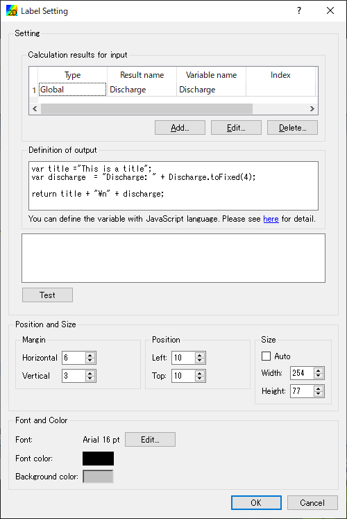
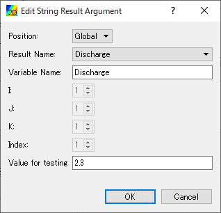

.. _sec_label_func:

Label display function
===========================

Label display function is the function to visualize calculation
result values defined at grid nodes, cells, edges etc. as string on
visualization windows.

You can use the function on [2D Post-processing Window] and
[3D Post-processing Window].

When you select [Property] menu from right-clicking menu of [Label]
dialog in :numref:`image_post_label_dialog` is shown.

.. _image_post_label_dialog:

   [Label Setting] dialog

You can define the label with the following steps:

1. Add [Calculation results for input]
2. Define [Definition of output]
3. Edit settings of position, size, fonts etc.

Please refer to next sections for detail.

Add [Calculation results for input]
--------------------------------------

When you click on [Add] or [Edit] button in [Calculation results for input]
group box, the dialog in :numref:`image_post_label_arg_edit_dialog` is shown,
and you can add or edit calculation results for input of labels.

The details of each item on the dialog is described in
:numref:`table_label_arg_input`.

.. _image_post_label_arg_edit_dialog:

   [Edit String Result Argument] dialog

.. list-table:: [Edit String Result Argument] dialog items
   :name: table_label_arg_input
   :header-rows: 1

   * - Item name
     - Description

   * - Position
     - The position where the calculation result is defined. You can select from [Global], [Node], etc.

   * - Result Name
     - The name of calculation result. You can select from combo box.

   * - Variable Name
     - The name to refer to this value, to use in [Definition of output].

   * - I, J, K, Index
     - Enabled when [Position] is not [Global]. You can use these to select the grid node (or cells etc.)

   * - Value for testing
     - When user click on "Test" button on [Label Setting] dialog, value defined here is input to the variable.

[Definition of output]
----------------------------

Please describe how to generate the label string, in [Definition of output].
You can describe by JavaScript language. Please refer to 
:ref:`sec_label_example` for example.

Please use the [Variable Name] you've input in [Edit String Result Argument] dialog,
to define label strings.

When you click on [Test] button, from the [Value for testing] for each variable,
and from [Definition of output], the label string is generated, and displayed.
If there are problems in the definition in [Definition of output], error meesage is shown.

In [Definition of output], you should input the definition, that return string at last.

Edit settings of position, size, fonts etc.
---------------------------------------------

You can edit settings of position, size, fonts etc. using the widgets
in [Position and Size] group box and [Font and Color] group box.

You can also edit the position and size by dragging the label on
visualization windows, when [Label] is selected in the [Object Browser].

.. _sec_label_example:

Examples of [Definition of output]
----------------------------------------

Basic informations and examples of [Definition of output] is described here.

Newline character
~~~~~~~~~~~~~~~~~~~~~

When you want to output multiple lines as labels, you can use "\\n" as
Newline character. :numref:`label_example_multilines` shows an example of
definition that uses Newline character, and :numref:`label_example_multilines_result`
shows the example of output.

.. code-block:: JavaScript
   :name: label_example_multilines
   :caption: Example of [Definition of output] (Newline character usage)

   var line1 = "This is the label at first line";
   var line2 = "This is the label at second line";
   return line1 + "\n" + line2;

.. code-block:: none
   :name: label_example_multilines_result
   :caption: Example of output (Newline character usage)

   This is the label at first line
   This is the label at second line

Output numerical values specifying format
~~~~~~~~~~~~~~~~~~~~~~~~~~~~~~~~~~~~~~~~~~~~

When you want to output numerical values specifying format,
you can use the following functions.

* Fixed-point notation: toFixed()
* Exponential notation: toExponential()

With both functions, you can give decimal places as the argument.

:numref:`label_example_tofixed` and :numref:`label_example_tofixed_result`
shows the example of Definition that uses toFixed() and the output.
:numref:`label_example_toexponential` and :numref:`label_example_toexponential_result`
shows the example of Definition that uses toExponential() and the output.
With both examples, Discharge should be defined as variable name in
[Calculation results for input].

.. code-block:: JavaScript
   :name: label_example_tofixed
   :caption: Example of [Definition of output] (toFixed usage)

   return "Discharge: " + Discharge.toFixed(3);

.. code-block:: none
   :name: label_example_tofixed_result
   :caption: Example of output (toFixed usage)

   Discharge: 23.321

.. code-block:: JavaScript
   :name: label_example_toexponential
   :caption: Example of [Definition of output (toExponential usage)

   return "Discharge: " + Discharge.toExponential(3);

.. code-block:: none
   :name: label_example_toexponential_result
   :caption: Example of output (toExponential usage)

   Discharge: 2.332e+1

Output with control syntaxes
~~~~~~~~~~~~~~~~~~~~~~~~~~~~~~~

JavaScript language has control syntaxes, like if statement, for statement etc.
You can use these syntaxes to define the [Definition of output].

numref:`label_example_if` and :numref:`label_example_if_result` shows
the example of Definition that uses if statement and the output.

.. code-block:: JavaScript
   :name: label_example_if
   :caption: Example of [Definition of output] (if statement usage)

   var title = "Flood simulation";
   var wl = "Normal";
   if (Discharge > 2000) {
      wl = "Over Limit";
   }
   return title + "\n" + "Discharge: " + Discharge.toFixed(3) + " (" + wl + ")";

.. code-block:: none
   :name: label_example_if_result
   :caption: Example of output (if statement usage)

   Flood simulation
   Discharge: 23.321 (Normal)
