.. _sec_graph_window:

[Graph Window]
================

The functions for opening a graph window that supports both "Time"
and "Position" as X-axis, and easy to switch between them, are explained in
this section.

[Open new Graph Window]
-------------------------

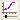

Either of the following actions opens a new graph window.

**Menu bar:** [Calculation Results] (R) --> [Open New Graph Window]

**Operation Toolbar:** |chart-window-icon|

The [Data Source Setting] dialog (:numref:`image_chart_data_source_dialog`)
will open, so select the data to draw graph and click on [OK].
A new [Graph Window] window
(:numref:`image_chart_window`)
will open that draws a graph for the data you selected.

When you select [Setting] on [Data Source Setting] dialog, the [Data
Setting] dialog (:numref:`image_chart_data_setting_dialog`)
is shown for the currently selected data,
so modify the setting and click on [OK].

.. _image_chart_data_source_dialog:

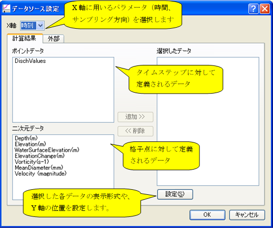

   [Data Source Setting] dialog

.. _image_chart_data_setting_dialog:

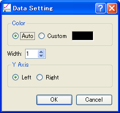

   [Data Setting] dialog

.. _image_chart_window:

.. figure:: images/chart_window.png

   [Graph Window]

Additional Menu items
----------------------

:numref:`table_chart_window_menu` shows the additional menu items
for the [Graph Window]. The
additional menu items are shown between [Import] and [Simulation] when
the [Graph Window] is active.

.. _table_chart_window_menu:

.. list-table:: Additional menu items for [Graph Window]
   :header-rows: 1

   * - Menu
     -
     - Description
   * - Draw (D)
     - [Data Source Setting] (D)
     - Display [Data Source Setting] dialog.
   * -
     - [Axis Setting] (A)
     - Display [Axis Setting] dialog.
   * -
     - [Draw Setting] (R)
     - Display [Draw Setting] dialog.
   * -
     - [Marker Setting] (M)
     - Display [Marker Setting] dialog.
   * -
     - [Add KP Markers](K)
     - Add KP markers for river survey data.
   * -
     - [Copy] (C)
     - Copy the calculation result

[Data Source Setting] (D)
--------------------------

**Description**: Set data source setting.

When you select this, the [Data Source Setting] dialog
(:numref:`image_chart_data_source_dialog`) will open.
Modify setting and click on [OK].

On the [Data Source Setting] dialog, you can import CSV files from
[External] tab. Refer to :ref:`sec_graph_external_data`
for the format of the CSV file to import.

[Axis Setting] (A)
--------------------

**Description**: Set axis setting.

When you select this, the [Axis Setting] dialog
(:numref:`image_chart_axissetting_dialog`) will open.
Modify setting and click on [OK]. A new graph will be made according to
the settings.

.. _image_chart_axissetting_dialog:

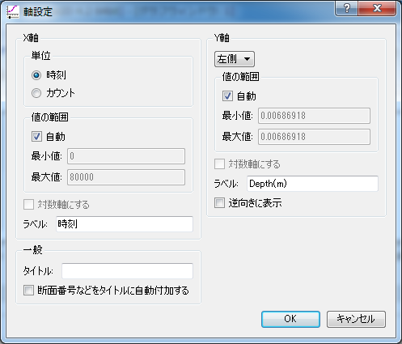

   [Axis Setting] dialog

[Draw Setting] (D)
--------------------

**Description**: Set the draw settings

When you select this, the [Draw Setting] dialog
(:numref:`image_chart_display_setting_dialog`) will open.
Modify setting and click on [OK]. A new graph will be made according to
the settings.

.. _image_chart_display_setting_dialog:

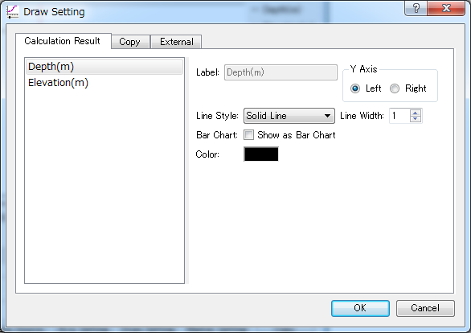

   [Display Setting] dialog

[Marker Setting] (M)
---------------------

**Description**: Set the marker settings

When you select this, the [Marker Setting] dialog
(:numref:`image_chart_marker_setting_dialog`) will
open. Modify setting and click on [OK]. A new graph will be made
according to the settings. :numref:`image_chart_marker_example`
shows an example of a [Graph Window]
after setting up a marker.

.. _image_chart_marker_setting_dialog:

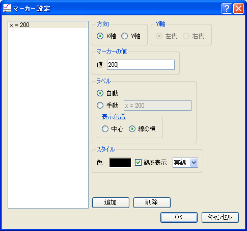

   [Marker Setting] dialog

.. _image_chart_marker_example:

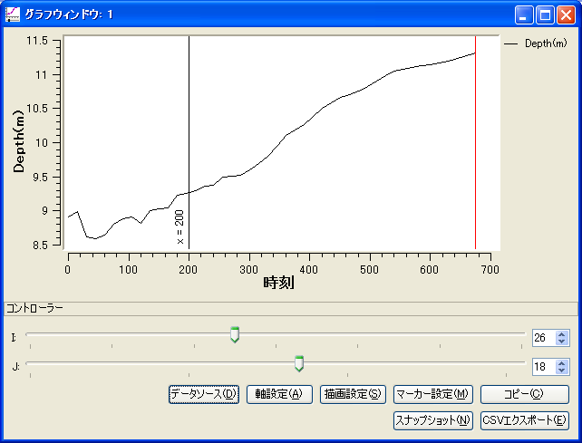

   Example of the [Graph Window] after setting up a marker.

[Add KP Markers] (K)
---------------------

**Description**: Add KP Markers for river survey data.

This function is available only when the following conditions are
satisfied:

-  Graph for two-dimensional structured grid result is drawn.
-  X-axis is I-direction in the grid.
-  The grid is created using the algorithm "Create grid from river survey data".

When you select this, the [Marker Setting] dialog
(:numref:`image_chart_marker_setting_dialog`) will
open. Modify setting and click on [OK]. A new graph will be made
according to the settings. :numref:`image_chart_kp_marker_example`
shows an example of a [Graph Window] after setting up a marker.

.. _image_chart_kp_marker_example:

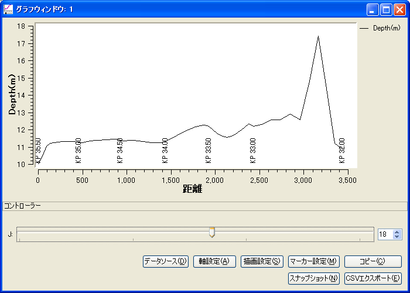

   Example of the [Graph Window] after adding KP markers

[Copy] (C)
----------

**Description**: Copy the calculation result. The copied data is fixed when
the user changes time step or the setting on the controller.

:numref:`image_chart_copy_example` shows an example of a [Graph Window]
after copying data.

.. _image_chart_copy_example:

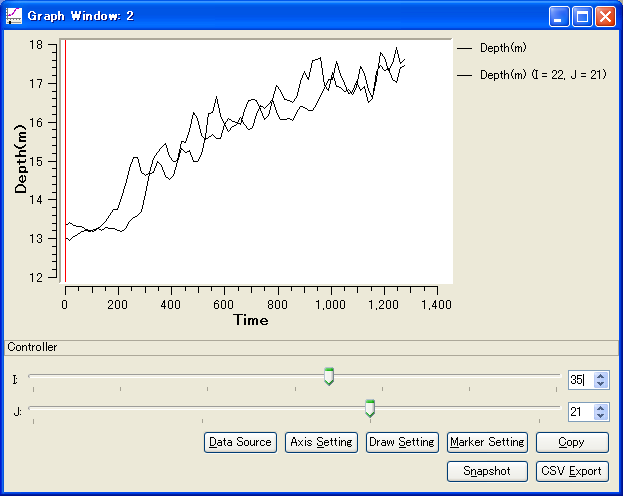

   Example of the [Graph Window] after copying data

[Snapshot] (S)
---------------

**Description**: Save graph snapshots to image files.

When you select this, the [Snapshot Setting] dialog
(:numref:`image_chart_snapshot_setting_dialog`) will
open. Setup setting, and click on [OK]. Saving snapshots will be
started.

.. _image_chart_snapshot_setting_dialog:

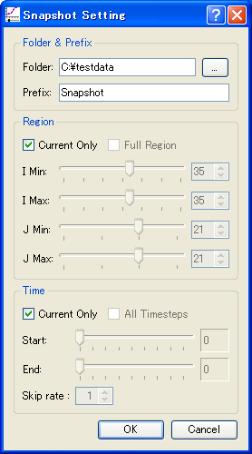

   [Snapshot Setting] dialog

[CSV Export] (E)
------------------

**Description**: Save data to CSV files.

When you select this, the [CSV Export Setting] dialog
(:numref:`image_chart_csv_export_dialog`) will
open. Setup setting, and click on [OK]. Saving CSV files will be
started.

.. _image_chart_csv_export_dialog:

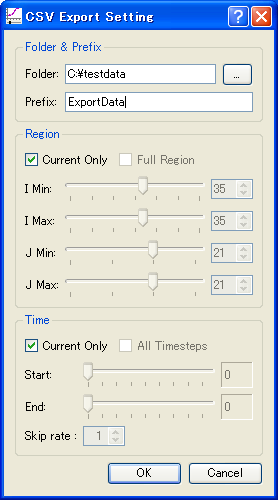

   [CSV Export Setting] dialog
