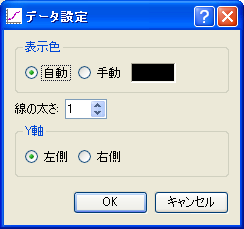
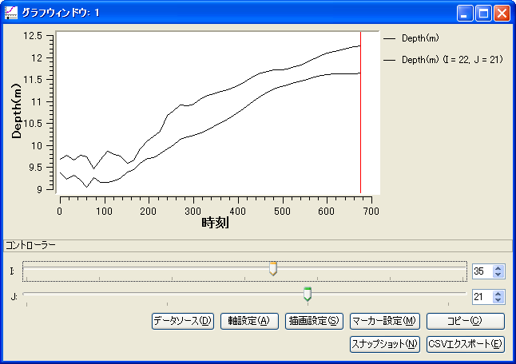
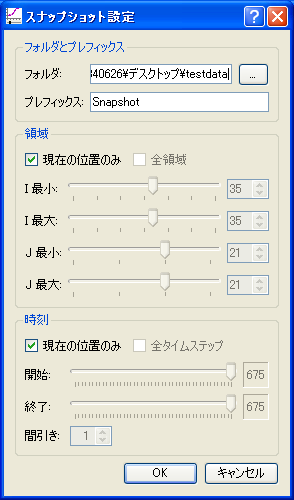

.. _sec_graph_window:

グラフ描画機能
================

X軸を位置または時間とするグラフを描画し、対話的に描画対象の位置を変更する機能
について説明します。

この機能を利用するには、グラフウィンドウを用います。

新しいグラフウィンドウを開く
----------------------------

.. |chart-window-icon| image:: images/chart-window-icon.png

新しいグラフウィンドウを開くには、以下のいずれかの操作を行います。

**メニューバー:** 計算結果 (R) --> 新しいグラフウィンドウを開く

**ツールバー:** |chart-window-icon|

データソース設定ダイアログ (:numref:`image_chart_data_source_dialog` 参照)
が表示されますので、グラフに描画する計算結果を設定して「OK」ボタンを押します。
すると、設定した内容にしたがってグラフウィンドウが新しく表示されます。
表示されるグラフウィンドウの例を
:numref:`image_chart_window` に示します。

データソース設定ダイアログで「設定」ボタンを押すと、「選択したデータ」で選択されているデータの設定ダイアログが表示されますので、表示形式やY軸の位置を設定して「OK」ボタンを押します。
表示されるデータ設定ダイアログの例を
:numref:`image_chart_data_setting_dialog` に示します。

.. _image_chart_data_source_dialog:

   データソース設定ダイアログ 表示例

.. _image_chart_data_setting_dialog:

   データ設定ダイアログ 表示例

.. _image_chart_window:

.. figure:: images/chart_window.png

   グラフウィンドウ 表示例

メニュー構成
-------------

グラフウィンドウ固有のメニュー構成を、
:numref:`table_chart_window_menu` に示します。
:numref:`table_chart_window_menu` に示すメニューは、
グラフウィンドウがアクティブな時、「インポート」メニューと
「計算」メニューの間に表示されます。

.. _table_chart_window_menu:

.. list-table:: グラフウィンドウ固有のメニュー構成
   :header-rows: 1

   * - メニュー
     -
     - 説明
   * - 描画設定 (D)
     - データソース設定 (C)
     - データソース設定をします
   * -
     - 軸設定 (A)
     - グラフの軸の設定をします
   * -
     - 描画設定 (D)
     - 表示する項目の描画設定をします
   * -
     - マーカー設定 (M)
     - マーカーの設定をします
   * -
     - KPマーカーの追加 (K)
     - 河川測量データのキロポストのマーカーを追加します
   * -
     - コピー (C)
     - 計算結果をコピーします

データソース設定 (D)
--------------------------

データソース設定をします。

データソース設定ダイアログ (:numref:`image_chart_data_source_dialog` 参照)
が表示されますので、設定を行って「OK」ボタンを押します。
すると、新しい設定内容にしたがってグラフが再描画されます。

なお、データソース設定では、「外部」タブから
CSVファイルをインポートすることもできます。
データソース設定からインポートできる
CSVファイルについては、 :ref:`sec_graph_external_data` を参照して下さい。

軸設定 (A)
--------------------

グラフの軸に関する設定をします。

軸設定ダイアログ (:numref:`image_chart_axissetting_dialog` 参照)
が表示されますので、設定を行って「OK」ボタンを押します。
すると、新しい設定内容にしたがってグラフが再描画されます。

.. _image_chart_axissetting_dialog:

   軸設定ダイアログ 表示例

描画設定 (D)
--------------------

グラフに描画する項目の描画設定をします。

描画設定ダイアログ (:numref:`image_chart_display_setting_dialog` 参照)
が表示されますので、設定を行って「OK」ボタンを押します。
すると、新しい設定にしたがってグラフが再描画されます。

.. _image_chart_display_setting_dialog:

.. figure:: images/chart_display_setting_dialog.png

   描画設定ダイアログ 表示例

マーカー設定 (M)
---------------------

マーカーの設定をします。

マーカー設定ダイアログ (:numref:`image_chart_marker_setting_dialog` 参照)
が表示されますので、設定を行って「OK」ボタンを押します。
すると、行った設定にしたがってグラフが再描画されます。
マーカー設定後のグラフウィンドウの表示例を
:numref:`image_chart_marker_example` に示します。

.. _image_chart_marker_setting_dialog:

   マーカー設定ダイアログ 表示例

.. _image_chart_marker_example:

   マーカー設定後のグラフウィンドウ表示例

KPマーカーの追加(K)
---------------------

河川測量データの KPに対応するマーカーを追加します。

この機能は、以下の条件を満たした時のみ有効です。

-  二次元構造格子の計算結果を描画している
-  X軸を、格子のI方向に設定している
-  格子を、「河川測量データから生成」アルゴリズムで作成した

KPマーカー追加後のグラフウィンドウの表示例を
:numref:`image_chart_kp_marker_example` に示します。

.. _image_chart_kp_marker_example:

   KPマーカー追加後のグラフウィンドウ表示例

コピー(C)
-------------

現在の計算結果の設定をコピーしたデータを作成します。
コピーしたデータは、タイムステップを移動したりコントローラーで
設定を変更したりしても変化しません。

データをコピー後のグラフウィンドウの表示例を
:numref:`image_chart_copy_example` に示します。

.. _image_chart_copy_example:

   データコピー後のグラフウィンドウ表示例

スナップショット (S)
------------------------

グラフのスナップショットを画像ファイルに保存します。

スナップショット設定ダイアログ (:numref:`image_chart_snapshot_setting_dialog`
参照)
が表示されますので、設定を行って「OK」ボタンを押します。
すると、行った設定にしたがってスナップショットの保存が開始されます。

.. _image_chart_snapshot_setting_dialog:

   スナップショット設定ダイアログ 表示例

CSVエクスポート (E)
--------------------

グラフで描画しているデータをCSVファイルに保存します。

CSVエクスポート設定ダイアログ (:numref:`image_chart_csv_export_dialog` 参照)
が表示されますので、設定を行って「OK」ボタンを押します。
すると、行った設定にしたがってCSVファイルのエクスポートが開始されます。

.. _image_chart_csv_export_dialog:

   CSVエクスポート設定ダイアログ 表示例
   
