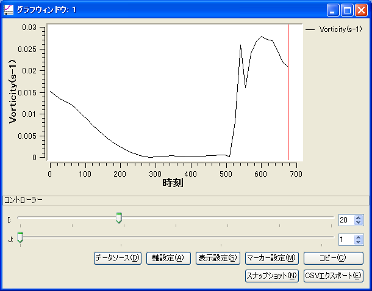
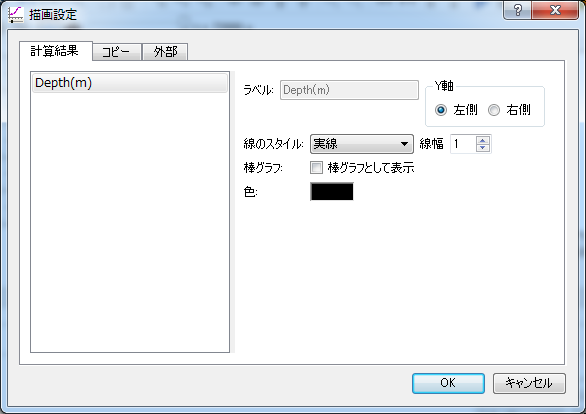

.. _sec_graph_window:

[Graph Window]
================

The functions for opening a graph window that supports both "Time"
and "Position" as X-axis, and easy to switch between them, are explained in
this section.

[Open new Graph Window]
-------------------------

.. |chart-window-icon| image:: images/chart-window-icon.png

Either of the following actions opens a new graph window.

**Menu bar:** [Calculation Results] (R) --> [Open New Graph Window]

**Operation Toolbar:** |chart-window-icon|

The [Data Source Setting] dialog (:numref:`image_chart_data_source_dialog`)
will open, so select the data to draw graph and click on [OK].
A new [Graph Window] window
(:numref:`image_chart_window`)
will open that draws a graph for the data you selected.

When you select [Setting] on [Data Source Setting] dialog, the [Data
Setting] dialog (:numref:`image_chart_data_setting_dialog`)
is shown for the currently selected data,
so modify the setting and click on [OK].

.. _image_chart_data_source_dialog:

.. figure:: images/chart_data_source_dialog.png
   :width: 260pt

   [Data Source Setting] dialog

.. _image_chart_data_setting_dialog:

.. figure:: images/chart_data_setting_dialog.png
   :width: 110pt

   [Data Setting] dialog

.. _image_chart_window:

   [Graph Window]

.. note:: Supporting calculation result defined at cell centers

   iRIC 3.0.11 and later supports drawing charts for calculation result
   defined at cell centers.
   
   If calculation result defind at cell centers exists, Combo box with
   label "Grid Location" is displayed,
   like in :numref:`image_chart_cell_center`, and you can draw charts for
   calculation result defined at cell centers by selecting "CellCenter".
  
   .. _image_chart_cell_center:

   .. figure:: images/chart_cell_center.png
      :width: 300pt

      "Grid Location" selecting function

.. note:: Supporting drawing charts with calculation result interpolated to polylines

   iRIC 3.0.14 and later supports drawing charts with calculation result interpolated
   to polylines.

   Using this new feature, user can use chart windows to draw chart like followings:

   * Drawing chart for cross sections for solvers that uses unstructured grids
   * Drawing chart for arbitrary cross sections (not I or J lines of grids) for
     solvers that uses structured grids

   To draw charts with calculation results interpolataed to polylines,
   on "Data source Setting" dialog, please select "Polyline" in "X Axis"
   combo box like in :numref:`image_chart_polyline`, and 
   in combo box "Polyline", select the polyline on which you want to 
   interpolate calculation result values and draw chart.

   Please refer to :ref:`sec_polyline_data` for how to define polylines.
   
   .. _image_chart_polyline:

   .. figure:: images/chart_polyline.png
      :width: 300pt

      Example of setting up drawing charts for a polyline

Additional Menu items
----------------------

:numref:`table_chart_window_menu` shows the additional menu items
for the [Graph Window]. The
additional menu items are shown between [Import] and [Simulation] when
the [Graph Window] is active.

.. _table_chart_window_menu:

.. list-table:: Additional menu items for [Graph Window]
   :header-rows: 1

   * - Menu
     -
     - Description
   * - Draw (D)
     - [Data Source Setting] (D)
     - Display [Data Source Setting] dialog.
   * -
     - [Axis Setting] (A)
     - Display [Axis Setting] dialog.
   * -
     - [Draw Setting] (R)
     - Display [Draw Setting] dialog.
   * -
     - [Marker Setting] (M)
     - Display [Marker Setting] dialog.
   * -
     - [Add KP Markers](K)
     - Add KP markers for river survey data.
   * -
     - [Copy] (C)
     - Copy the calculation result

[Data Source Setting] (D)
--------------------------

**Description**: Set data source setting.

When you select this, the [Data Source Setting] dialog
(:numref:`image_chart_data_source_dialog`) will open.
Modify setting and click on [OK].

On the [Data Source Setting] dialog, you can import CSV files from
[External] tab. Refer to :ref:`sec_graph_external_data`
for the format of the CSV file to import.

[Axis Setting] (A)
--------------------

**Description**: Set axis setting.

When you select this, the [Axis Setting] dialog
(:numref:`image_chart_axissetting_dialog`) will open.
Modify setting and click on [OK]. A new graph will be made according to
the settings.

.. _image_chart_axissetting_dialog:

.. figure:: images/chart_axissetting_dialog.png
   :width: 280pt

   [Axis Setting] dialog

[Draw Setting] (D)
--------------------

**Description**: Set the draw settings

When you select this, the [Draw Setting] dialog
(:numref:`image_chart_display_setting_dialog`) will open.
Modify setting and click on [OK]. A new graph will be made according to
the settings.

.. _image_chart_display_setting_dialog:

   [Display Setting] dialog

[Marker Setting] (M)
---------------------

**Description**: Set the marker settings

When you select this, the [Marker Setting] dialog
(:numref:`image_chart_marker_setting_dialog`) will
open. Modify setting and click on [OK]. A new graph will be made
according to the settings. :numref:`image_chart_marker_example`
shows an example of a [Graph Window]
after setting up a marker.

.. _image_chart_marker_setting_dialog:

.. figure:: images/chart_marker_setting_dialog.png
   :width: 220pt

   [Marker Setting] dialog

.. _image_chart_marker_example:

.. figure:: images/chart_marker_example.png
   :width: 280pt

   Example of the [Graph Window] after setting up a marker.

[Add KP Markers] (K)
---------------------

**Description**: Add KP Markers for river survey data.

This function is available only when the following conditions are
satisfied:

-  Graph for two-dimensional structured grid result is drawn.
-  X-axis is I-direction in the grid.
-  The grid is created using the algorithm "Create grid from river survey data".

When you select this, the [Marker Setting] dialog
(:numref:`image_chart_marker_setting_dialog`) will
open. Modify setting and click on [OK]. A new graph will be made
according to the settings. :numref:`image_chart_kp_marker_example`
shows an example of a [Graph Window] after setting up a marker.

.. _image_chart_kp_marker_example:

.. figure:: images/chart_kp_marker_example.png
   :width: 280pt

   Example of the [Graph Window] after adding KP markers

[Copy] (C)
----------

**Description**: Copy the calculation result. The copied data is fixed when
the user changes time step or the setting on the controller.

:numref:`image_chart_copy_example` shows an example of a [Graph Window]
after copying data.

.. _image_chart_copy_example:

.. figure:: images/chart_copy_example.png
   :width: 260pt

   Example of the [Graph Window] after copying data

[Snapshot] (S)
---------------

**Description**: Save graph snapshots to image files.

When you select this, the [Snapshot Setting] dialog
(:numref:`image_chart_snapshot_setting_dialog`) will
open. Setup setting, and click on [OK]. Saving snapshots will be
started.

.. _image_chart_snapshot_setting_dialog:

.. figure:: images/chart_snapshot_setting_dialog.png
   :width: 140pt

   [Snapshot Setting] dialog

[CSV Export] (E)
------------------

**Description**: Save data to CSV files.

When you select this, the [CSV Export Setting] dialog
(:numref:`image_chart_csv_export_dialog`) will
open. Setup setting, and click on [OK]. Saving CSV files will be
started.

.. _image_chart_csv_export_dialog:

.. figure:: images/chart_csv_export_dialog.png
   :width: 140pt

   [CSV Export Setting] dialog
