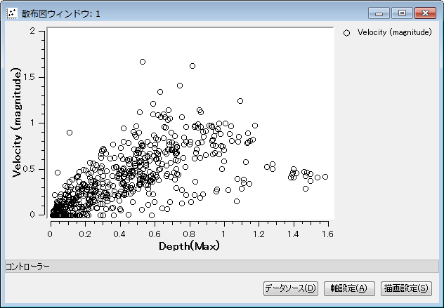
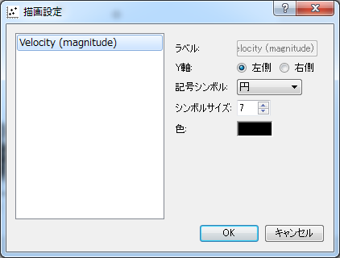

.. _sec_scattered_chart_window_detail:

[Scattered Chart Window]
==========================

The functions for opening a scattered chart window are explained in this
section.

[Open new Scattered Chart Window]
-----------------------------------

.. |scattered-window-icon| image:: images/scattered-window-icon.png

Either of the following actions opens a new graph window.

**Menu bar:** [Calculation Results] (R) --> [Open New Scattered Chart Window]

**Operation Toolbar:** |scattered-window-icon|

The [Data Source Setting] dialog (:numref:`image_scattered_data_source_dialog`)
will open, so select the
data to draw graph and click on [OK]. A new [Scattered Chart Window]
window (:numref:`image_scattered_window`) will open that
draws a scattered chart for the data you selected.

.. _image_scattered_data_source_dialog:

.. figure:: images/scattered_data_source_dialog.png
   :width: 240pt

   [Data Source Setting] dialog

.. _image_scattered_window:

   [Scattered Chart Window]

Additional Menu items
----------------------

:numref:`table_scattered_window_menu`
shows the additional menu items for the [Scattered Chart Window].
The additional menu items are shown between [Import] and
[Simulation] when the [Scattered Chart Window] is active.

.. _table_scattered_window_menu:

.. list-table:: Additional menu items for [Scattered Chart Window]
   :header-rows: 1

   * - Menu
     -
     - Description
   * - Draw (D)
     - [Data Source Setting] (D)
     - Display [Data Source Setting] dialog.
   * -
     - [Axis Setting] (A)
     - Display [Axis Setting] dialog.
   * -
     - [Draw Setting] (D)
     - Display [Draw Setting] dialog.

[Data Source Setting] (D)
----------------------------

**Description**: Set data source setting.

When you select this, the [Data Source Setting] dialog
(:numref:`image_scattered_data_source_dialog`)
will open. Modify setting and click on [OK].

[Axis Setting] (A)
--------------------

**Description**: Set axis setting.

When you select this, the [Axis Setting] dialog
(:numref:`image_scattered_axis_setting_dialog`) will open.
Modify setting and click on [OK]. A new graph will be made according to
the settings.

.. _image_scattered_axis_setting_dialog:

.. figure:: images/scattered_axis_setting_dialog.png
   :width: 280pt

   [Axis Setting] dialog

[Draw Setting] (D)
-------------------

**Description**: Set the draw settings

When you select this, the [Draw Setting] dialog
(:numref:`image_scattered_draw_setting_dialog`) will open.
Modify setting and click on [OK]. A new graph will be made according to
the settings.

.. _image_scattered_draw_setting_dialog:

   [Draw Setting] dialog
