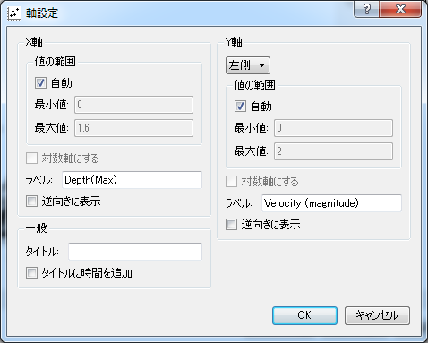

.. _sec_scattered_chart_window_detail:

散布図描画機能
==========================

散布図を描画する機能について説明します。

この機能を利用するには、散布図ウィンドウを用います。

新しい散布図ウィンドウを開く
-----------------------------------

.. |scattered-window-icon| image:: images/scattered-window-icon.png

新しい散布図ウィンドウを開くには、以下のいずれかの操作を行います。

**メニューバー:** 計算結果 (R) --> 新しい散布図ウィンドウを開く

**ツールバー:** |scattered-window-icon|

データソース設定ダイアログ (:numref:`image_scattered_data_source_dialog`
参照)
が表示されますので、散布図でX軸に使用する計算結果、
Y軸に使用する計算結果を設定して「OK」ボタンを押します。すると、設定した内容
にしたがって散布図ウィンドウが新しく表示されます。
表示される散布図ウィンドウの例を
:numref:`image_scattered_window` に示します。

.. _image_scattered_data_source_dialog:

.. figure:: images/scattered_data_source_dialog.png
   :width: 240pt

   データソース設定ダイアログ 表示例

.. _image_scattered_window:

.. figure:: images/scattered_window.png
   :width: 300pt

   散布図ウィンドウ 表示例

メニュー構成
----------------------

散布図ウィンドウ固有のメニュー構成を、:numref:`table_scattered_window_menu`
に示します。:numref:`table_scattered_window_menu`
に示すメニューは、散布図ウィンドウがアクティブな時、
「インポート」メニューと「計算」メニューの間に表示されます。

.. _table_scattered_window_menu:

.. list-table:: 散布図ウィンドウ固有のメニュー構成
   :header-rows: 1

   * - メニュー
     -
     - 説明
   * - 描画設定 (D)
     - データソース設定 (C)
     - データソース設定をします
   * -
     - 軸設定 (A)
     - グラフの軸の設定をします
   * -
     - 描画設定 (D)
     - 表示する項目の描画設定をします

データソース設定 (D)
----------------------------

データソース設定をします。

データソース設定ダイアログ (:numref:`image_scattered_data_source_dialog` 参照)
が表示されますので、設定を行って「OK」ボタンを押します。
すると、新しい設定内容にしたがってグラフが再描画されます。

軸設定 (A)
--------------------

グラフの軸に関する設定をします。

軸設定ダイアログ (:numref:`image_scattered_axis_setting_dialog` 参照)
が表示されますので、設定を行って「OK」ボタンを押します。
すると、新しい設定内容にしたがってグラフが再描画されます。

.. _image_scattered_axis_setting_dialog:

   軸設定ダイアログ 表示例

描画設定 (D)
-------------------

グラフに描画する項目の描画設定をします。

描画設定ダイアログ (:numref:`image_scattered_draw_setting_dialog` 参照)
が表示されますので、設定を行って「OK」ボタンを押します。
すると、新しい設定にしたがってグラフが再描画されます。

.. _image_scattered_draw_setting_dialog:

.. figure:: images/scattered_draw_setting_dialog.png
   :width: 240pt

   描画設定ダイアログ 表示例
