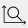
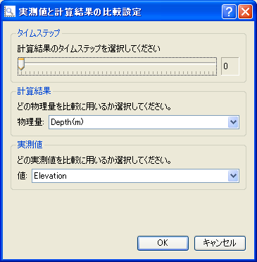

.. _sec_compare_with_measured_data_window:

実測値と比較
===================

計算結果と実測値を比較するための一連のグラフを描画するダイアログを表示します。

この機能を利用するには、あらかじめ実測値をインポートしておく必要があります。
実測値のインポートについては
:ref:`sec_file_import_measured_data` を参照してください。

実測値と比較するためのダイアログを開くには、以下のいずれかの操作を行います。

**メニューバー:** 計算結果 (R) --> 実測値と比較

**ツールバー:** |compare-window-icon|

比較設定ダイアログ
 (:numref:`image_compare_verification_setting_dialog` 参照)
が表示されますので、比較に用いるデータを設定して「OK」ボタンを押します。
すると、設定した内容にしたがってグラフダイアログが表示されます。表示されるダイアログの例を
:numref:`image_compare_verification_dialog` に示します。

.. _image_compare_verification_setting_dialog:

   比較設定ダイアログ 表示例

.. _image_compare_verification_dialog:

.. figure:: images/compare_verification_dialog.png

   実測値と比較ダイアログ 表示例
